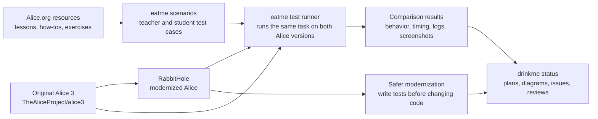
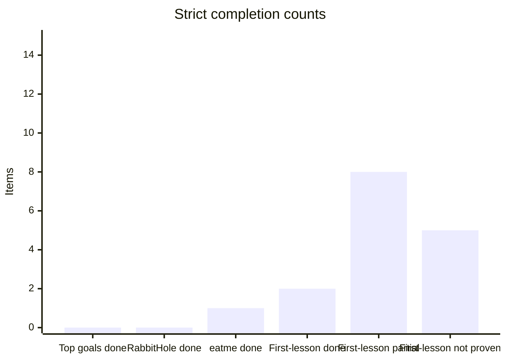
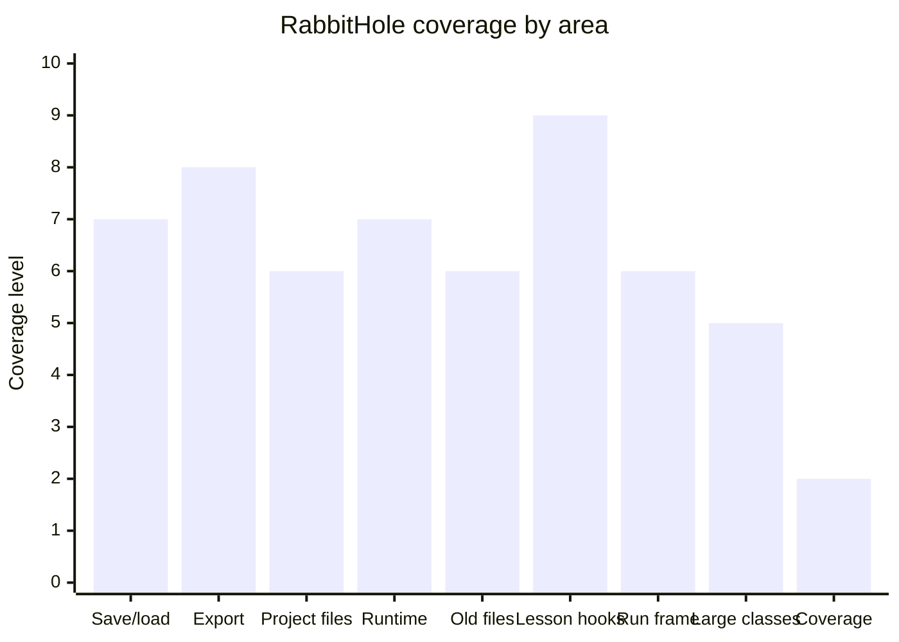
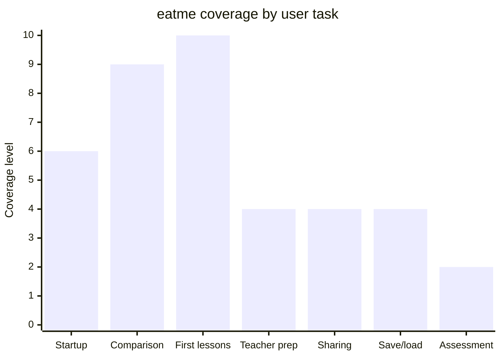
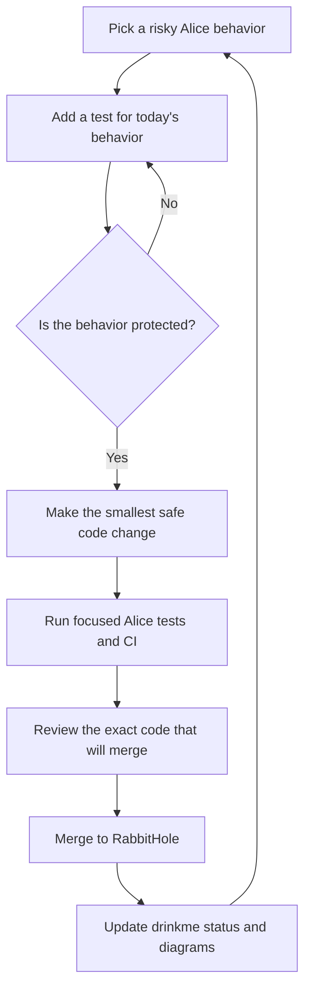
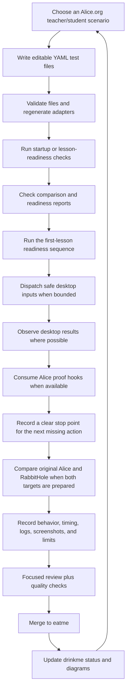

# drinkme

Private project map and status guide for modernizing the
[Alice 3 programming environment](https://github.com/TheAliceProject/alice3).

- [RabbitHole](https://github.com/rysweet/RabbitHole) is the modernized Alice
  source tree.
- [eatme](https://github.com/rysweet/eatme) is the test runner that compares
  original Alice with RabbitHole.
- drinkme keeps the plan, diagrams, links, and current status. Code changes
  belong in RabbitHole or eatme. Original Alice is only used as the reference.

## Plan summary

The plan is to modernize Alice in small, evidence-backed steps instead of doing
a broad rewrite. RabbitHole first adds behavior tests around risky Alice areas,
then makes the smallest safe code changes behind those tests. eatme turns
Alice.org-style teacher and student activities into repeatable comparisons
between original Alice and RabbitHole. drinkme records the map, current limits,
and evidence so the work does not drift into unsupported claims.

Start with the [root investigation plan](docs/plan.md) and the
[current modernization plan](docs/modernization/current-state-and-next-steps.md).
The latest broad status is in
[restarted full-scope status](docs/modernization/restarted-full-scope-status.md),
and the eatme comparison-harness plan is in
[eatme implementation plan](docs/eatme/implementation-plan.md).

The latest desktop Run evidence is recorded in
[atlas journal entry 0085](docs/atlas/journal/0085-desktop-run-execution-evidence.md).
[RabbitHole PR #154](https://github.com/rysweet/RabbitHole/pull/154)
records a narrow Run window attachment signal. It proves Alice put the Run
panel into the Run window area. It does not prove pixels were drawn, does not
prove the lesson finished, and is not grading.

Current open work:

| Work item | Plain status |
| --- | --- |
| [RabbitHole PR #155](https://github.com/rysweet/RabbitHole/pull/155) | Launcher evidence checks are green, but review is still running. |
| [RabbitHole PR #156](https://github.com/rysweet/RabbitHole/pull/156) | Old archive/image recovery checks are still waiting on coverage. |
| [eatme PR #89](https://github.com/rysweet/eatme/pull/89) | Instructor/student readiness is green, but review is still running. |

## Plain-English terms

| Term | Meaning in this project |
| --- | --- |
| RabbitHole | The modernized Alice codebase. |
| eatme | The test runner that tries the same Alice task on original Alice and RabbitHole. |
| drinkme | The planning and status repository you are reading now. |
| Behavior test | A test that records what Alice does today so refactoring does not accidentally change it. |
| No-go contract | A machine-readable "stop here" record. It says the next action is known, but the proof needed to run it safely does not exist yet. |
| First-lesson readiness | Checks that the files, logs, screenshots, and window evidence needed for a first Alice lesson are present. It is not full lesson automation yet. |
| Tweedle/player files | Alice project/player file formats that RabbitHole must keep reading correctly. |

## One-page project map

## Current verdict

The project is making real progress, but it is not complete.

The counts below are intentionally strict. An item is **done** only when the
current repositories have executable evidence and no known "still needs work"
for that item. **Partial** means useful proof exists, but the plan still has a
named gap. **Not proven** means there is no accepted proof yet.

| Plan slice | Counted items | Done | Partial | Not proven | What this means |
| --- | ---: | ---: | ---: | ---: | --- |
| Top-level plan goals in this section | 7 | 0 | 7 | 0 | Every major goal has useful evidence, but every one still has an open gap. |
| RabbitHole code areas below | 9 | 0 | 9 | 0 | Each area has tests or guarded changes; none is broad enough to call complete. |
| eatme user-task areas below | 7 | 1 | 6 | 0 | Startup comparison is the only complete user-task slice; lesson automation remains partial. |
| First-lesson action chain | 15 | 2 | 8 | 5 | Only launch and window focus are fully done. RabbitHole can partially prove several backend steps and the narrow Run window attachment signal from PR #154; pixel drawing, save-menu completion, grading, and full lesson completion are still open. |

### First-lesson action chain

This is the clearest view of how much of the original instructor/student lesson
vision is executable today.

| # | First-lesson step | Original Alice | RabbitHole | Status |
| ---: | --- | --- | --- | --- |
| 1 | Package and launch Alice | Proven | Proven | Done |
| 2 | Detect and focus the Alice window | Proven | Proven | Done |
| 3 | Dispatch desktop save shortcut | Proven as input only | Proven as input only | Partial |
| 4 | Place a Bunny in the scene | No hook; blocked | Backend proof hook passes | Partial: RabbitHole backend proof only; original Alice and desktop gallery placement are not proven |
| 5 | Edit the fixed first-lesson procedure | No hook; blocked | Backend proof hook passes | Partial: RabbitHole backend proof only; original Alice and desktop editor interaction are not proven |
| 6 | Run the edited procedure through the backend proof hook | No hook; blocked | Backend proof hook passes | Partial: RabbitHole backend proof only; desktop Run is not proven here. Separate desktop VM backend proof appears in step 11. |
| 7 | Save the edited project through the backend proof hook | No hook; blocked | Backend proof hook passes | Partial: RabbitHole backend proof only; desktop save-menu use is not proven |
| 8 | Dispatch desktop Run shortcut (`Ctrl+F5`) | Not reached safely | Proven as input only | Partial |
| 9 | Observe a Run window after `Ctrl+F5` | Not proven | Not proven | Not proven |
| 10 | Put the Run panel in the Run window area | Not proven | Proven by [RabbitHole PR #154](https://github.com/rysweet/RabbitHole/pull/154) as a narrow attachment signal | Partial: RabbitHole proves Alice put the Run panel into the Run window area; original Alice and pixel drawing are not proven |
| 11 | Prove the Run window drew pixels | Not proven | Not proven | Not proven |
| 12 | Prove visible world rendering | Not proven | Not proven | Not proven |
| 13 | Prove desktop save-menu completion | Not proven | Not proven | Not proven |
| 14 | Grade or assess a learner world | Not proven | Not proven | Not proven |
| 15 | Complete an end-to-end teacher/student lesson | Not proven | Not proven | Not proven |

Short version: **2 of 15 first-lesson steps are fully done**, **8 are partial**,
and **5 remain unproven**. That is enough to compare meaningful RabbitHole
progress against original Alice, but it is not full lesson automation.

| Goal from the plan | What exists now | Plain-language verdict |
| --- | --- | --- |
| Preserve Alice behavior before refactoring | Many tests have been added around saving, loading, exporting, generated Java code, old project migration, Tweedle/player file reads, and recovery paths. [PR #140](https://github.com/rysweet/RabbitHole/pull/140) adds an old-archive boundary for unresolved parent types. | There is a useful safety net, but total test coverage is still far below the long-term target. |
| Reduce risky oversized code safely | `ProjectMigrationManager` has protected reductions in [PR #118](https://github.com/rysweet/RabbitHole/pull/118) and [PR #123](https://github.com/rysweet/RabbitHole/pull/123); JSON project resource writing was split out in [PR #128](https://github.com/rysweet/RabbitHole/pull/128); model resource array and joint-tree helpers were split out in [PR #135](https://github.com/rysweet/RabbitHole/pull/135) and [PR #137](https://github.com/rysweet/RabbitHole/pull/137); [PR #141](https://github.com/rysweet/RabbitHole/pull/141) turns missing or cyclic joint parents into a clear failure instead of a hang. | Cleanup has started. Many large production classes remain. |
| Protect classroom-facing project behavior | Save, load, export, and classroom project behavior landed in [PR #119](https://github.com/rysweet/RabbitHole/pull/119), [PR #122](https://github.com/rysweet/RabbitHole/pull/122), and [PR #126](https://github.com/rysweet/RabbitHole/pull/126). | More behavior is protected by automated tests. Full desktop use is still thin. |
| Protect exported projects | NetBeans/Ant checks landed in [PR #124](https://github.com/rysweet/RabbitHole/pull/124), generated launcher wiring with a JavaFX stub landed in [PR #130](https://github.com/rysweet/RabbitHole/pull/130), missing-JavaFX runtime failure is checked in [PR #132](https://github.com/rysweet/RabbitHole/pull/132), real OpenJFX modules now reach either `Program.main` or the specific headless display boundary in [PR #134](https://github.com/rysweet/RabbitHole/pull/134), Xvfb-backed OpenJFX launch reaches `Program.main` in [PR #138](https://github.com/rysweet/RabbitHole/pull/138), and [PR #142](https://github.com/rysweet/RabbitHole/pull/142) guards generated launchers from running `Program.main` with a null JavaFX `Stage`. | Export behavior is better protected. Real user-visible JavaFX display, rendering, installer launchers, and deployed runtime behavior remain open. |
| Keep Alice project/player files readable | Field-only, primitive Tweedle, sibling type-resolution, method-decode boundary, complex-initializer boundary, and unresolved-parent boundary work landed in [PR #120](https://github.com/rysweet/RabbitHole/pull/120), [PR #121](https://github.com/rysweet/RabbitHole/pull/121), [PR #126](https://github.com/rysweet/RabbitHole/pull/126), [PR #129](https://github.com/rysweet/RabbitHole/pull/129), [PR #136](https://github.com/rysweet/RabbitHole/pull/136), [PR #139](https://github.com/rysweet/RabbitHole/pull/139), and [PR #140](https://github.com/rysweet/RabbitHole/pull/140). | Basic file-read paths are covered and more unsupported gaps are explicitly checked. Full method/constructor decoding, complex values, and unresolved parent type support remain gaps. |
| Build eatme into a comparison test runner | eatme now has target setup, comparison reports, scorecards, path checks, lesson-session checks, readiness checks, a first-lesson readiness sequence, Alice window activation, first-lesson backend proof hooks, desktop input dispatch, stale display cleanup, explicit test-only license preference seeding, and a narrow RabbitHole Run window attachment signal. [RabbitHole PR #154](https://github.com/rysweet/RabbitHole/pull/154) proves Alice put the Run panel into the Run window area. [RabbitHole PR #155](https://github.com/rysweet/RabbitHole/pull/155) has green launcher evidence checks, but review is still running. [RabbitHole PR #156](https://github.com/rysweet/RabbitHole/pull/156) old archive/image recovery checks are still waiting on coverage. [eatme PR #89](https://github.com/rysweet/eatme/pull/89) instructor/student readiness is green, but review is still running. | eatme can compare startup behavior, check first-lesson evidence, find and focus the Alice main window under bare Xvfb, dispatch real desktop save and Run shortcuts as input evidence, record the license agreement as a blocker unless an explicit test switch seeds the isolated preferences, clean stale X display files left by crashed runs, ask RabbitHole to prove backend first-lesson actions, and consume the PR #154 Run window attachment signal. Ctrl+F5 still does not open the Run window in the current Xvfb run. eatme still does not prove pixels were drawn, desktop save-menu completion, grading, or a full teacher/student lesson. |
| Turn Alice.org lessons into tests | eatme has 31 editable scenario files, 32 generated adapter files, 11 teacher role files, and 13 student role files. | The lesson library is broad. The actual automated execution is still shallow. |

The ledger is a navigation aid. It is not a replacement for coverage reports,
CI logs, or the comparison reports produced by eatme.

## RabbitHole code areas

| Code area | Why it matters | What is protected now | Links | What still needs work |
| --- | --- | --- | --- | --- |
| Saving, loading, backups, recovery | Data loss is the worst failure mode. | More headless tests exist; JSON resource writing was split out of a larger class; full desktop recovery coverage is still limited. | [backup/save/export flow #119](https://github.com/rysweet/RabbitHole/pull/119), [classroom round trip #122](https://github.com/rysweet/RabbitHole/pull/122), [primitive archive reads #126](https://github.com/rysweet/RabbitHole/pull/126), [resource entry extraction #128](https://github.com/rysweet/RabbitHole/pull/128), [backup and recovery notes](docs/atlas/journal/0054-backup-recovery-io-path.md) | More tests for real temporary files and desktop recovery behavior. |
| Exported projects | Students and teachers need generated Java projects to work outside Alice. | Compile and Ant behavior are covered; generated launcher wiring has a JavaFX-stub test; missing JavaFX classes fail before `Program.main`; real OpenJFX modules reach either `Program.main` or the specific headless display boundary; Xvfb-backed OpenJFX reaches `Program.main`; generated launchers now stop clearly if called with a null primary `Stage`. | [Ant test-main #124](https://github.com/rysweet/RabbitHole/pull/124), [generated launcher stub #130](https://github.com/rysweet/RabbitHole/pull/130), [missing JavaFX boundary #132](https://github.com/rysweet/RabbitHole/pull/132), [OpenJFX display boundary #134](https://github.com/rysweet/RabbitHole/pull/134), [Xvfb OpenJFX launcher #138](https://github.com/rysweet/RabbitHole/pull/138), [null Stage guard #142](https://github.com/rysweet/RabbitHole/pull/142), [testing roadmap](docs/atlas/diagrams/testing-roadmap-mermaid.svg), [NetBeans export notes](docs/atlas/journal/0034-netbeans-exported-build-contract.md) | Real user-visible JavaFX display, rendering, installer launchers, and deployed launcher behavior. |
| Project/player file reading | Modern Alice files must still open correctly. | Basic field, primitive value, sibling type, method-boundary, complex-initializer, and unresolved-parent boundary reads are improved; unsupported cases are still clearly marked. | [field-only read #120](https://github.com/rysweet/RabbitHole/pull/120), [constructor boundary #121](https://github.com/rysweet/RabbitHole/pull/121), [primitive values #126](https://github.com/rysweet/RabbitHole/pull/126), [sibling type resolution #129](https://github.com/rysweet/RabbitHole/pull/129), [method decode boundary #136](https://github.com/rysweet/RabbitHole/pull/136), [complex initializer boundary #139](https://github.com/rysweet/RabbitHole/pull/139), [unresolved parent boundary #140](https://github.com/rysweet/RabbitHole/pull/140), [player read notes](docs/atlas/journal/0058-player-export-json-resource-read.md) | Full methods, constructors, complex expressions, and unresolved parent type support. |
| Generated Java and runtime events | Alice worlds must produce Java that compiles and behaves correctly. | Generated Java compilation is tested; timer, display-callback, and generated `TimeEvent` payload behavior have more headless coverage. | [timer handler #125](https://github.com/rysweet/RabbitHole/pull/125), [automatic display time listener dispatch #127](https://github.com/rysweet/RabbitHole/pull/127), [time event payload #133](https://github.com/rysweet/RabbitHole/pull/133), [startup flow diagram](docs/atlas/diagrams/startup-flow-mermaid.svg), [story API notes](docs/atlas/journal/0049-story-api-generated-source.md) | More event/listener behavior and fuller playback coverage. |
| First-lesson backend hooks | eatme needs Alice to make deterministic first-lesson changes before it can compare more than startup/readiness. | RabbitHole now exposes `tools/eatme-place-object`, `tools/eatme-edit-procedure`, `tools/eatme-run-world`, and `tools/eatme-save-project`. Together they can write a placed project, write an edited project plus procedure/code diff proof, run the selected scene method body headlessly, and prove the edited `.a3p` can be saved and read back. | [object placement hook #143](https://github.com/rysweet/RabbitHole/pull/143), [stdout contract fix #144](https://github.com/rysweet/RabbitHole/pull/144), [procedure edit hook #145](https://github.com/rysweet/RabbitHole/pull/145), [run-world hook #146](https://github.com/rysweet/RabbitHole/pull/146), [save-project hook #147](https://github.com/rysweet/RabbitHole/pull/147), [eatme object proof consumer #69](https://github.com/rysweet/eatme/pull/69), [eatme action progress #70](https://github.com/rysweet/eatme/pull/70), [eatme edit proof consumer #73](https://github.com/rysweet/eatme/pull/73), [eatme run proof consumer #75](https://github.com/rysweet/eatme/pull/75), [eatme save proof consumer #76](https://github.com/rysweet/eatme/pull/76), [object-placement journal](docs/atlas/journal/0069-object-placement-hook-implementation.md), [edit-proof journal](docs/atlas/journal/0073-edit-proof-consumption.md), [run-world proof journal](docs/atlas/journal/0076-run-world-proof-hook.md), [project-save proof journal](docs/atlas/journal/0077-project-save-proof-hook.md) | This is backend proof only. It is not gallery clicking, desktop editor clicking, desktop run-button clicking, desktop save-menu use, grading, or full lesson consumption. |
| Desktop Run window | eatme must know what Alice can prove after Run is requested, not just whether a keypress was sent. | [RabbitHole PR #154](https://github.com/rysweet/RabbitHole/pull/154) records a narrow Run window attachment signal: Alice put the Run panel into the Run window area. It does not prove pixels were drawn, does not prove the lesson finished, and is not grading. Ctrl+F5 still does not open the Run window in the latest real run. | [RabbitHole PR #154](https://github.com/rysweet/RabbitHole/pull/154), [RabbitHole PR #155](https://github.com/rysweet/RabbitHole/pull/155), [RabbitHole PR #156](https://github.com/rysweet/RabbitHole/pull/156), [eatme PR #89](https://github.com/rysweet/eatme/pull/89), [desktop Run evidence journal](docs/atlas/journal/0085-desktop-run-execution-evidence.md) | Finish review on PR #155 after green launcher evidence checks; add coverage for PR #156 old archive/image recovery checks; add separate proof before claiming pixel drawing, lesson completion, or grading. |
| Older projects and archives | Teachers may have old worlds and starter projects. Breaking them breaks trust. | Selected migration paths are tested; generated JSON `.a3w` reading now includes sibling Tweedle types plus image data; JSON player method, complex-initializer, and unresolved-parent boundaries are explicitly checked; broad migration coverage is still thin. | [lagoon texture migration #117](https://github.com/rysweet/RabbitHole/pull/117), [migration extraction #118](https://github.com/rysweet/RabbitHole/pull/118), [migration helper #123](https://github.com/rysweet/RabbitHole/pull/123), [generated archive resources #131](https://github.com/rysweet/RabbitHole/pull/131), [method decode boundary #136](https://github.com/rysweet/RabbitHole/pull/136), [complex initializer boundary #139](https://github.com/rysweet/RabbitHole/pull/139), [unresolved parent boundary #140](https://github.com/rysweet/RabbitHole/pull/140) | More historical `.a3p`, `.a3c`, and `.a3w` files with committed fixtures. |
| Large production classes | Large classes are hard to review and easy to break. | Protected cleanup has begun, including JSON project IO splits, model resource array helper extraction, model resource joint-tree helper extraction, and bounded failure for bad joint-tree parent data. | [text snippet extraction #118](https://github.com/rysweet/RabbitHole/pull/118), [mapping extraction #123](https://github.com/rysweet/RabbitHole/pull/123), [resource entry extraction #128](https://github.com/rysweet/RabbitHole/pull/128), [model resource array helpers #135](https://github.com/rysweet/RabbitHole/pull/135), [model resource joint tree helpers #137](https://github.com/rysweet/RabbitHole/pull/137), [joint parent guard #141](https://github.com/rysweet/RabbitHole/pull/141), [current state notes](docs/modernization/current-state-and-next-steps.md) | Continue cleanup only where tests already protect the behavior. |
| Test coverage | The 70 percent target must be measured honestly. | Coverage checks and scorecards exist; total coverage is still about 10 percent in the latest recorded audit. | [coverage/status work #94](https://github.com/rysweet/RabbitHole/pull/94), [current state notes](docs/modernization/current-state-and-next-steps.md) | Add real behavior tests, not padding. |

## eatme lesson scenarios and test coverage

eatme turns Alice.org teaching resources into test cases. The goal is a
repeatable run where a teacher and students use Alice, first with original Alice
and then with RabbitHole, so the results can be compared.

| User area | Alice/eatme files | What eatme can do now | Current proof | What still needs work |
| --- | --- | --- | --- | --- |
| Startup | [real-alice-launch-smoke](https://github.com/rysweet/eatme/blob/master/assets/scenarios/eatme/real-alice-launch-smoke.yaml) | Packages Alice, starts a virtual display, launches Alice, and records logs, screenshots, checks, and timing. | Original Alice and RabbitHole both pass repeated startup comparisons after [PR #58](https://github.com/rysweet/eatme/pull/58). | This only proves startup. |
| Original-vs-RabbitHole comparison | [comparison target registry](https://github.com/rysweet/eatme/blob/master/assets/alice-comparison-targets.yaml) | Runs checks for target setup, comparison reports, timing, lesson-session evidence, readiness evidence, first-lesson readiness, Alice window discovery and focus, bounded desktop shortcut dispatch, object/edit/run/save proof consumption when hooks exist, action-level progress, and the PR #154 Run window attachment signal for RabbitHole. | [PR #56](https://github.com/rysweet/eatme/pull/56), [#57](https://github.com/rysweet/eatme/pull/57), [#58](https://github.com/rysweet/eatme/pull/58), [#59](https://github.com/rysweet/eatme/pull/59), [#60](https://github.com/rysweet/eatme/pull/60), [#61](https://github.com/rysweet/eatme/pull/61), [#62](https://github.com/rysweet/eatme/pull/62), [#63](https://github.com/rysweet/eatme/pull/63), [#64](https://github.com/rysweet/eatme/pull/64), [#65](https://github.com/rysweet/eatme/pull/65), [#66](https://github.com/rysweet/eatme/pull/66), [#67](https://github.com/rysweet/eatme/pull/67), [#68](https://github.com/rysweet/eatme/pull/68), [#69](https://github.com/rysweet/eatme/pull/69), [#70](https://github.com/rysweet/eatme/pull/70), [#71](https://github.com/rysweet/eatme/pull/71), [#72](https://github.com/rysweet/eatme/pull/72), [#73](https://github.com/rysweet/eatme/pull/73), [#74](https://github.com/rysweet/eatme/pull/74), [#75](https://github.com/rysweet/eatme/pull/75), [#76](https://github.com/rysweet/eatme/pull/76), [#77](https://github.com/rysweet/eatme/pull/77), [#78](https://github.com/rysweet/eatme/pull/78), [#79](https://github.com/rysweet/eatme/pull/79), [#80](https://github.com/rysweet/eatme/pull/80), [#81](https://github.com/rysweet/eatme/pull/81), [#82](https://github.com/rysweet/eatme/pull/82), [#83](https://github.com/rysweet/eatme/pull/83), [#84](https://github.com/rysweet/eatme/pull/84), [run evidence journal](docs/atlas/journal/0074-edit-proof-readiness-run.md), [run-world contract notes](docs/atlas/journal/0075-run-world-contract-boundary.md), [run-world proof notes](docs/atlas/journal/0076-run-world-proof-hook.md), [project-save proof notes](docs/atlas/journal/0077-project-save-proof-hook.md), [desktop shortcut notes](docs/atlas/journal/0079-desktop-run-shortcut-dispatch.md), [Run-window observation notes](docs/atlas/journal/0080-run-window-observation.md), [license modal notes](docs/atlas/journal/0081-license-modal-run-window-blocker.md), [license seed notes](docs/atlas/journal/0082-license-preseeded-run-window-check.md), [toolbar proof notes](docs/atlas/journal/0084-run-window-toolbar-proof.md), [desktop Run evidence notes](docs/atlas/journal/0085-desktop-run-execution-evidence.md) | Add separate proof for pixels drawn, save completion, grading, and full teacher/student lesson flow before claiming those outcomes. |
| First Alice lessons | [first-lessons-real-ui-actions](https://github.com/rysweet/eatme/blob/master/assets/scenarios/eatme/first-lessons-real-ui-actions.yaml), [building-a-scene-first-world](https://github.com/rysweet/eatme/blob/master/assets/scenarios/eatme/building-a-scene-first-world.yaml), [code-editor-first-run](https://github.com/rysweet/eatme/blob/master/assets/scenarios/eatme/code-editor-first-run.yaml) | Teacher and student test files describe visible actions, reflections, expected files, readiness checks, Alice window activation, Ctrl+S desktop input dispatch, bounded Ctrl+F5 Run shortcut dispatch, Run-window observation, object-placement proof, procedure-edit proof, bounded run-world proof, backend project-save proof, and action-level progress. Adapter files are generated. | Scenario validation, adapter freshness checks, readiness checks, the first-lesson readiness sequence, Alice window activation, Ctrl+S dispatch, Ctrl+F5 dispatch after edit proof, Run-window observation, the place-object stop record, the missing-control contract, the hook contract, object-proof consumption, action-level reporting, the bare-Xvfb window fallback, the edit stop record, edit-proof consumption, the run-world stop record, run-world proof consumption, save-proof consumption, stale display cleanup, and explicit test-only license preference seeding pass after [PR #69](https://github.com/rysweet/eatme/pull/69), [PR #70](https://github.com/rysweet/eatme/pull/70), [PR #71](https://github.com/rysweet/eatme/pull/71), [PR #72](https://github.com/rysweet/eatme/pull/72), [PR #73](https://github.com/rysweet/eatme/pull/73), [PR #74](https://github.com/rysweet/eatme/pull/74), [PR #75](https://github.com/rysweet/eatme/pull/75), [PR #76](https://github.com/rysweet/eatme/pull/76), [PR #77](https://github.com/rysweet/eatme/pull/77), [PR #78](https://github.com/rysweet/eatme/pull/78), [PR #79](https://github.com/rysweet/eatme/pull/79), [PR #80](https://github.com/rysweet/eatme/pull/80), and [PR #81](https://github.com/rysweet/eatme/pull/81). Real run `run-window-license-seeded-clean-20260506143829` showed original Alice passing window focus and Ctrl+S dispatch, then stopping at object placement; RabbitHole passed window focus, Ctrl+S dispatch, bounded Ctrl+F5 Run dispatch, object placement, backend procedure edit, bounded run-world proof, and backend project-save proof. The license window was gone under explicit opt-in, but no Run window was observed after Ctrl+F5. | Desktop gallery/editor controls, proof that Ctrl+F5 opened the desktop Run window or completed desktop world execution, proof that the desktop save menu completed a save, and full teacher/student lesson completion are still intentionally limited. |
| Teacher preparation | [instructor-lesson-materials-remix](https://github.com/rysweet/eatme/blob/master/assets/scenarios/eatme/instructor-lesson-materials-remix.yaml), [workshop-facilitator-live-studio](https://github.com/rysweet/eatme/blob/master/assets/scenarios/eatme/workshop-facilitator-live-studio.yaml) | Teacher test files describe setup, facilitation, prompt cards, and classroom handoff. | Editable YAML files and generated adapter files exist. | Need an executable comparison where a teacher creates or prepares an assignment. |
| Student files and sharing | [student sharing evidence](https://github.com/rysweet/eatme/blob/master/assets/scenarios/eatme/student-artifact-package-share-evidence.yaml), [teacher community sharing](https://github.com/rysweet/eatme/blob/master/assets/scenarios/eatme/teacher-community-sharing-loop.yaml) | Student test files describe reflection, ownership, sharing, and peer review expectations. | The scenario library covers packaging and sharing expectations. | Need real open/change/run/save/share evidence against both Alice versions. |
| Save/load/export setup | [starter project save/load/export check](https://github.com/rysweet/eatme/blob/master/assets/scenarios/eatme/starter-project-open-save-export-preflight.yaml) | The scenario connects Alice startup checks to project file checks. | The scenario is ready for deeper automation. | Needs deeper execution beyond startup and readiness checks. |
| Assessment limits | [instructor-student-outcomes-rubric](https://github.com/rysweet/eatme/blob/master/assets/scenarios/eatme/instructor-student-outcomes-rubric.yaml) | Review language keeps the project from claiming more than it proves. | Assets explicitly avoid automated creative assessment and student-world grading claims. | Human review or a narrow rubric runner is needed before claims expand. |

## How the work is done

RabbitHole and eatme use different workflows because they solve different
problems. RabbitHole changes a large desktop app. eatme builds tests around how
teachers and students use that app.

### RabbitHole: test behavior before changing Alice

### eatme: write lesson tests, then compare Alice versions

Hard rules:

- No upstream Alice issues or pull requests.
- No broad refactor before behavior is covered by tests.
- No completion claim while coverage, oversized classes, real user behavior,
  historical archives, and instructor/student comparison remain incomplete.
- Keep status in [drinkme issues](https://github.com/rysweet/drinkme/issues),
  not hidden in chat.
- Keep diagrams and code maps in [docs/atlas](docs/atlas/index.md).
- Keep this README current on every loop when project state, process diagrams,
  progress visuals, evidence links, or the RabbitHole/eatme strategy changes.

## Diagrams and code maps

| View | What it shows |
| --- | --- |
| [Repository surface](docs/atlas/diagrams/repo-surface-mermaid.svg) | Main Alice module groups and where modernization is happening. |
| [Startup flow](docs/atlas/diagrams/startup-flow-mermaid.svg) | How Alice launch paths connect to runtime behavior. |
| [Testing roadmap](docs/atlas/diagrams/testing-roadmap-mermaid.svg) | What behavior still needs tests. |
| [RabbitHole comparison test wave](docs/atlas/journal/0065-rabbithole-compare-harness-wave.md) | Notes for the first RabbitHole/eatme comparison work. |
| [JavaFX, archive, and first-lesson action boundaries](docs/atlas/journal/0066-javafx-archive-ui-action-boundaries.md) | Notes for the latest JavaFX launcher, archive, cleanup, and first-lesson boundary work. |
| [Xvfb launcher and object-placement contract](docs/atlas/journal/0067-xvfb-launcher-and-affordance-contract.md) | Notes for the latest Xvfb launcher proof and named object-placement affordance gap. |
| [Archive guards and object-placement hook contract](docs/atlas/journal/0068-archive-guards-and-object-placement-hook.md) | Notes for bounded archive/model failures, generated launcher null-Stage guard, and the eatme object-placement hook proof contract. |
| [Object-placement hook implementation](docs/atlas/journal/0069-object-placement-hook-implementation.md) | Notes for RabbitHole's backend Bunny placement hook and eatme's consumer category change. |
| [Object-placement progress evidence](docs/atlas/journal/0070-object-placement-progress-evidence.md) | Notes for the stdout contract fix, action-level readiness reporting, and the remaining real-window blocker. |
| [Window fallback first-lesson readiness](docs/atlas/journal/0071-window-fallback-first-lesson-readiness.md) | Notes for the Xvfb window fallback and the first readiness run that reached the remaining edit/run/save blockers. |
| [Edit action contract boundary](docs/atlas/journal/0072-edit-action-contract-boundary.md) | Notes for the machine-readable `edit-procedure-or-code-block` no-go contract after object placement proof. |
| [Edit proof consumption](docs/atlas/journal/0073-edit-proof-consumption.md) | Notes for RabbitHole's backend procedure-edit hook and eatme's proof consumer. |
| [Edit proof readiness run](docs/atlas/journal/0074-edit-proof-readiness-run.md) | Notes for the real first-lesson readiness run that now reaches run/save blockers after RabbitHole edit proof. |
| [Run-world contract boundary](docs/atlas/journal/0075-run-world-contract-boundary.md) | Notes for the machine-readable `run-world` no-go contract after RabbitHole edit proof. |
| [Run-world proof hook](docs/atlas/journal/0076-run-world-proof-hook.md) | Notes for RabbitHole's bounded backend run-world hook and eatme's proof consumer. |
| [Project-save proof hook](docs/atlas/journal/0077-project-save-proof-hook.md) | Notes for RabbitHole's bounded backend save hook and eatme's proof consumer. |
| [Desktop save shortcut dispatch](docs/atlas/journal/0078-desktop-save-shortcut-dispatch.md) | Notes for eatme's bounded Ctrl+S desktop input-dispatch probe and the remaining save-proof limit. |
| [Desktop Run shortcut dispatch](docs/atlas/journal/0079-desktop-run-shortcut-dispatch.md) | Notes for eatme's gated Ctrl+F5 desktop input-dispatch probe after procedure-edit proof. |
| [Run-window observation](docs/atlas/journal/0080-run-window-observation.md) | Notes for eatme's Run-window observation probe and the real run that recorded no observed Run window after Ctrl+F5. |
| [License modal Run-window blocker](docs/atlas/journal/0081-license-modal-run-window-blocker.md) | Notes for eatme's stale display cleanup and the real run that names the license agreement as the Run-window blocker. |
| [License-preseeded Run-window check](docs/atlas/journal/0082-license-preseeded-run-window-check.md) | Notes for eatme's explicit test-only license preference seeding and the real run showing Ctrl+F5 still does not open an observed Run window. |
| [Run shortcut focus delivery](docs/atlas/journal/0083-run-shortcut-focus-delivery.md) | Notes for eatme's bare-Xvfb-safe focus step before Ctrl+F5 and the real run still showing no observed Run window. |
| [Run-window toolbar proof](docs/atlas/journal/0084-run-window-toolbar-proof.md) | Historical notes for the older Run-window proof file and toolbar-click check. |
| [Desktop Run execution evidence](docs/atlas/journal/0085-desktop-run-execution-evidence.md) | Notes for the PR #154 Run window attachment signal and the limits around pixels drawn, lesson completion, and grading. |

## Tool and repository map

| Repository or tool | Role |
| --- | --- |
| [TheAliceProject/alice3](https://github.com/TheAliceProject/alice3) | Original upstream Alice source. Reference-only for this effort. |
| [rysweet/RabbitHole](https://github.com/rysweet/RabbitHole) | Active modernized Alice source repository. |
| [rysweet/eatme](https://github.com/rysweet/eatme) | Test runner for teacher/student Alice scenarios. |
| [rysweet/drinkme](https://github.com/rysweet/drinkme) | Planning, diagrams, review notes, and status. |
| [rysweet/gadugi-agentic-test](https://github.com/rysweet/gadugi-agentic-test) | Runner used by generated scenario adapter files. |
| [rysweet/amplihack-recipe-runner](https://github.com/rysweet/amplihack-recipe-runner) | Workflow runner used when the process needs to be repeatable. |
| [rysweet/amplihack-memory-lib](https://github.com/rysweet/amplihack-memory-lib) | Memory helper used by the broader automation workflow when needed. |

## Where to go next

- Start with [current modernization state](docs/modernization/current-state-and-next-steps.md).
- Review [the modernization operating model](docs/modernization/operating-model.md).
- Inspect [the code maps and diagrams](docs/atlas/index.md).
- Read [the eatme implementation plan](docs/eatme/implementation-plan.md).
- Track live status in [issue #1](https://github.com/rysweet/drinkme/issues/1),
  [issue #2](https://github.com/rysweet/drinkme/issues/2), and
  [issue #3](https://github.com/rysweet/drinkme/issues/3).
