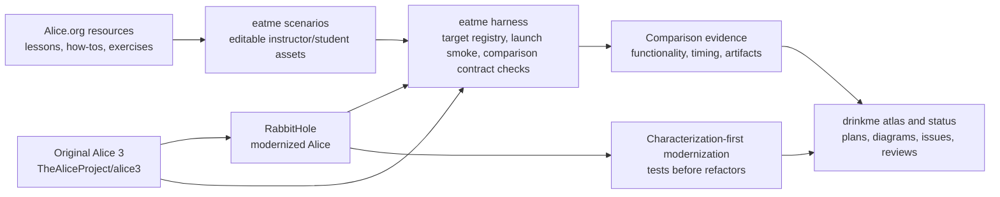
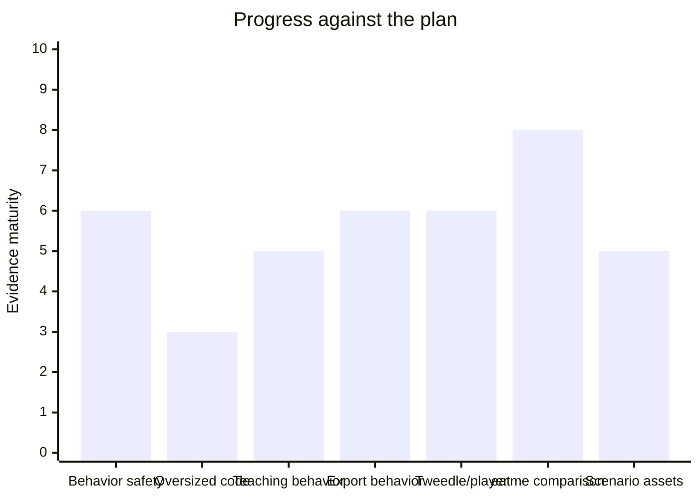
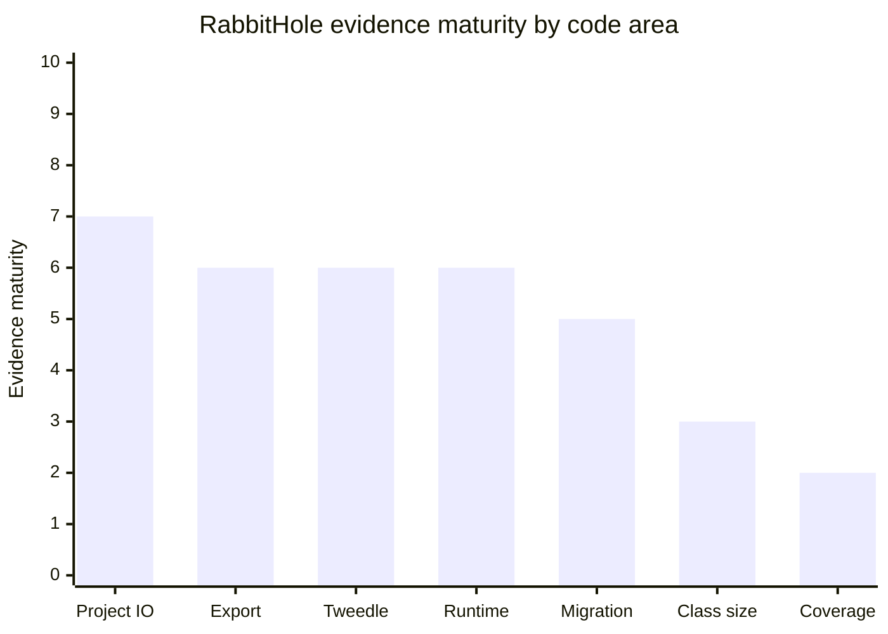
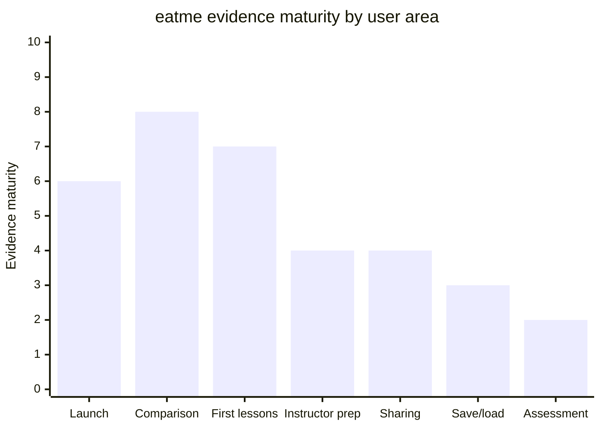
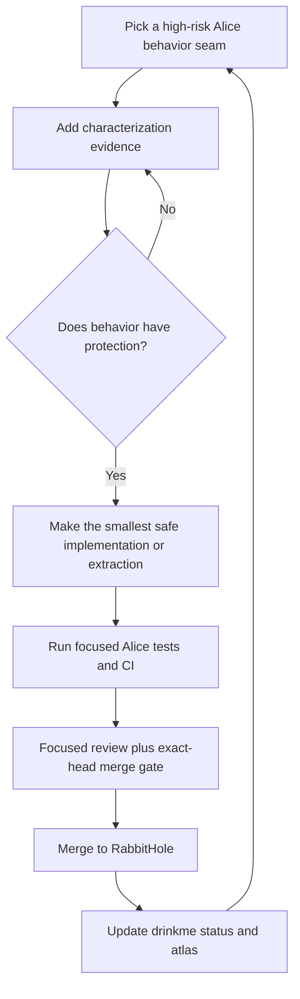
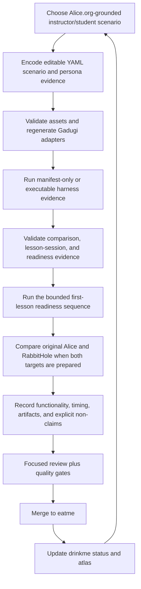

# drinkme

Private project map, evidence library, and coordination guide for modernizing
the [Alice 3 programming environment](https://github.com/TheAliceProject/alice3)
through [RabbitHole](https://github.com/rysweet/RabbitHole) and testing it with
the [eatme agentic Alice QA harness](https://github.com/rysweet/eatme).

This repository stores plans, atlas diagrams, evidence notes, prompts, and
status handoffs. Source changes belong in RabbitHole or eatme. Original Alice is
reference-only.

## One-page project map

## Current verdict

The project is making real progress, but it is not complete.

| Goal from the plan | Current evidence | Plain-language verdict |
| --- | --- | --- |
| Preserve Alice behavior before refactoring | Many characterization PRs merged across project IO, export, generated source, migration, Tweedle/player reads, and recovery seams. | A useful safety net exists, but coverage is still far below the long-term target. |
| Reduce risky oversized code safely | `ProjectMigrationManager` has protected reductions in [PR #118](https://github.com/rysweet/RabbitHole/pull/118) and [PR #123](https://github.com/rysweet/RabbitHole/pull/123); JSON project resource-entry writing was extracted in [PR #128](https://github.com/rysweet/RabbitHole/pull/128). | Refactoring has started. Many large production classes remain. |
| Prove teaching-facing project behavior | Save/load/export and classroom project behavior landed in [PR #119](https://github.com/rysweet/RabbitHole/pull/119), [PR #122](https://github.com/rysweet/RabbitHole/pull/122), and [PR #126](https://github.com/rysweet/RabbitHole/pull/126). | Headless and controlled evidence is growing. Full desktop use remains thin. |
| Prove exported project behavior | NetBeans/Ant evidence landed in [PR #124](https://github.com/rysweet/RabbitHole/pull/124), and generated launcher wiring with a JavaFX stub landed in [PR #130](https://github.com/rysweet/RabbitHole/pull/130). | Export behavior is better protected. Real JavaFX display/toolkit and deployed runtime behavior remain open. |
| Decode modern project/player formats | Field-only, primitive Tweedle, and sibling manifest type-resolution work landed in [PR #120](https://github.com/rysweet/RabbitHole/pull/120), [PR #121](https://github.com/rysweet/RabbitHole/pull/121), [PR #126](https://github.com/rysweet/RabbitHole/pull/126), and [PR #129](https://github.com/rysweet/RabbitHole/pull/129). | Basic paths are covered. Methods, constructors, complex initializers, and unresolved supertypes remain bounded gaps. |
| Build eatme into a baseline-vs-modernized harness | eatme now has target registry, comparison manifests, scorecards, required-path preflight, an embedded comparison contract, a lesson-session contract, CLI checkers, and a first-lesson readiness sequence in [PR #56](https://github.com/rysweet/eatme/pull/56), [PR #57](https://github.com/rysweet/eatme/pull/57), [PR #58](https://github.com/rysweet/eatme/pull/58), [PR #59](https://github.com/rysweet/eatme/pull/59), [PR #60](https://github.com/rysweet/eatme/pull/60), [PR #61](https://github.com/rysweet/eatme/pull/61), [PR #62](https://github.com/rysweet/eatme/pull/62), [PR #63](https://github.com/rysweet/eatme/pull/63), and [PR #64](https://github.com/rysweet/eatme/pull/64). | The harness can compare launch smoke, records the first-lesson session boundary, validates readiness artifacts, and can run the bounded readiness sequence. It does not yet run a full instructor/student lesson session. |
| Connect Alice.org scenarios to agentic tests | eatme has 31 editable scenario assets, 32 generated Gadugi adapters, 11 instructor personas, and 13 student personas. | The curriculum-facing asset corpus is broad. Real execution depth is still shallow. |

The chart is qualitative. It is a guide to evidence maturity, not a substitute
for coverage reports, CI logs, or comparison manifests.

## RabbitHole code areas

| Code area | Why it matters | Test coverage and refactor state | Evidence links | Next gap |
| --- | --- | --- | --- | --- |
| Project IO, save, load, backup, recovery | Data loss is the worst modernization failure mode. | Stronger headless characterization; JSON project resource-entry writing is split from the larger IO class; limited full UI side-effect coverage. | [backup/save/export flow #119](https://github.com/rysweet/RabbitHole/pull/119), [classroom round trip #122](https://github.com/rysweet/RabbitHole/pull/122), [primitive archive reads #126](https://github.com/rysweet/RabbitHole/pull/126), [resource entry extraction #128](https://github.com/rysweet/RabbitHole/pull/128), [backup atlas journal](docs/atlas/journal/0054-backup-recovery-io-path.md) | More real temporary-file and desktop-facing recovery paths. |
| NetBeans/exported project | Students and teachers depend on generated Java projects working outside the editor. | Compile and Ant behavior are covered; generated launcher wiring has a JavaFX-stub characterization; real JavaFX display/toolkit behavior remains open. | [Ant test-main #124](https://github.com/rysweet/RabbitHole/pull/124), [generated launcher stub #130](https://github.com/rysweet/RabbitHole/pull/130), [atlas testing roadmap](docs/atlas/diagrams/testing-roadmap-mermaid.svg), [NetBeans atlas entries](docs/atlas/journal/0034-netbeans-exported-build-contract.md) | Real JavaFX toolkit/display and deployed launcher behavior. |
| Tweedle/player/type decoding | Modern project/player archives need reliable program and type reads. | Field-only, primitive initializer, and sibling manifest user-type paths improved; unsupported boundaries are preserved. | [field-only decode #120](https://github.com/rysweet/RabbitHole/pull/120), [constructor boundary #121](https://github.com/rysweet/RabbitHole/pull/121), [primitive initializers #126](https://github.com/rysweet/RabbitHole/pull/126), [sibling type resolution #129](https://github.com/rysweet/RabbitHole/pull/129), [player read atlas](docs/atlas/journal/0058-player-export-json-resource-read.md) | Methods, constructors, complex expressions, and unresolved supertypes. |
| Generated source and runtime behavior | Alice worlds must generate Java that behaves, not just text that compiles. | Generated-source compile seams are protected; timer handler and automatic display callback evidence now cover more of the headless runtime path. | [timer-handler seam #125](https://github.com/rysweet/RabbitHole/pull/125), [automatic display time listener dispatch #127](https://github.com/rysweet/RabbitHole/pull/127), [startup flow diagram](docs/atlas/diagrams/startup-flow-mermaid.svg), [story API atlas](docs/atlas/journal/0049-story-api-generated-source.md) | More event/listener behavior and fuller playback evidence. |
| Migration and historical content | Teachers have old worlds and starter projects. Breaking them breaks trust. | Selected fixtures and migration seams are covered; generated JSON `.a3w` reading now includes sibling Tweedle types plus image payload; broad semantic migration remains thin. | [lagoon texture migration #117](https://github.com/rysweet/RabbitHole/pull/117), [migration extraction #118](https://github.com/rysweet/RabbitHole/pull/118), [migration helper #123](https://github.com/rysweet/RabbitHole/pull/123), [generated archive resources #131](https://github.com/rysweet/RabbitHole/pull/131) | More historical `.a3p`, `.a3c`, and `.a3w` behavior with committed fixtures. |
| Oversized production classes | Large classes slow review and hide regressions. | Protected reduction has begun, including one JSON project IO extraction, but many hotspots remain. | [text snippet extraction #118](https://github.com/rysweet/RabbitHole/pull/118), [mapping extraction #123](https://github.com/rysweet/RabbitHole/pull/123), [resource entry extraction #128](https://github.com/rysweet/RabbitHole/pull/128), [current state notes](docs/modernization/current-state-and-next-steps.md) | Continue only where characterization already protects behavior. |
| Coverage infrastructure | The 70 percent target must be measured honestly. | Ratchets and scorecards exist; aggregate coverage is still about 10 percent in the latest recorded audit. | [coverage/status work #94](https://github.com/rysweet/RabbitHole/pull/94), [current state notes](docs/modernization/current-state-and-next-steps.md) | Increase real coverage, not coverage-padding tests. |

## eatme user scenarios and agentic systems

eatme turns Alice.org teaching resources into editable assets and executable
evidence. The goal is a repeatable session where an instructor and students use
Alice against both original Alice and RabbitHole.

| User area | Alice/eatme scenario assets | Agentic system coverage | Current proof | Remaining work |
| --- | --- | --- | --- | --- |
| Launch readiness | [real-alice-launch-smoke](https://github.com/rysweet/eatme/blob/master/assets/scenarios/eatme/real-alice-launch-smoke.yaml) | eatme CLI packages Alice, starts Xvfb, launches Alice, records manifest, artifacts, assertions, and timing. | Baseline and RabbitHole both pass repeated launch-smoke comparisons after [PR #58](https://github.com/rysweet/eatme/pull/58). | This is startup evidence only. |
| Baseline-vs-modernized comparison | [comparison target registry](https://github.com/rysweet/eatme/blob/master/assets/alice-comparison-targets.yaml) | eatme comparison contract, lesson-session contract, target preflight, scorecard, diff, timing rules, `alice check-lesson-session`, `alice check-lesson-readiness`, and the first-lesson readiness sequence. | [PR #56](https://github.com/rysweet/eatme/pull/56), [#57](https://github.com/rysweet/eatme/pull/57), [#58](https://github.com/rysweet/eatme/pull/58), [#59](https://github.com/rysweet/eatme/pull/59), [#60](https://github.com/rysweet/eatme/pull/60), [#61](https://github.com/rysweet/eatme/pull/61), [#62](https://github.com/rysweet/eatme/pull/62), [#63](https://github.com/rysweet/eatme/pull/63), [#64](https://github.com/rysweet/eatme/pull/64) | Expand from checked readiness sequence to executable instructor/student lesson sessions. |
| First Alice lessons | [first-lessons-real-ui-actions](https://github.com/rysweet/eatme/blob/master/assets/scenarios/eatme/first-lessons-real-ui-actions.yaml), [building-a-scene-first-world](https://github.com/rysweet/eatme/blob/master/assets/scenarios/eatme/building-a-scene-first-world.yaml), [code-editor-first-run](https://github.com/rysweet/eatme/blob/master/assets/scenarios/eatme/code-editor-first-run.yaml) | Student and instructor personas define visible actions, reflections, artifact expectations, and checked readiness evidence. Gadugi adapters are generated. | Asset validation, generated-adapter freshness, readiness artifact checks, and the first-lesson readiness sequence pass after [PR #64](https://github.com/rysweet/eatme/pull/64). | Real UI action automation is still intentionally limited. |
| Instructor preparation | [instructor-lesson-materials-remix](https://github.com/rysweet/eatme/blob/master/assets/scenarios/eatme/instructor-lesson-materials-remix.yaml), [workshop-facilitator-live-studio](https://github.com/rysweet/eatme/blob/master/assets/scenarios/eatme/workshop-facilitator-live-studio.yaml) | Instructor personas model setup, facilitation, prompt cards, and classroom handoff. | Editable YAML assets and generated adapters exist. | Need executable instructor creates-assignment comparison. |
| Student artifact and sharing | [student-artifact-package-share-evidence](https://github.com/rysweet/eatme/blob/master/assets/scenarios/eatme/student-artifact-package-share-evidence.yaml), [teacher-community-sharing-loop](https://github.com/rysweet/eatme/blob/master/assets/scenarios/eatme/teacher-community-sharing-loop.yaml) | Student personas preserve reflection, ownership, sharing, and peer review evidence. | Scenario corpus covers packaging and sharing expectations. | Need actual open/change/run/save/share evidence against both targets. |
| Save/load/export preflight | [starter-project-open-save-export-preflight](https://github.com/rysweet/eatme/blob/master/assets/scenarios/eatme/starter-project-open-save-export-preflight.yaml) | eatme scenario language connects real Alice launch evidence to project artifact checks. | The scenario is ready for harness expansion. | Needs deeper execution beyond launch/action-contract evidence. |
| Assessment boundary | [instructor-student-outcomes-rubric](https://github.com/rysweet/eatme/blob/master/assets/scenarios/eatme/instructor-student-outcomes-rubric.yaml) | Agentic review language keeps claims honest. | Assets explicitly avoid automated creative assessment and student-world grading claims. | Human review or a much narrower rubric executor is needed before claims expand. |

## Processes being used

RabbitHole and eatme should not follow the same process. RabbitHole is
modernizing a large legacy desktop application. eatme is building an
outside-in harness that represents how instructors and students use Alice.

### RabbitHole: characterize before changing Alice

### eatme: model user scenarios, then compare targets

Hard rules:

- No upstream Alice issues or pull requests.
- No broad refactor before behavior is characterized.
- No completion claim while coverage, oversized classes, real user behavior,
  historical archives, and instructor/student comparison remain incomplete.
- Keep status in [drinkme issues](https://github.com/rysweet/drinkme/issues),
  not hidden in chat.
- Keep diagrams and code-atlas artifacts in [docs/atlas](docs/atlas/index.md).
- Keep this README current on every loop when project state, process diagrams,
  progress visuals, evidence links, or the RabbitHole/eatme strategy changes.

## Visual atlas

| Atlas view | What it shows |
| --- | --- |
| [Repository surface](docs/atlas/diagrams/repo-surface-mermaid.svg) | Main Alice module groups and modernization surface area. |
| [Startup flow](docs/atlas/diagrams/startup-flow-mermaid.svg) | How Alice launch paths connect to runtime behavior. |
| [Testing roadmap](docs/atlas/diagrams/testing-roadmap-mermaid.svg) | Characterization targets and evidence expansion paths. |
| [RabbitHole comparison harness wave](docs/atlas/journal/0065-rabbithole-compare-harness-wave.md) | Latest atlas journal for RabbitHole/eatme comparison evidence. |

## Tool and repository map

| Repository or tool | Role |
| --- | --- |
| [TheAliceProject/alice3](https://github.com/TheAliceProject/alice3) | Original upstream Alice source. Reference-only for this effort. |
| [rysweet/RabbitHole](https://github.com/rysweet/RabbitHole) | Active modernized Alice source repository. |
| [rysweet/eatme](https://github.com/rysweet/eatme) | Agentic instructor/student Alice QA harness and scenario assets. |
| [rysweet/drinkme](https://github.com/rysweet/drinkme) | Planning, atlas, review, and evidence repository. |
| [rysweet/gadugi-agentic-test](https://github.com/rysweet/gadugi-agentic-test) | Scenario adapter execution target used by generated Gadugi assets. |
| [rysweet/amplihack-recipe-runner](https://github.com/rysweet/amplihack-recipe-runner) | Supporting workflow runner used when orchestration needs repeatable process enforcement. |
| [rysweet/amplihack-memory-lib](https://github.com/rysweet/amplihack-memory-lib) | Supporting memory library used by the broader agentic workflow system when needed. |

## Where to go next

- Start with [current modernization state](docs/modernization/current-state-and-next-steps.md).
- Review [the modernization operating model](docs/modernization/operating-model.md).
- Inspect [the code atlas](docs/atlas/index.md).
- Read [the eatme implementation plan](docs/eatme/implementation-plan.md).
- Track live status in [issue #1](https://github.com/rysweet/drinkme/issues/1),
  [issue #2](https://github.com/rysweet/drinkme/issues/2), and
  [issue #3](https://github.com/rysweet/drinkme/issues/3).
