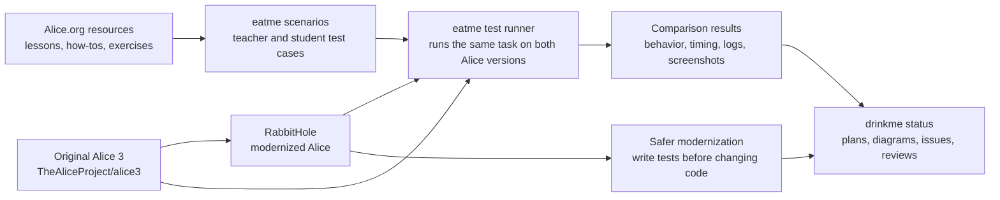
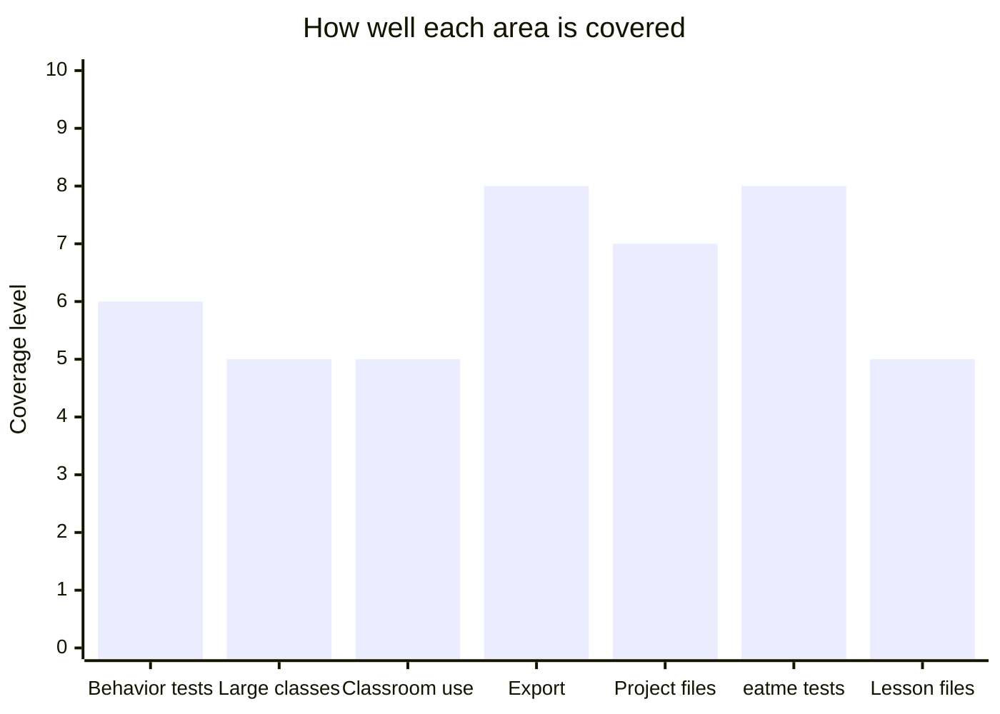
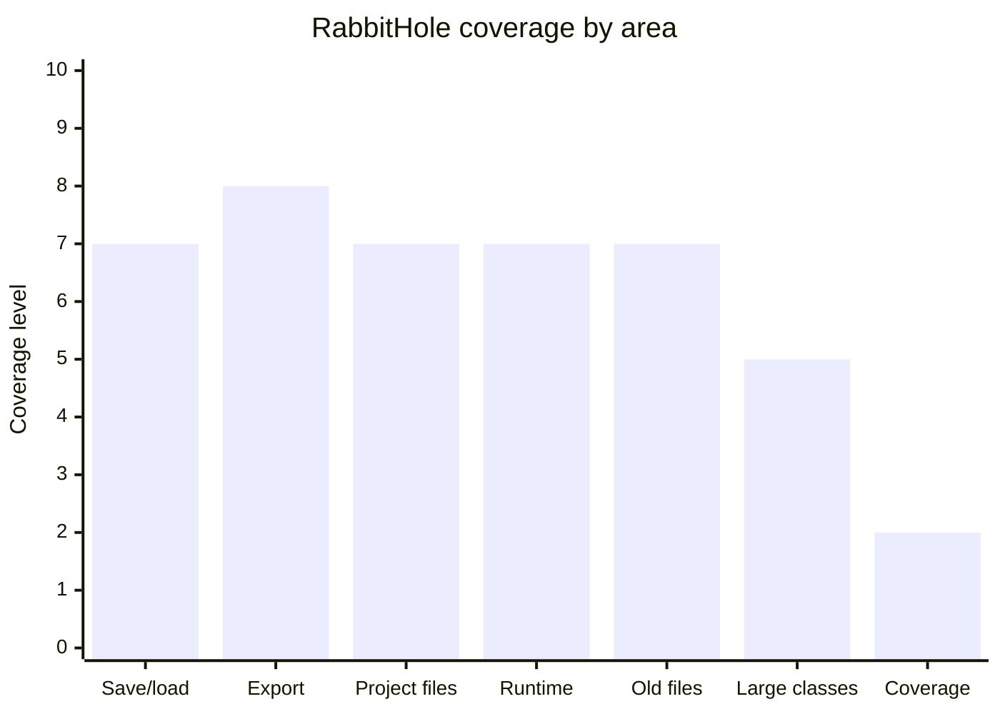
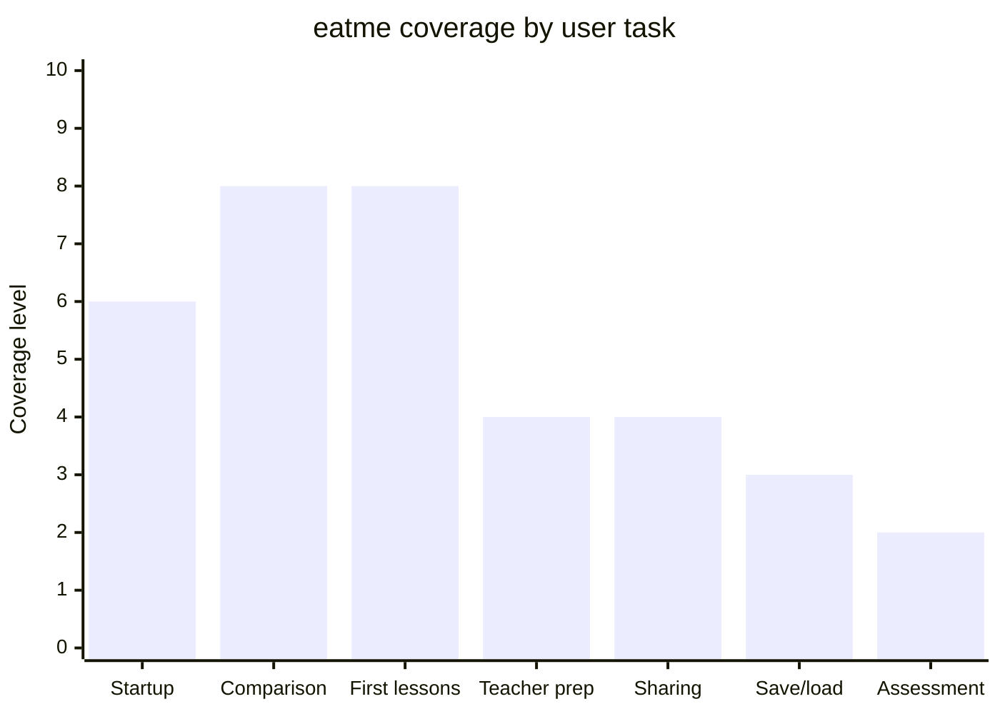
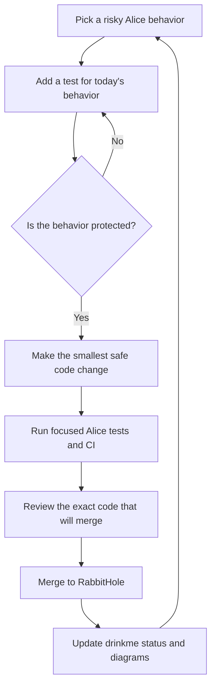
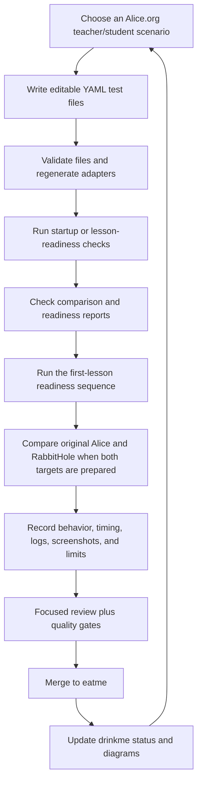

# drinkme

Private project map and status guide for modernizing the
[Alice 3 programming environment](https://github.com/TheAliceProject/alice3).

- [RabbitHole](https://github.com/rysweet/RabbitHole) is the modernized Alice
  source tree.
- [eatme](https://github.com/rysweet/eatme) is the test runner that compares
  original Alice with RabbitHole.
- drinkme keeps the plan, diagrams, links, and current status. Code changes
  belong in RabbitHole or eatme. Original Alice is only used as the reference.

## Plain-English terms

| Term | Meaning in this project |
| --- | --- |
| RabbitHole | The modernized Alice codebase. |
| eatme | The test runner that tries the same Alice task on original Alice and RabbitHole. |
| drinkme | The planning and status repository you are reading now. |
| Behavior test | A test that records what Alice does today so refactoring does not accidentally change it. |
| First-lesson readiness | Checks that the files, logs, screenshots, and window evidence needed for a first Alice lesson are present. It is not full lesson automation yet. |
| Tweedle/player files | Alice project/player file formats that RabbitHole must keep reading correctly. |

## One-page project map

## Current verdict

The project is making real progress, but it is not complete.

| Goal from the plan | What exists now | Plain-language verdict |
| --- | --- | --- |
| Preserve Alice behavior before refactoring | Many tests have been added around saving, loading, exporting, generated Java code, old project migration, Tweedle/player file reads, and recovery paths. [PR #140](https://github.com/rysweet/RabbitHole/pull/140) adds an old-archive boundary for unresolved parent types. | There is a useful safety net, but total test coverage is still far below the long-term target. |
| Reduce risky oversized code safely | `ProjectMigrationManager` has protected reductions in [PR #118](https://github.com/rysweet/RabbitHole/pull/118) and [PR #123](https://github.com/rysweet/RabbitHole/pull/123); JSON project resource writing was split out in [PR #128](https://github.com/rysweet/RabbitHole/pull/128); model resource array and joint-tree helpers were split out in [PR #135](https://github.com/rysweet/RabbitHole/pull/135) and [PR #137](https://github.com/rysweet/RabbitHole/pull/137); [PR #141](https://github.com/rysweet/RabbitHole/pull/141) turns missing or cyclic joint parents into a clear failure instead of a hang. | Cleanup has started. Many large production classes remain. |
| Protect classroom-facing project behavior | Save, load, export, and classroom project behavior landed in [PR #119](https://github.com/rysweet/RabbitHole/pull/119), [PR #122](https://github.com/rysweet/RabbitHole/pull/122), and [PR #126](https://github.com/rysweet/RabbitHole/pull/126). | More behavior is protected by automated tests. Full desktop use is still thin. |
| Protect exported projects | NetBeans/Ant checks landed in [PR #124](https://github.com/rysweet/RabbitHole/pull/124), generated launcher wiring with a JavaFX stub landed in [PR #130](https://github.com/rysweet/RabbitHole/pull/130), missing-JavaFX runtime failure is checked in [PR #132](https://github.com/rysweet/RabbitHole/pull/132), real OpenJFX modules now reach either `Program.main` or the specific headless display boundary in [PR #134](https://github.com/rysweet/RabbitHole/pull/134), Xvfb-backed OpenJFX launch reaches `Program.main` in [PR #138](https://github.com/rysweet/RabbitHole/pull/138), and [PR #142](https://github.com/rysweet/RabbitHole/pull/142) guards generated launchers from running `Program.main` with a null JavaFX `Stage`. | Export behavior is better protected. Real user-visible JavaFX display, rendering, installer launchers, and deployed runtime behavior remain open. |
| Keep Alice project/player files readable | Field-only, primitive Tweedle, sibling type-resolution, method-decode boundary, complex-initializer boundary, and unresolved-parent boundary work landed in [PR #120](https://github.com/rysweet/RabbitHole/pull/120), [PR #121](https://github.com/rysweet/RabbitHole/pull/121), [PR #126](https://github.com/rysweet/RabbitHole/pull/126), [PR #129](https://github.com/rysweet/RabbitHole/pull/129), [PR #136](https://github.com/rysweet/RabbitHole/pull/136), [PR #139](https://github.com/rysweet/RabbitHole/pull/139), and [PR #140](https://github.com/rysweet/RabbitHole/pull/140). | Basic file-read paths are covered and more unsupported gaps are explicitly checked. Full method/constructor decoding and complex values remain gaps. |
| Build eatme into a comparison test runner | eatme now has target setup, comparison reports, scorecards, path checks, lesson-session checks, readiness checks, a first-lesson readiness sequence, Alice window activation, a machine-readable place-object no-go probe, the exact missing object-placement affordance, and an Alice-side command-hook contract in [PR #56](https://github.com/rysweet/eatme/pull/56), [PR #57](https://github.com/rysweet/eatme/pull/57), [PR #58](https://github.com/rysweet/eatme/pull/58), [PR #59](https://github.com/rysweet/eatme/pull/59), [PR #60](https://github.com/rysweet/eatme/pull/60), [PR #61](https://github.com/rysweet/eatme/pull/61), [PR #62](https://github.com/rysweet/eatme/pull/62), [PR #63](https://github.com/rysweet/eatme/pull/63), [PR #64](https://github.com/rysweet/eatme/pull/64), [PR #65](https://github.com/rysweet/eatme/pull/65), [PR #66](https://github.com/rysweet/eatme/pull/66), [PR #67](https://github.com/rysweet/eatme/pull/67), and [PR #68](https://github.com/rysweet/eatme/pull/68). | eatme can compare startup behavior, check first-lesson evidence, activate the Alice window, and define the proof Alice must return for object placement. It does not yet place objects, edit code, run worlds, save projects, or run a full teacher/student lesson. |
| Turn Alice.org lessons into tests | eatme has 31 editable scenario files, 32 generated adapter files, 11 teacher role files, and 13 student role files. | The lesson library is broad. The actual automated execution is still shallow. |

The chart is a rough guide. It is not a replacement for coverage reports, CI
logs, or the comparison reports produced by eatme.

## RabbitHole code areas

| Code area | Why it matters | What is protected now | Links | What still needs work |
| --- | --- | --- | --- | --- |
| Saving, loading, backups, recovery | Data loss is the worst failure mode. | More headless tests exist; JSON resource writing was split out of a larger class; full desktop recovery coverage is still limited. | [backup/save/export flow #119](https://github.com/rysweet/RabbitHole/pull/119), [classroom round trip #122](https://github.com/rysweet/RabbitHole/pull/122), [primitive archive reads #126](https://github.com/rysweet/RabbitHole/pull/126), [resource entry extraction #128](https://github.com/rysweet/RabbitHole/pull/128), [backup and recovery notes](docs/atlas/journal/0054-backup-recovery-io-path.md) | More tests for real temporary files and desktop recovery behavior. |
| Exported projects | Students and teachers need generated Java projects to work outside Alice. | Compile and Ant behavior are covered; generated launcher wiring has a JavaFX-stub test; missing JavaFX classes fail before `Program.main`; real OpenJFX modules reach either `Program.main` or the specific headless display boundary; Xvfb-backed OpenJFX reaches `Program.main`; generated launchers now stop clearly if called with a null primary `Stage`. | [Ant test-main #124](https://github.com/rysweet/RabbitHole/pull/124), [generated launcher stub #130](https://github.com/rysweet/RabbitHole/pull/130), [missing JavaFX boundary #132](https://github.com/rysweet/RabbitHole/pull/132), [OpenJFX display boundary #134](https://github.com/rysweet/RabbitHole/pull/134), [Xvfb OpenJFX launcher #138](https://github.com/rysweet/RabbitHole/pull/138), [null Stage guard #142](https://github.com/rysweet/RabbitHole/pull/142), [testing roadmap](docs/atlas/diagrams/testing-roadmap-mermaid.svg), [NetBeans export notes](docs/atlas/journal/0034-netbeans-exported-build-contract.md) | Real user-visible JavaFX display, rendering, installer launchers, and deployed launcher behavior. |
| Project/player file reading | Modern Alice files must still open correctly. | Basic field, primitive value, sibling type, method-boundary, complex-initializer, and unresolved-parent boundary reads are improved; unsupported cases are still clearly marked. | [field-only read #120](https://github.com/rysweet/RabbitHole/pull/120), [constructor boundary #121](https://github.com/rysweet/RabbitHole/pull/121), [primitive values #126](https://github.com/rysweet/RabbitHole/pull/126), [sibling type resolution #129](https://github.com/rysweet/RabbitHole/pull/129), [method decode boundary #136](https://github.com/rysweet/RabbitHole/pull/136), [complex initializer boundary #139](https://github.com/rysweet/RabbitHole/pull/139), [unresolved parent boundary #140](https://github.com/rysweet/RabbitHole/pull/140), [player read notes](docs/atlas/journal/0058-player-export-json-resource-read.md) | Full methods, constructors, and complex expressions. |
| Generated Java and runtime events | Alice worlds must produce Java that compiles and behaves correctly. | Generated Java compilation is tested; timer, display-callback, and generated `TimeEvent` payload behavior have more headless coverage. | [timer handler #125](https://github.com/rysweet/RabbitHole/pull/125), [automatic display time listener dispatch #127](https://github.com/rysweet/RabbitHole/pull/127), [time event payload #133](https://github.com/rysweet/RabbitHole/pull/133), [startup flow diagram](docs/atlas/diagrams/startup-flow-mermaid.svg), [story API notes](docs/atlas/journal/0049-story-api-generated-source.md) | More event/listener behavior and fuller playback coverage. |
| Older projects and archives | Teachers may have old worlds and starter projects. Breaking them breaks trust. | Selected migration paths are tested; generated JSON `.a3w` reading now includes sibling Tweedle types plus image data; JSON player method, complex-initializer, and unresolved-parent boundaries are explicitly checked; broad migration coverage is still thin. | [lagoon texture migration #117](https://github.com/rysweet/RabbitHole/pull/117), [migration extraction #118](https://github.com/rysweet/RabbitHole/pull/118), [migration helper #123](https://github.com/rysweet/RabbitHole/pull/123), [generated archive resources #131](https://github.com/rysweet/RabbitHole/pull/131), [method decode boundary #136](https://github.com/rysweet/RabbitHole/pull/136), [complex initializer boundary #139](https://github.com/rysweet/RabbitHole/pull/139), [unresolved parent boundary #140](https://github.com/rysweet/RabbitHole/pull/140) | More historical `.a3p`, `.a3c`, and `.a3w` files with committed fixtures. |
| Large production classes | Large classes are hard to review and easy to break. | Protected cleanup has begun, including JSON project IO splits, model resource array helper extraction, model resource joint-tree helper extraction, and bounded failure for bad joint-tree parent data. | [text snippet extraction #118](https://github.com/rysweet/RabbitHole/pull/118), [mapping extraction #123](https://github.com/rysweet/RabbitHole/pull/123), [resource entry extraction #128](https://github.com/rysweet/RabbitHole/pull/128), [model resource array helpers #135](https://github.com/rysweet/RabbitHole/pull/135), [model resource joint tree helpers #137](https://github.com/rysweet/RabbitHole/pull/137), [joint parent guard #141](https://github.com/rysweet/RabbitHole/pull/141), [current state notes](docs/modernization/current-state-and-next-steps.md) | Continue cleanup only where tests already protect the behavior. |
| Test coverage | The 70 percent target must be measured honestly. | Coverage checks and scorecards exist; total coverage is still about 10 percent in the latest recorded audit. | [coverage/status work #94](https://github.com/rysweet/RabbitHole/pull/94), [current state notes](docs/modernization/current-state-and-next-steps.md) | Add real behavior tests, not padding. |

## eatme lesson scenarios and test coverage

eatme turns Alice.org teaching resources into test cases. The goal is a
repeatable run where a teacher and students use Alice, first with original Alice
and then with RabbitHole, so the results can be compared.

| User area | Alice/eatme files | What eatme can do now | Current proof | What still needs work |
| --- | --- | --- | --- | --- |
| Startup | [real-alice-launch-smoke](https://github.com/rysweet/eatme/blob/master/assets/scenarios/eatme/real-alice-launch-smoke.yaml) | Packages Alice, starts a virtual display, launches Alice, and records logs, screenshots, checks, and timing. | Original Alice and RabbitHole both pass repeated startup comparisons after [PR #58](https://github.com/rysweet/eatme/pull/58). | This only proves startup. |
| Original-vs-RabbitHole comparison | [comparison target registry](https://github.com/rysweet/eatme/blob/master/assets/alice-comparison-targets.yaml) | Runs checks for target setup, comparison reports, timing, lesson-session evidence, readiness evidence, the first-lesson readiness sequence, Alice window activation, the blocked object-placement action, the exact missing affordance, and the Alice-side command-hook proof contract. | [PR #56](https://github.com/rysweet/eatme/pull/56), [#57](https://github.com/rysweet/eatme/pull/57), [#58](https://github.com/rysweet/eatme/pull/58), [#59](https://github.com/rysweet/eatme/pull/59), [#60](https://github.com/rysweet/eatme/pull/60), [#61](https://github.com/rysweet/eatme/pull/61), [#62](https://github.com/rysweet/eatme/pull/62), [#63](https://github.com/rysweet/eatme/pull/63), [#64](https://github.com/rysweet/eatme/pull/64), [#65](https://github.com/rysweet/eatme/pull/65), [#66](https://github.com/rysweet/eatme/pull/66), [#67](https://github.com/rysweet/eatme/pull/67), [#68](https://github.com/rysweet/eatme/pull/68) | Add the Alice-side command or UI hook that returns real object-placement proof. |
| First Alice lessons | [first-lessons-real-ui-actions](https://github.com/rysweet/eatme/blob/master/assets/scenarios/eatme/first-lessons-real-ui-actions.yaml), [building-a-scene-first-world](https://github.com/rysweet/eatme/blob/master/assets/scenarios/eatme/building-a-scene-first-world.yaml), [code-editor-first-run](https://github.com/rysweet/eatme/blob/master/assets/scenarios/eatme/code-editor-first-run.yaml) | Teacher and student test files describe visible actions, reflections, expected files, readiness checks, Alice window activation, the missing affordance for object placement, and the proof files Alice must provide before object placement counts as done. Adapter files are generated. | Scenario validation, adapter freshness checks, readiness checks, the first-lesson readiness sequence, Alice window activation, the place-object no-go probe, the missing-affordance contract, and the object-placement hook contract pass after [PR #68](https://github.com/rysweet/eatme/pull/68). | Object placement, code editing, world run, and project save automation are still intentionally limited. |
| Teacher preparation | [instructor-lesson-materials-remix](https://github.com/rysweet/eatme/blob/master/assets/scenarios/eatme/instructor-lesson-materials-remix.yaml), [workshop-facilitator-live-studio](https://github.com/rysweet/eatme/blob/master/assets/scenarios/eatme/workshop-facilitator-live-studio.yaml) | Teacher test files describe setup, facilitation, prompt cards, and classroom handoff. | Editable YAML files and generated adapter files exist. | Need an executable comparison where a teacher creates or prepares an assignment. |
| Student files and sharing | [student sharing evidence](https://github.com/rysweet/eatme/blob/master/assets/scenarios/eatme/student-artifact-package-share-evidence.yaml), [teacher community sharing](https://github.com/rysweet/eatme/blob/master/assets/scenarios/eatme/teacher-community-sharing-loop.yaml) | Student test files describe reflection, ownership, sharing, and peer review expectations. | The scenario library covers packaging and sharing expectations. | Need real open/change/run/save/share evidence against both Alice versions. |
| Save/load/export setup | [starter project save/load/export check](https://github.com/rysweet/eatme/blob/master/assets/scenarios/eatme/starter-project-open-save-export-preflight.yaml) | The scenario connects Alice startup checks to project file checks. | The scenario is ready for deeper automation. | Needs deeper execution beyond startup and readiness checks. |
| Assessment limits | [instructor-student-outcomes-rubric](https://github.com/rysweet/eatme/blob/master/assets/scenarios/eatme/instructor-student-outcomes-rubric.yaml) | Review language keeps the project from claiming more than it proves. | Assets explicitly avoid automated creative assessment and student-world grading claims. | Human review or a narrow rubric runner is needed before claims expand. |

## How the work is done

RabbitHole and eatme use different workflows because they solve different
problems. RabbitHole changes a large desktop app. eatme builds tests around how
teachers and students use that app.

### RabbitHole: test behavior before changing Alice

### eatme: write lesson tests, then compare Alice versions

Hard rules:

- No upstream Alice issues or pull requests.
- No broad refactor before behavior is covered by tests.
- No completion claim while coverage, oversized classes, real user behavior,
  historical archives, and instructor/student comparison remain incomplete.
- Keep status in [drinkme issues](https://github.com/rysweet/drinkme/issues),
  not hidden in chat.
- Keep diagrams and code maps in [docs/atlas](docs/atlas/index.md).
- Keep this README current on every loop when project state, process diagrams,
  progress visuals, evidence links, or the RabbitHole/eatme strategy changes.

## Diagrams and code maps

| View | What it shows |
| --- | --- |
| [Repository surface](docs/atlas/diagrams/repo-surface-mermaid.svg) | Main Alice module groups and where modernization is happening. |
| [Startup flow](docs/atlas/diagrams/startup-flow-mermaid.svg) | How Alice launch paths connect to runtime behavior. |
| [Testing roadmap](docs/atlas/diagrams/testing-roadmap-mermaid.svg) | What behavior still needs tests. |
| [RabbitHole comparison test wave](docs/atlas/journal/0065-rabbithole-compare-harness-wave.md) | Notes for the first RabbitHole/eatme comparison work. |
| [JavaFX, archive, and first-lesson action boundaries](docs/atlas/journal/0066-javafx-archive-ui-action-boundaries.md) | Notes for the latest JavaFX launcher, archive, cleanup, and first-lesson boundary work. |
| [Xvfb launcher and object-placement contract](docs/atlas/journal/0067-xvfb-launcher-and-affordance-contract.md) | Notes for the latest Xvfb launcher proof and named object-placement affordance gap. |
| [Archive guards and object-placement hook contract](docs/atlas/journal/0068-archive-guards-and-object-placement-hook.md) | Notes for bounded archive/model failures, generated launcher null-Stage guard, and the eatme object-placement hook proof contract. |

## Tool and repository map

| Repository or tool | Role |
| --- | --- |
| [TheAliceProject/alice3](https://github.com/TheAliceProject/alice3) | Original upstream Alice source. Reference-only for this effort. |
| [rysweet/RabbitHole](https://github.com/rysweet/RabbitHole) | Active modernized Alice source repository. |
| [rysweet/eatme](https://github.com/rysweet/eatme) | Test runner for teacher/student Alice scenarios. |
| [rysweet/drinkme](https://github.com/rysweet/drinkme) | Planning, diagrams, review notes, and status. |
| [rysweet/gadugi-agentic-test](https://github.com/rysweet/gadugi-agentic-test) | Runner used by generated scenario adapter files. |
| [rysweet/amplihack-recipe-runner](https://github.com/rysweet/amplihack-recipe-runner) | Workflow runner used when the process needs to be repeatable. |
| [rysweet/amplihack-memory-lib](https://github.com/rysweet/amplihack-memory-lib) | Memory helper used by the broader automation workflow when needed. |

## Where to go next

- Start with [current modernization state](docs/modernization/current-state-and-next-steps.md).
- Review [the modernization operating model](docs/modernization/operating-model.md).
- Inspect [the code maps and diagrams](docs/atlas/index.md).
- Read [the eatme implementation plan](docs/eatme/implementation-plan.md).
- Track live status in [issue #1](https://github.com/rysweet/drinkme/issues/1),
  [issue #2](https://github.com/rysweet/drinkme/issues/2), and
  [issue #3](https://github.com/rysweet/drinkme/issues/3).
