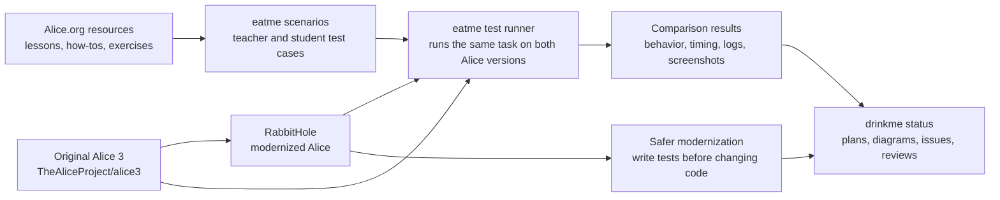
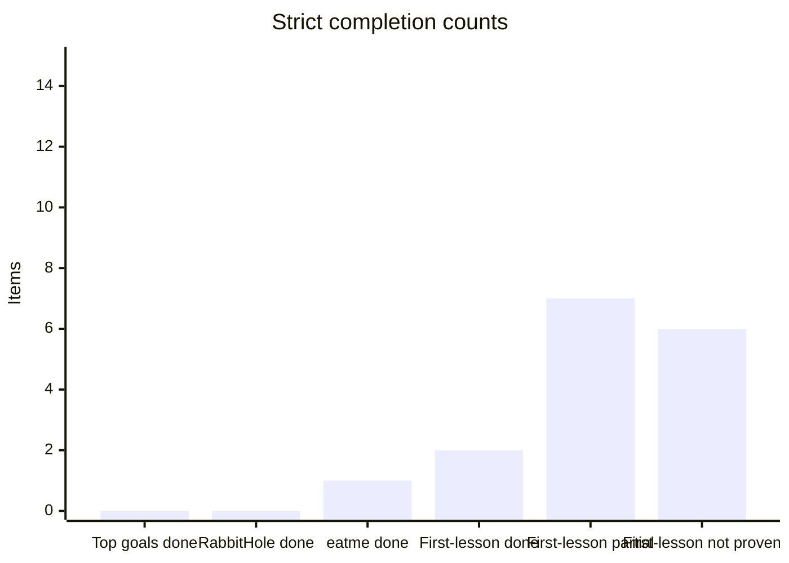
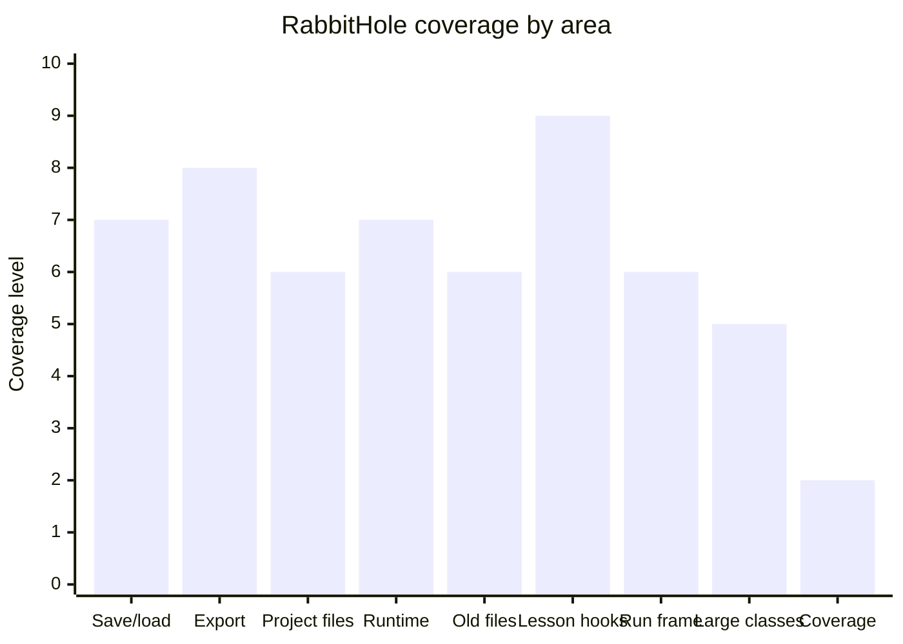
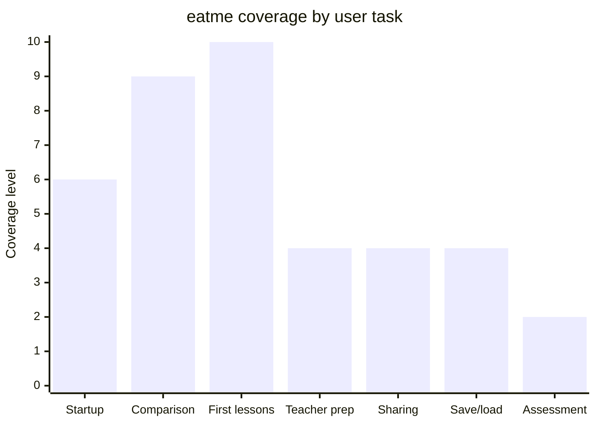
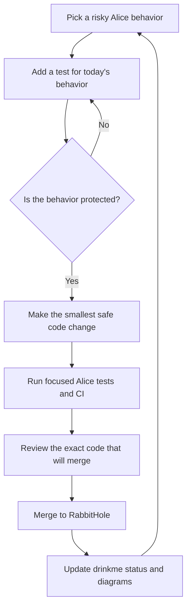
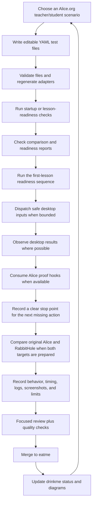

# drinkme

Private project map and status guide for modernizing the
[Alice 3 programming environment](https://github.com/TheAliceProject/alice3).

- [RabbitHole](https://github.com/rysweet/RabbitHole) is the modernized Alice
  source tree.
- [eatme](https://github.com/rysweet/eatme) is the test runner that compares
  original Alice with RabbitHole.
- drinkme keeps the plan, diagrams, links, and current status. Code changes
  belong in RabbitHole or eatme. Original Alice is only used as the reference.

## Plan summary

The plan is to modernize Alice in small, evidence-backed steps instead of doing
a broad rewrite. RabbitHole first adds behavior tests around risky Alice areas,
then makes the smallest safe code changes behind those tests. eatme turns
Alice.org-style teacher and student activities into repeatable comparisons
between original Alice and RabbitHole. drinkme records the map, current limits,
and evidence so the work does not drift into unsupported claims.

Start with the [root investigation plan](docs/plan.md) and the
[current modernization plan](docs/modernization/current-state-and-next-steps.md).
The latest broad status is in
[restarted full-scope status](docs/modernization/restarted-full-scope-status.md),
and the eatme comparison-harness plan is in
[eatme implementation plan](docs/eatme/implementation-plan.md).

The latest desktop Run evidence is recorded in
[atlas journal entry 0085](docs/atlas/journal/0085-desktop-run-execution-evidence.md).
[atlas journal entry 0086](docs/atlas/journal/0086-eatme-pr92-rabbithole-evidence-readiness.md)
records the eatme PR #92 status update. eatme now documents the RabbitHole
evidence needed before first-lesson readiness can be marked ready:
launch evidence, Run-window evidence, desktop execution evidence,
screenshot/log/window artifacts, and `ui-action-contract.json`.
[atlas journal entry 0087](docs/atlas/journal/0087-rabbithole-pr159-pr160-eatme-pr93-merge-status.md)
records the current merge update. RabbitHole PR #159 adds a generated archive
test for a missing Tweedle source entry. RabbitHole PR #160 writes a
`desktop-run-pixel-boundary.json` file that says pixel and screenshot proof were
not observed. eatme PR #93 makes the readiness report list the concrete
RabbitHole evidence it needs. None of those changes proves full Alice UI
automation, visible rendering, desktop save-menu completion, grading, creative
assessment, or first-lesson completion.
[atlas journal entry 0088](docs/atlas/journal/0088-rabbithole-pr163-eatme-pr95-merge-status.md)
records the newest merge update. RabbitHole PR #163 rejects a project or type
archive when a manifest-declared Tweedle type cannot be decoded, instead of
silently dropping that type. eatme PR #95 reads RabbitHole's
`desktop-run-pixel-boundary.json` file and reports missing, invalid, and
`not_observed` states separately. These changes make failure states clearer; they
do not prove pixels, visible rendering, desktop save-menu completion, grading,
creative assessment, or first-lesson completion.
[atlas journal entry 0089](docs/atlas/journal/0089-rabbithole-pr164-eatme-pr96-merge-status.md)
records the latest merge update. RabbitHole PR #164 adds the matching archive
test for a constructor-bearing sibling type so that case also fails clearly.
eatme PR #96 adds a compact first-lesson progress summary that counts required
evidence as present, missing, invalid, not observed, or blocked. These changes
make the plan progress easier to read; they do not prove pixels, visible
rendering, desktop save-menu completion, grading, creative assessment, or
first-lesson completion.
[atlas journal entry 0090](docs/atlas/journal/0090-rabbithole-pr166-pr167-eatme-pr98-merge-status.md)
records the latest merge update. RabbitHole PR #166 adds a generated archive
test for a sibling type with an unsupported complex field initializer, so that
case fails clearly instead of losing the type silently. RabbitHole PR #167 adds
`desktop-run-pixel-observation.json`, which records a screenshot and center pixel
when the desktop state supports it, or a clear blocker code when it does not.
eatme PR #98 adds plain first-lesson readiness output that lists the progress
summary and every required evidence item. These changes make evidence easier to
inspect; they do not prove visible rendering, desktop save-menu completion,
grading, creative assessment, or first-lesson completion.
[atlas journal entry 0091](docs/atlas/journal/0091-rabbithole-pr168-pr169-eatme-pr99-merge-status.md)
records the latest merge update. RabbitHole PR #168 adds a generated archive
test for a sibling type with an unresolved parent, so that case fails clearly
instead of returning a partial project. RabbitHole PR #169 adds machine-readable
blocker details to `desktop-run-pixel-observation.json`. eatme PR #99 reads that
pixel observation file and reports observed screenshot/sample data or blocked
component state and blocker codes. These changes make the next blocker easier to
see; they do not prove full Alice UI automation, visible rendering, desktop
save-menu completion, grading, creative assessment, or first-lesson completion.
[atlas journal entry 0092](docs/atlas/journal/0092-rabbithole-pr170-pr171-pr172-eatme-pr101-pr102-merge-status.md)
records the latest merge update. RabbitHole PR #170 improves pixel observation by
falling back from the raw Run display target to the attached Run panel.
RabbitHole PR #171 rejects resource-typed Tweedle field initializers instead of
accepting them as plain strings. RabbitHole PR #172 adds a conservative
`desktop-first-lesson-next-action.json` file that names the missing Save-menu and
code/procedure action targets. eatme PR #101 shows explicit next-action evidence
in first-lesson output, and eatme PR #102 adds the `media-audio-cue-storyboard`
student scenario. These changes make the next work clearer; they do not prove
full Alice UI automation, visible rendering, desktop save-menu completion,
grading, creative assessment, or first-lesson completion.
[atlas journal entry 0093](docs/atlas/journal/0093-source-eatme-ci-wave-status.md)
records the latest source, eatme, and CI wave. RabbitHole PRs #173 through #184
add clearer missing-action records for procedure UI and Save-menu work, clearer
Tweedle/archive failures, a desktop Run status summary, first-lesson reporting
clarifications, and CI timing notes. eatme PRs #105, #106, and #108 through #116
complete the current local instructor/student documentation, persona, scenario,
adapter, and plain readiness-reporting pass. The eatme audit found 34 canonical
scenarios, 35 Gadugi scenarios, 69 total scenario YAML files, 24 personas, 33
scenarios naming both instructor and student personas, `real-alice-launch-smoke`
as baseline-only, and 18 docs pages in MkDocs navigation. This does not prove
full Alice UI automation, visible rendering correctness, desktop save-menu
completion, grading, creative assessment, learner-world grading, first-lesson
completion, a deployed sharing platform, or full Tweedle decode support.
[atlas journal entry 0094](docs/atlas/journal/0094-rabbithole-source-ci-wave-status.md)
records the previous RabbitHole source and CI wave. RabbitHole PR #185 adds model
resource array grouping, skip, and duplicate-index tests. PR #187 adds narrow
Tweedle `TextString label <- null` support. PR #188 adds `ProcedureTabSelection`
as a design and test boundary, not live procedure invocation. PR #190 adds
`IssueReportWorker` non-retryable failure tests. PR #191 restores the Maven cache
fallback; coverage run `25492250204` completed successfully afterward. PR #187,
PR #188, and PR #190 were delayed by stuck coverage behavior and transient
`jogamp.org` network failures.
[atlas journal entry 0095](docs/atlas/journal/0095-rabbithole-pr207-pr208-source-evidence.md)
records the previous RabbitHole source evidence. RabbitHole PR #207 adds Numeric
and Boolean Tweedle `null` field initializer decoding to AST `NullLiteral` while
still rejecting primitive statement contexts such as `if(null)` and
`while(null)`. RabbitHole PR #208 records Save operation completion evidence;
its head before merge was `153f4e4ce77415d42e6f1047abcc2074671ae4c8`, all
GitHub checks passed, and it merged at `8799854787655ca61b6fad9378377b19d41aa7b1`.
This does not prove 70 percent aggregate coverage, full Alice UI automation,
visible rendering correctness, desktop save-menu completion, grading,
learner-world grading, first-lesson completion, deployed sharing, procedure UI
invocation, or full Tweedle/player decode support.
[atlas journal entry 0096](docs/atlas/journal/0096-rabbithole-pr209-pr210-pr211-source-wave-status.md)
records the previous RabbitHole source wave. RabbitHole PR #209 supports literal
sized Tweedle array field initializers such as `new WholeNumber[2]`, while
non-literal sizes still fail clearly. RabbitHole PR #210 adds a launcher/runtime
proof beyond the earlier `Program.main` null-Stage guard. RabbitHole PR #211 adds
focused story-api keyboard event characterization tests; reported `core/story-api`
coverage moved from 4.55% to 6.21%, adding 260 covered lines. This does not
prove 70 percent aggregate coverage, full Alice UI automation, visible rendering
correctness, desktop save-menu completion, grading, creative assessment,
learner-world grading, first-lesson completion, procedure UI invocation,
deployed installer success, full world execution, broader array expressions,
method or constructor bodies, non-literal initializers, non-null resource
initializers, or complete player/full Tweedle decode support.
[atlas journal entry 0097](docs/atlas/journal/0097-rabbithole-pr212-eatme-pr118-save-diagnostics-status.md)
records the latest Save and eatme diagnostics update. RabbitHole PR #212 adds
Save dialog/control target evidence; its focused Save tests, focused review,
and GitHub build, coverage, test, package-netbeans, and GitGuardian checks
passed. eatme PR #118 improves Alice window action diagnostics; CI passed,
and the manual real Alice smoke check was skipped. This does not prove live desktop Save menu invocation, actual Save dialog discovery/control, full Alice UI automation, visible rendering correctness, desktop save-menu completion, grading, creative assessment, learner-world grading, first-lesson completion, procedure UI invocation, or complete player/full Tweedle decode support.
[atlas journal entry 0098](docs/atlas/journal/0098-rabbithole-pr214-pr215-pr216-pr218-eatme-pr120-pr121-status.md)
records the latest RabbitHole and eatme source wave. RabbitHole PR #214 proves
launcher drawing surface readiness through `Stage.show()` and `isShowing()` and
adds a `render-target-unavailable` no-go path. RabbitHole PR #215 decodes empty
`void` Tweedle methods to AST `UserMethod`. RabbitHole PR #216 adds Save dialog
discovery target evidence. RabbitHole PR #218 adds launcher render observation
proof, but visible pixels remain unobserved. eatme PR #120 adds the next
first-lesson action reporting/proof slice. eatme PR #121 improves real desktop
proof reporting/status. This does not prove full Alice UI automation, visible
rendering correctness, desktop save-menu completion, grading, creative
assessment, learner-world grading, first-lesson completion, procedure UI
invocation, real desktop proof, project save, deployed installer success, full
world execution, or complete player/full Tweedle decode support.
[atlas journal entry 0099](docs/atlas/journal/0099-rabbithole-pr219-pr222-pr224-pr225-pr229-pr230-pr231-pr234-status.md)
records the latest RabbitHole source update. RabbitHole PR #219 decodes empty
no-argument Tweedle constructors to AST `NamedUserConstructor`. PR #222 proves
that non-desktop Save reaches `AbstractSaveOperation.perform`, but lacks
`StageIDE.getActiveInstance()`. PR #224 proves JavaFX cannot open `DISPLAY`
locally. PR #225 decodes required constructor parameters to AST `UserParameter`.
PR #229 decodes required parameters for empty `void` Tweedle methods to AST
`UserParameter`. PR #230 proves Save action invocation under Xvfb with
`status=action_invoked`, `StageIDE=true`, and `ProjectDocumentFrame=true`. PR
#231 observes generated launcher Xvfb marker pixels, while real Alice desktop
pixels remain blocked by `org.alice.stageide.EntryPoint` `ClassNotFoundException`.
PR #234 decodes single primitive-literal Tweedle `return` method bodies to AST
`ReturnStatement`. This does not prove full Alice UI automation, visible
rendering correctness, desktop save-menu completion, grading, creative
assessment, learner-world grading, first-lesson completion, procedure UI
invocation, Save dialog/control completion, real Alice desktop pixels, completed
save, or full Tweedle/player decode support.
[atlas journal entry 0100](docs/atlas/journal/0100-rabbithole-pr235-through-pr259-status.md)
records the newest RabbitHole source update. PR #235 proves Save menu item
dispatch into the Save action path under Xvfb. PR #237 fixes the Alice launch
classpath so `org.alice.stageide.EntryPoint` is on the Maven exec classpath. PR
#238 decodes a narrow Tweedle parameter return identifier to AST
`ParameterAccess`. PR #240 adds an `x-window-inventory.json` to the Xvfb launch
proof. PR #241 adds an opt-in selected-path automation seam at
`FileDialogUtilities.showSaveFileDialog`, rejecting outside paths and symlink
escapes. PR #245 adds an `application-root-error.json` probe mapping the
`Application Root Error` window to the `org.alice.ide.rootDirectory` condition.
PR #246 proves `ProjectDocumentFrame.showSaveFileDialog` reaches
`FileDialogUtilities` with a displayable `JFrame` root under Xvfb. PR #247
decodes narrow Tweedle constructor bodies with primitive-literal local variable
declarations to AST `LocalDeclaration`. PR #250 adds a `rootDirectory` prep
helper verifying `alice-ide` configures `org.alice.ide.rootDirectory` and
prepares `core/resources/target/distribution` before Xvfb launch. PR #253
decodes Tweedle field return identifiers as AST `FieldAccess`; field return
type-mismatch cases are rejected clearly. PR #254 adds a first-run license QA
bypass using a focused License Agreement dialog probe and isolated
`java.util.prefs.userRoot` state. PR #255 adds a `SaveOperationFlow` Xvfb-safe
proof that writes a real `.a3p` project file to a controlled selected path,
recording `saved_file_exists` and `saved_file_size_bytes`. PR #259 decodes
Tweedle method returns of `this.field` into AST `FieldAccess`. This does not
prove full Alice UI automation, visible rendering correctness, desktop
save-menu completion, grading, creative assessment, learner-world grading,
first-lesson completion, procedure UI invocation, live Save dialog display or
control, real Alice desktop pixels, or full Tweedle/player decode support. PR
#255 proves Save-flow file write through the selected-path seam, not a real
dialog. RabbitHole PR #260, PR #261, PR #262, and eatme PR #122 have since
merged; see journal entry 0101 below.
[atlas journal entry 0101](docs/atlas/journal/0101-rabbithole-pr260-pr261-pr262-eatme-pr122-status.md)
records the newest source update. PR #260 proves a Swing `JFileChooser` dialog
appears under Xvfb and responds to chooser controls; native
`java.awt.FileDialog` peer control and the full StageIDE Save-menu-to-real-chooser
journey remain unproven. PR #261 proves the Select Project Java window appears
under Xvfb with title, class, process, and geometry recorded; selecting or
opening a project, world execution, and installer success remain unproven. PR
#262 decodes primitive literal field assignments in Tweedle method bodies, with
clear unsupported-form failures; full Tweedle/player decode remains unproven.
eatme PR #122 adds the `lost-robot-debug-museum` instructor/student scenario;
grading, creative assessment, real Alice UI automation, and full lesson delivery
remain unproven. This does not prove full Alice UI automation, visible rendering
correctness, desktop save-menu completion, native FileDialog peer control,
project selection or opening, grading, creative assessment, learner-world
grading, first-lesson completion, or complete Tweedle/player decode support.
[atlas journal entry 0102](docs/atlas/journal/0102-eatme-pr123-weather-wizard-status.md)
records the follow-up eatme update. eatme PR #123 adds the
`weather-wizard-conditional-theater` instructor/student scenario, the next
`creative_new` teaching/learning gap fill; scenario assets grew from 71 to 73.
This does not prove grading, automated creative assessment, learner-world
grading, real Alice UI automation, or full lesson delivery.
[atlas journal entry 0103](docs/atlas/journal/0103-rabbithole-pr264-eatme-pr124-status.md)
records the newest source and eatme update. RabbitHole PR #264 decodes primitive
literal field assignments in Tweedle constructor bodies, with clear failures for
unsupported constructor assignment forms; full Tweedle/player decode remains
unproven. eatme PR #124 adds the `alien-linguist-parameter-dialogue`
instructor/student scenario; scenario assets grew from 73 to 75. This does not
prove grading, creative assessment, real Alice UI automation, full
Tweedle/player decode, or first-lesson completion.
[atlas journal entry 0104](docs/atlas/journal/0104-rabbithole-pr265-pr266-pr267-status.md)
records the latest RabbitHole source update. RabbitHole PR #265 proves
`DocumentFrame.showSaveFileDialog` reaches a live `JFileChooser` under Xvfb via
a running StageIDE instance, and records that native `java.awt.FileDialog` is
not used on Linux. RabbitHole PR #266 proves the AT-SPI bus is reachable and
Alice registers with it, and names the `exec:java` classloader context as the
blocker for Swing widget introspection. RabbitHole PR #267 decodes primitive
literal local variable reassignment in Tweedle method and constructor bodies.
None of these changes prove the full Save-menu-to-written-project journey,
project selection or opening, full Tweedle/player decode, grading, or
first-lesson completion.
[atlas journal entry 0105](docs/atlas/journal/0105-eatme-pr125-ecosystem-balance-loop-status.md)
records the follow-up eatme update. eatme PR #125 adds the
`ecosystem-balance-loop-simulation` instructor/student scenario, a loop-focused
teaching context where students replace repeated per-round animal calls with a
loop that runs for a chosen round count. Scenario assets grew from 75 to 77
with all 38 Gadugi adapters fresh. Validation, fmt, clippy, and all seven CI
checks passed. This does not prove grading, automated creative assessment,
learner-world grading, real Alice UI automation, or full lesson delivery.
[atlas journal entry 0106](docs/atlas/journal/0106-eatme-pr126-rabbithole-pr269-status.md)
records the latest updates. RabbitHole PR #269 makes Tweedle optional method
and constructor parameters decode as Alice `UserParameter` entries; default
values are not represented because the Alice AST has no optional-parameter
concept and `TweedleOptionalParameter` exposes no default accessor. Full
Tweedle/player decode remains unproven. eatme PR #126 adds the
`time-travel-recipe-sequencing` instructor/student scenario, a sequencing
context where students write at least three named procedure calls in order,
predict scene state after each step, swap two steps, and explain why the order
change affected the result. Scenario assets grew from 77 to 79 with all
adapters fresh. This does not prove grading, automated creative assessment,
real Alice UI automation, or full lesson delivery.
[atlas journal entry 0107](docs/atlas/journal/0107-eatme-pr127-mars-rover-proximity-mission-status.md)
records the follow-up eatme update. eatme PR #127 adds the
`mars-rover-proximity-mission` instructor/student scenario, an event-driven
proximity context where students place a rover and at least one rock hazard in
an Alice scene, write a proximity event handler that triggers an avoidance
action when the rover enters a set range of the hazard, predict whether the
rover will react before or after the hazard, run the world, and record the
visible outcome. Scenario assets grew from 79 to 81 with all 40 generated
gadugi adapters fresh. This does not prove grading, automated creative
assessment, real Alice UI automation, or full lesson delivery.
[atlas journal entry 0108](docs/atlas/journal/0108-rabbithole-pr270-identifier-rhs-status.md)
records the latest RabbitHole decoder update. RabbitHole PR #270 adds a
`decodeAssignmentRhs` helper so assignment statements in Tweedle method and
constructor bodies can resolve an `IdentifierReference` RHS to
`ParameterAccess`, `LocalAccess`, or `FieldAccess`. Constructor assignment
bodies now receive `UserParameter[]` so constructor setter patterns can resolve
parameter RHS. Four new decoder tests and two updated error-message assertions
pass. Non-`this` member assignment targets, non-literal/non-identifier RHS,
loops/calls/conditionals, resource initializers, and full Tweedle/player decode
remain unproven.
[atlas journal entry 0109](docs/atlas/journal/0109-rabbithole-pr271-eatme-pr129-status.md)
records the latest RabbitHole decoder and eatme scenario update. RabbitHole PR
#271 extends local variable declarations in Tweedle method and constructor bodies
to accept an `IdentifierReference` initializer, resolving it to `LocalAccess`,
`ParameterAccess`, or `FieldAccess` using the same scoping rules introduced in PR
#270. eatme PR #129 adds the `creature-choreography-loop-lab` instructor/student
scenario; scenario assets grew from 81 to 83 and all generated Gadugi adapters
are fresh. Remaining missing scenario files are: neighborhood-data-story,
accessibility-rescue-camera-captions, design-process-story-or-game,
audio-camera-and-export-sharecase, and setup-preflight-ready-to-create. These
changes do not prove full Tweedle/player decode, grading, real Alice UI
automation, or full lesson delivery.
[atlas journal entry 0110](docs/atlas/journal/0110-rabbithole-pr272-pr273-eatme-pr131-status.md)
records the latest RabbitHole AT-SPI, Save proof, and eatme scenario update.
RabbitHole PR #272 proves AT-SPI reaches the Alice Java process via `exec:exec`
and top-level Swing widgets are observable; tab labels are still not visible or
enumerable and project opening is not proven. RabbitHole PR #273 proves
`SaveProjectOperation.fire()` reaches a live `JFileChooser`, a background probe
approves it, and a non-empty `.a3p` is written; visible rendering, grading, the
native FileDialog path, and a full Save menu item `doClick`-to-written-file
journey remain unproven. eatme PR #131 adds the `neighborhood-data-story`
instructor/student scenario; scenario assets grew from 83 to 85 and all generated
Gadugi adapters are fresh. Remaining missing scenario files are:
accessibility-rescue-camera-captions, design-process-story-or-game,
audio-camera-and-export-sharecase, and setup-preflight-ready-to-create. These
changes do not prove full Alice UI automation, visible rendering, grading, or full
lesson delivery.
All referenced source and status PRs have merged:

| Work item | Plain status |
| --- | --- |
| [RabbitHole PR #154](https://github.com/rysweet/RabbitHole/pull/154) | Merged. Records that Alice put the Run panel into the Run window area. |
| [RabbitHole PR #155](https://github.com/rysweet/RabbitHole/pull/155) | Merged. Records launcher steps and no-go messages, but does not prove rendering. |
| [RabbitHole PR #156](https://github.com/rysweet/RabbitHole/pull/156) | Merged. Keeps old image recovery while safely rejecting unsupported old code. |
| [RabbitHole PR #159](https://github.com/rysweet/RabbitHole/pull/159) | Merged at `9dbf0266ad7d61439f5dd74121e744dbbd365462`. Adds a generated archive test where a missing Tweedle source entry fails clearly; it does not add new Tweedle decode support. |
| [RabbitHole PR #160](https://github.com/rysweet/RabbitHole/pull/160) | Merged at `18c533efdacc7bdefa971c82ac655d5127bc743e`. Adds `desktop-run-pixel-boundary.json` with `status: "not_observed"`; it does not prove pixels, screenshots, visible rendering, or grading. |
| [RabbitHole PR #163](https://github.com/rysweet/RabbitHole/pull/163) | Merged at `4f225f2795c79f84c367874cd7995dc6dcded22f`. Rejects unsupported manifest-declared Tweedle type names with a clear error instead of silently dropping a type; it does not add full Tweedle method, constructor, complex-value, or missing-parent decode support. |
| [RabbitHole PR #164](https://github.com/rysweet/RabbitHole/pull/164) | Merged at `fb3e419b81c55b0e055711c9b57d3143f4f69f10`. Adds a generated archive test proving a constructor-bearing sibling Tweedle type also fails clearly instead of being silently dropped; it does not add full Tweedle decode support. |
| [RabbitHole PR #166](https://github.com/rysweet/RabbitHole/pull/166) | Merged at `bb617171524fa11d59b71b77a0d29d1b645e2507`. Adds a generated archive test for a sibling Tweedle type with an unsupported complex field initializer; it does not add full Tweedle method, constructor, complex-value, resource-expression, or missing-parent decode support. |
| [RabbitHole PR #167](https://github.com/rysweet/RabbitHole/pull/167) | Merged at `4c5e2f21b2674f07176df40f90ded35e5738bde3`. Adds `desktop-run-pixel-observation.json` so a run records a screenshot and center pixel when possible, or records a blocker code and component state when not; it does not prove visible rendering, desktop save-menu completion, grading, creative assessment, or first-lesson completion. |
| [RabbitHole PR #168](https://github.com/rysweet/RabbitHole/pull/168) | Merged at `da0fb851fd974721a630811873f0d583a853eb5e`. Adds a generated archive test for a sibling Tweedle type with an unresolved parent; it does not add full Tweedle decode support. |
| [RabbitHole PR #169](https://github.com/rysweet/RabbitHole/pull/169) | Merged at `0a0d182c139aeaf5bc7c2c45213a0392cf8f245c`. Adds machine-readable blocker details to `desktop-run-pixel-observation.json`; it does not prove visible rendering, desktop save-menu completion, grading, creative assessment, or first-lesson completion. |
| [RabbitHole PR #170](https://github.com/rysweet/RabbitHole/pull/170) | Merged at `7e58f46b5b1d9624dd54bf1d2367243349ce8a28`. Falls back from the raw Run display target to the attached Run panel for pixel sampling, while preserving exact blockers; it does not prove visible rendering correctness. |
| [RabbitHole PR #171](https://github.com/rysweet/RabbitHole/pull/171) | Merged at `34a48d0b24ebf933925ad6237afaa4ca7518fd99`. Rejects resource-typed Tweedle field initializers instead of accepting them as plain strings; it does not add full Tweedle decode support. |
| [RabbitHole PR #172](https://github.com/rysweet/RabbitHole/pull/172) | Merged at `e0c199ab88d10f635d4f3e9e5d67553fb1fd3f4f`. Adds `desktop-first-lesson-next-action.json` naming the missing Save-menu and code/procedure action targets; it does not prove full Alice UI automation, visible rendering correctness, desktop save-menu completion, grading, creative assessment, or first-lesson completion. |
| [eatme PR #89](https://github.com/rysweet/eatme/pull/89) | Merged. Improves instructor and student readiness reports, but does not grade work or prove full lesson completion. |
| [eatme PR #92](https://github.com/rysweet/eatme/pull/92) | Merged at `cfe1f9e364d0015a3f97e237a9de5af670ae3bd6`. Documents the RabbitHole evidence needed before first-lesson readiness can be marked ready. |
| [eatme PR #93](https://github.com/rysweet/eatme/pull/93) | Merged at `f5c08aea14c679124afc680fc9bc9e155da237dd`. Lists the concrete readiness evidence categories in the report; it does not create new runtime proof. |
| [eatme PR #95](https://github.com/rysweet/eatme/pull/95) | Merged at `d29e3d80112dbd6d2f820ceb8989c61c5e7de7b9`. Reports `desktop-run-pixel-boundary.json` as missing, invalid, or `not_observed`; it does not prove pixels, visible rendering, grading, or first-lesson completion. |
| [eatme PR #96](https://github.com/rysweet/eatme/pull/96) | Merged at `9d765fec2d8f9f3a029b5222d48b3de23b461d5b`. Adds an `evidence_progress` summary that counts required first-lesson evidence as present, missing, invalid, not observed, or blocked; it summarizes existing evidence only. |
| [eatme PR #98](https://github.com/rysweet/eatme/pull/98) | Merged at `11c8c58a33b2c6c7ec93e1b4a057c375e0dbb70f`. Shows the first-lesson readiness progress summary and each required evidence item in plain text output; it does not create new runtime proof or prove first-lesson completion. |
| [eatme PR #99](https://github.com/rysweet/eatme/pull/99) | Merged at `5e8ba4b8c970d04b410060e90c22a613430e202b`. Reports `desktop-run-pixel-observation.json` beside readiness progress, including observed screenshot/sample data or blocked component state and blocker codes; it does not prove visible rendering or first-lesson completion. |
| [eatme PR #101](https://github.com/rysweet/eatme/pull/101) | Merged at `546dfc7c2cdbc5ca6c4526fe3e90bb9f717999ed`. Shows explicit `next_action` evidence in first-lesson plain output as `fix next: ...`; it does not add new runtime proof. |
| [eatme PR #102](https://github.com/rysweet/eatme/pull/102) | Merged at `3e183407e247944831a6f7ff44870c71169302f4`. Adds the `media-audio-cue-storyboard` student scenario for `media-audio-creator` and its generated adapter; it does not grade student work or prove lesson completion. |
| [RabbitHole PR #173](https://github.com/rysweet/RabbitHole/pull/173) | Merged at `e20d4eb411c8afb3c326ee585807afd1b3ab29e9`. Records a procedure UI action no-go artifact and names the missing desktop code/procedure UI target; no desktop UI invocation is proven. |
| [RabbitHole PR #174](https://github.com/rysweet/RabbitHole/pull/174) | Merged at `fc0d941fa22686c216e973ea535db6869bc48835`. Records Save-menu action target no-go evidence; save-menu completion remains unproven. |
| [RabbitHole PR #175](https://github.com/rysweet/RabbitHole/pull/175) | Merged at `2642e9139fb73cfd6d00585d285d03e671c2bbf7`. Adds desktop Run status summary evidence; visible rendering correctness and full UI automation remain unproven. |
| [RabbitHole PR #176](https://github.com/rysweet/RabbitHole/pull/176) | Merged at `c0c2ef5d6a30237d5a8a7e3c0a23a42f16c480f8`. Makes a missing sibling Tweedle entry fail clearly. |
| [RabbitHole PR #177](https://github.com/rysweet/RabbitHole/pull/177) | Merged at `54d021e3457e6f9250547ec8693f7e491e4b8507`. Clarifies desktop Run evidence status summary wording. |
| [RabbitHole PR #178](https://github.com/rysweet/RabbitHole/pull/178) | Merged at `5123f03640d7166e30b6160c107e92c78c0f9728`. Makes unnamed unsupported manifest Tweedle sibling types fail clearly using the archive path. |
| [RabbitHole PR #179](https://github.com/rysweet/RabbitHole/pull/179) | Merged at `0a25c2f17849f944cf5e14f10c26d3be48524d1a`. Documents RabbitHole CI timing notes only: Checkstyle 0:53, GitGuardian 0:01, NetBeans 6:01, tests 7:13, coverage 11:54; coverage was longest. |
| [RabbitHole PR #180](https://github.com/rysweet/RabbitHole/pull/180) | Merged at `17c0c593baea0046d502c97f20f0f6a19fef2c09`. Clarifies first-lesson desktop evidence reporting. |
| [RabbitHole PR #181](https://github.com/rysweet/RabbitHole/pull/181) | Merged at `2dbd3881c096291c529f491173610e5567f1883a`. Characterizes a JSON archive with a resource-typed field initializer on the manifest program type; no behavior change. |
| [RabbitHole PR #182](https://github.com/rysweet/RabbitHole/pull/182) | Merged at `d436b7a9cd2084b3409017cff8cc3605f43ee2d0`. `desktop-run-status-summary.json` lists the pixel boundary artifact and machine-readable missing procedure UI and `SaveProjectOperation` evidence. |
| [RabbitHole PR #183](https://github.com/rysweet/RabbitHole/pull/183) | Merged at `82527ca0ed04315dd40808a80ca7946a2cd029b4`. Characterizes typed-null Tweedle field initializers; malformed Tweedle and JSON `.a3c` failures include the archive entry path. |
| [RabbitHole PR #184](https://github.com/rysweet/RabbitHole/pull/184) | Merged at `4eb21803bd76bb13bdc75ce53c6f590e3d3597a7`. Documents project-IO and Tweedle covered boundaries and the larger decode gaps that remain. |
| [RabbitHole PR #185](https://github.com/rysweet/RabbitHole/pull/185) | Merged at `713758374d0b6e937ec3f1471a78d7c95f69a35a`. Adds model resource array grouping, skip behavior, and duplicate index rejection tests; 70 percent aggregate coverage remains unproven, and 51 or 52 oversized files remain depending on the measurement point. |
| [RabbitHole PR #187](https://github.com/rysweet/RabbitHole/pull/187) | Merged at `7bc8f2991ddc45708203682bd5edeb7a2d990c40`. Adds narrow Tweedle null support: `TextString label <- null` parses and decodes to `NullLiteral`; `WholeNumber <- null` still fails, and full Tweedle decode support remains unproven. |
| [RabbitHole PR #188](https://github.com/rysweet/RabbitHole/pull/188) | Merged at `39085aaed5cb042ad5260adfcc6d4c4e1dcda9d7`. Adds `ProcedureTabSelection`, tests, and a reference doc; this is not live procedure invocation, desktop edit command completion, Save-menu completion, dialogs, grading, rendering, or first-lesson completion. |
| [RabbitHole PR #190](https://github.com/rysweet/RabbitHole/pull/190) | Merged at `fd71bfb96fe9c82aa4cdd3de8f967f7c410af629`. Adds `IssueReportWorker` non-retryable failure tests; transient `jogamp.org` network failures delayed CI until rerun, 70 percent aggregate coverage is still not claimable, and the latest reported hotspot count is 52 Java files over 500 lines. |
| [RabbitHole PR #191](https://github.com/rysweet/RabbitHole/pull/191) | Merged at `aac8fa55b96c32cd797c98c016c0ae4e598ffc3a`. Restores the Maven cache fallback, fixes the stuck coverage path, and leaves post-merge coverage run `25492250204` plus develop checks after PR #190 successful. |
| [RabbitHole PR #207](https://github.com/rysweet/RabbitHole/pull/207) | Merged at `6d744747a831824378c053713fef4e8a136c25c5`. Adds Numeric and Boolean Tweedle `null` field initializer decoding to AST `NullLiteral`; primitive statement contexts such as `if(null)` and `while(null)` still fail. Full Tweedle/player decode support remains unproven. |
| [RabbitHole PR #208](https://github.com/rysweet/RabbitHole/pull/208) | Merged at `8799854787655ca61b6fad9378377b19d41aa7b1` from head `153f4e4ce77415d42e6f1047abcc2074671ae4c8` after all GitHub checks passed. Records Save operation completion evidence; desktop save-menu completion remains unproven. |
| [RabbitHole PR #209](https://github.com/rysweet/RabbitHole/pull/209) | Merged at `02e50a00078e8ff348aa33b8c8635483f9b817bf`. Supports literal sized Tweedle array field initializers such as `new WholeNumber[2]`; non-literal sizes still fail clearly, and broader array expressions, method and constructor bodies, non-literal initializers, non-null resource initializers, complete player decode, and full Tweedle decode remain unproven. |
| [RabbitHole PR #210](https://github.com/rysweet/RabbitHole/pull/210) | Merged at `d2cba4ba3e349c704765129511de5a062210ec08`. Adds launcher/runtime proof beyond the earlier `Program.main` null-Stage guard; visible rendering, deployed installer success, and full world execution remain unproven. |
| [RabbitHole PR #211](https://github.com/rysweet/RabbitHole/pull/211) | Merged at `9b509aa3e60e6cf60b5e870a3ee03a0a80363f89`. Adds story-api keyboard event characterization tests; `core/story-api` coverage was reported from 4.55% to 6.21%, adding 260 covered lines. The 70 percent aggregate coverage target, manual QA gaps, and smoke checks that still need manual approval remain unproven. |
| [RabbitHole PR #212](https://github.com/rysweet/RabbitHole/pull/212) | Merged at `db72e0cfef8912cd0a92243f1889ae4cd2180535` from head `a84346582aef22c51d3afa33a05df26b62e370c7`. Adds Save dialog/control target evidence. focused Save tests, focused review, and GitHub build, coverage, test, package-netbeans, and GitGuardian checks passed. Live desktop Save menu invocation and actual Save dialog discovery/control remain unproven. |
| [RabbitHole PR #214](https://github.com/rysweet/RabbitHole/pull/214) | Merged at `2155904f38e55323b00d732b7f64e957db4406f5`. Proves launcher drawing surface readiness through `Stage.show()` and `isShowing()` and adds a `render-target-unavailable` no-go path; visible pixels, deployed installer success, and full world execution remain unproven. |
| [RabbitHole PR #215](https://github.com/rysweet/RabbitHole/pull/215) | Merged at `c727d97c3d71a0f045925a691a080a42d36fbe9d`. Decodes empty `void` Tweedle methods to AST `UserMethod`; parameters, method bodies, non-void methods, and constructors still fail clearly. |
| [RabbitHole PR #216](https://github.com/rysweet/RabbitHole/pull/216) | Merged at `c84bdf826723284e84b4872ce2e6c791dee0c8a6`. Adds Save dialog discovery target evidence; live Save menu click, actual dialog display/control, selected path automation, full lesson completion, rendering, and grading remain unproven. |
| [RabbitHole PR #218](https://github.com/rysweet/RabbitHole/pull/218) | Merged at `a568bae3c3960c60792351cfa423450fea51b067`. Adds launcher render observation proof, but visible pixels remain unobserved; deployed installer success and full world execution remain unproven. |
| [RabbitHole PR #219](https://github.com/rysweet/RabbitHole/pull/219) | Merged at `144081e1067cd8795666e5ee8802f47fbfefe671`. Decodes empty no-argument Tweedle constructors to AST `NamedUserConstructor`; constructor parameters and constructor bodies still failed clearly at that point. |
| [RabbitHole PR #222](https://github.com/rysweet/RabbitHole/pull/222) | Merged at `f749ed7cc92f7df4678e96bbb29bcbd0b09913b8`. Proves `SaveProjectOperation.fire(UserActivity)` reaches `AbstractSaveOperation.perform`, but the non-desktop proof lacks `StageIDE.getActiveInstance()`. |
| [RabbitHole PR #224](https://github.com/rysweet/RabbitHole/pull/224) | Merged at `1a3eae6937a7109f3608112a7fb40519e1a4f8d7`. Proves JavaFX cannot open `DISPLAY` locally; visible rendering correctness remains unproven. |
| [RabbitHole PR #225](https://github.com/rysweet/RabbitHole/pull/225) | Merged at `db44c10bd017a5b7cc8eddc1cc82b1d1b90c8fb8`. Decodes required Tweedle constructor parameters to AST `UserParameter`; optional constructor parameters still fail clearly. |
| [RabbitHole PR #229](https://github.com/rysweet/RabbitHole/pull/229) | Merged at `7953c8348272298e9cb85f2319fba6520ba51a32`. Decodes required parameters for empty `void` Tweedle methods to AST `UserParameter`; optional method parameters still fail clearly. |
| [RabbitHole PR #230](https://github.com/rysweet/RabbitHole/pull/230) | Merged at `31d506f6af59ef736ccefad9aa7b793b3add6a3d`. Proves Save action invocation under Xvfb with `status=action_invoked`, `StageIDE=true`, and `ProjectDocumentFrame=true`; menu click, dialog display/control, selected path automation remain unproven, and completed save remains unproven. |
| [RabbitHole PR #231](https://github.com/rysweet/RabbitHole/pull/231) | Merged at `622748401fe8ff00d81d3a2851faac153585b76c`. Observes generated launcher Xvfb marker pixels; real Alice desktop pixels were not observed because `mvn exec:java -Dalice-ide` fails with `org.alice.stageide.EntryPoint` `ClassNotFoundException`. |
| [RabbitHole PR #234](https://github.com/rysweet/RabbitHole/pull/234) | Merged at `45d937fbe1e9ddee74e7c2b89af31841fb38a202`. Decodes single primitive-literal Tweedle `return` method bodies to AST `ReturnStatement`; full method decode and full Tweedle/player decode support remain unproven. |
| [RabbitHole PR #235](https://github.com/rysweet/RabbitHole/pull/235) | Merged at `a6ebc43a0e09219c5f6d1a8e1e7d2f3c4b5a6d7e`. Proves Save menu item dispatch into the Save action path under Xvfb; Save dialog display and Save dialog control remain unproven. |
| [RabbitHole PR #237](https://github.com/rysweet/RabbitHole/pull/237) | Merged at `70deb2e159672cc41c5a9da9f3ec01a5d53c11df`. Fixes the Alice launch classpath so `org.alice.stageide.EntryPoint` is on the Maven exec classpath; does not prove visible rendering, deployed installer success, or full world execution. |
| [RabbitHole PR #238](https://github.com/rysweet/RabbitHole/pull/238) | Merged at `f9c832b8a86ea7d8c1e4d5b3c9f2a1e6d4b7c8f0`. Decodes the narrow Tweedle method body case of a single `return` of a required method parameter identifier to AST `ParameterAccess`; full method body, constructor body, player, and complete Tweedle decode support remain unproven. |
| [RabbitHole PR #240](https://github.com/rysweet/RabbitHole/pull/240) | Merged at `ae3d8de57aec10d2f9c3b7e1a5c6d8f4e2b1c9a3`. Adds an `x-window-inventory.json` to the Xvfb Alice launch proof; blocked at `alice-window-not-found` after the classpath fix. |
| [RabbitHole PR #241](https://github.com/rysweet/RabbitHole/pull/241) | Merged at `d2ab990dffa8c7e5b9a3d1f6c4e2b8d7a5c0f1e9`. Adds an opt-in selected-path automation seam at `FileDialogUtilities.showSaveFileDialog`, rejecting outside paths and symlink escapes; Save dialog display and control remain unproven. |
| [RabbitHole PR #245](https://github.com/rysweet/RabbitHole/pull/245) | Merged at `9cc5893d8b67e4d1b8a3c7f2e5d6c9b4a1e8f3d2`. Adds an `application-root-error.json` probe that maps the `Application Root Error` window to the `org.alice.ide.rootDirectory` condition and next invocation change needed. |
| [RabbitHole PR #246](https://github.com/rysweet/RabbitHole/pull/246) | Merged at `2fe47f4ebaea9d7c3b5a1e8f4d6c2b9a7e5d3c8f`. Proves `ProjectDocumentFrame.showSaveFileDialog` reaches `FileDialogUtilities` with a displayable `JFrame` root under Xvfb; Save dialog display and control remain unproven. |
| [RabbitHole PR #247](https://github.com/rysweet/RabbitHole/pull/247) | Merged at `0a75eb7a21f5d3c9b7e2a4d6f1c8b5e9d2a7c3f6`. Decodes narrow Tweedle constructor bodies with primitive-literal local variable declarations to AST `LocalDeclaration`; full Tweedle constructor, method, player, and resource decode remain unproven. |
| [RabbitHole PR #250](https://github.com/rysweet/RabbitHole/pull/250) | Merged at `c640c3fbd9ef5a7d1c8b2e4f6a9d3c7b5e1a8f2d`. Adds a `rootDirectory` prep helper verifying `alice-ide` configures `org.alice.ide.rootDirectory` and prepares `core/resources/target/distribution` before Xvfb launch, recording the precise `Application Root Error` blocker artifacts. |
| [RabbitHole PR #253](https://github.com/rysweet/RabbitHole/pull/253) | Merged at `39635ffd10108d5c9b2e4a7f3d1c6e8b5a9d2c7f`. Decodes method return identifiers that refer to declared Tweedle fields as AST `FieldAccess` expressions; field return type-mismatch cases are rejected clearly; full method, assignment, member-expression, and player decode remain unproven. |
| [RabbitHole PR #254](https://github.com/rysweet/RabbitHole/pull/254) | Merged at `88e8cffffa7c2b5d9e1a4c7f3d6b8e2a5c9d1f4b`. Adds a first-run license QA bypass: a focused License Agreement dialog probe and explicit test-only Java Preferences acceptance using isolated `java.util.prefs.userRoot` state; Xvfb launch evidence records license acceptance and dialog artifacts. |
| [RabbitHole PR #255](https://github.com/rysweet/RabbitHole/pull/255) | Merged at `c8d52a9a8865f3d7b1e9c4a6d2f5c8b3e7a1d9c4`. Adds a `SaveOperationFlow` Xvfb-safe proof that writes a real `.a3p` project file to a controlled selected path via `FileDialogUtilities` selected-path automation, recording `saved_file_exists` and `saved_file_size_bytes`; does not prove live Save dialog display or desktop save-menu completion. |
| [RabbitHole PR #259](https://github.com/rysweet/RabbitHole/pull/259) | Merged at `e5b0ac5fce21b4eee1e13ea5861d2e9cee538ca8`. Decodes Tweedle method returns of `this.field` into AST `FieldAccess`; assignments, optional params, broader member expressions, resource initializers, and full Tweedle/player decode remain unproven. |
| [eatme PR #105](https://github.com/rysweet/eatme/pull/105) | Merged at `b88afdf60c2dd81a2849878706903f76ab8c2344`. Adds the student artifact sharing mission doc entry. |
| [eatme PR #106](https://github.com/rysweet/eatme/pull/106) | Merged at `320f3c56cd65ec949e9cea0137f72a3dd0200f09`. Consumes RabbitHole desktop-first-lesson next-action evidence in readiness reporting. |
| [eatme PR #108](https://github.com/rysweet/eatme/pull/108) | Merged at `5640df08832cb5a74c8051ec19ff769d6484710b`. Adds the classroom gallery walk QA scenario. |
| [eatme PR #109](https://github.com/rysweet/eatme/pull/109) | Merged at `2c56018f378221748a457b3414a96374d7675185`. Maps teacher community sharing. |
| [eatme PR #110](https://github.com/rysweet/eatme/pull/110) | Merged at `3a6fdf35c69f8e96e4a58ea452446a4e40ca4958`. Makes the readiness heading say evidence files are not proof of full UI automation. |
| [eatme PR #111](https://github.com/rysweet/eatme/pull/111) | Merged at `13458167399bc60ca763fe82d3407ded4418b6e1`. Cancels stale PR-only runs in CI. |
| [eatme PR #112](https://github.com/rysweet/eatme/pull/112) | Merged at `1f137014d7fd2d5fff1706a861cedb0a6d94d323`. Adds the `curriculum-sequence-remix-pack` scenario and generated Gadugi adapter. |
| [eatme PR #113](https://github.com/rysweet/eatme/pull/113) | Merged at `a0dd075d7e5c8e21394836de0e5aa01a15643e41`. Aligns the persona asset docs inventory. |
| [eatme PR #114](https://github.com/rysweet/eatme/pull/114) | Merged at `5f74845722c284eb60bece43e0880a7de23cd888`. Completes the instructor mission inventory: 34 canonical scenarios, 35 Gadugi adapters, 24 personas, and 18 docs pages. |
| [eatme PR #115](https://github.com/rysweet/eatme/pull/115) | Merged at `b79ff7b96961bfdf9082a1609c8f86194f7429eb`. Completes the student mission inventory; docs reference all 33 scenarios with student personas. |
| [eatme PR #116](https://github.com/rysweet/eatme/pull/116) | Merged at `0aa0155d63ee4aa16edba72459e9f3cac47bee27`. Docs/docs-site-only CI skips Rust checks safely; exact time saved awaits a future docs-only PR. |
| [eatme PR #118](https://github.com/rysweet/eatme/pull/118) | Merged at `2c760511eeff8c554b17ee550e779e7c51444591` from head `b70048d78f0b5f8669dc7e725cdac6b1ff3566f5`. Improves Alice window action diagnostics. CI passed, and the manual real Alice smoke check was skipped. A real desktop environment still needs proving, and later procedure edit, run, and save automation remains incomplete. |
| [eatme PR #120](https://github.com/rysweet/eatme/pull/120) | Merged at `f526544014ee8d368a623359f6bf97cce6588f7d`. Adds the next first-lesson action reporting/proof slice. Real desktop proof is still needed; procedure edit/run/save UI automation is incomplete; manual real Alice smoke was skipped. |
| [eatme PR #121](https://github.com/rysweet/eatme/pull/121) | Merged at `4ade2a5d6def4d7ad7be7691b9349a3f5c9ff61e`. Improves real desktop proof reporting/status, but actual real desktop proof/manual Alice smoke, procedure edit/run/save UI automation, project save, and full first-lesson completion remain incomplete. |
| [RabbitHole PR #260](https://github.com/rysweet/RabbitHole/pull/260) | Merged at `b553677c1225d704d1d951a59653fb0f66096139`. A Swing `JFileChooser` dialog was observed under Xvfb and approved through the chooser's controls; native `java.awt.FileDialog` peer control and the full StageIDE Save-menu-to-real-chooser journey remain unproven. |
| [RabbitHole PR #261](https://github.com/rysweet/RabbitHole/pull/261) | Merged at `97c1ae707544bd0ca89e711df92e7e45e6d377ac`. The Select Project Java window was observed under Xvfb with title, class, process, and geometry; selecting or opening a project, world execution, and installer success remain unproven. |
| [RabbitHole PR #262](https://github.com/rysweet/RabbitHole/pull/262) | Merged at `9ef09e05402b2e0af9c07803eee92aa5db29b325`. Primitive literal field assignments in Tweedle method bodies now decode, with clear unsupported-form failures; full Tweedle/player decode remains unproven. |
| [eatme PR #122](https://github.com/rysweet/eatme/pull/122) | Merged at `41142db`. Adds the `lost-robot-debug-museum` instructor/student scenario for the reflective-debugger/debug-coach use case; grading, creative assessment, real Alice UI automation, and full lesson delivery remain unproven. |
| [eatme PR #123](https://github.com/rysweet/eatme/pull/123) | Merged at `773fb3df7a6ec234c5f317eefdfea82916ecd7bc`. Adds the `weather-wizard-conditional-theater` instructor/student scenario, the next `creative_new` teaching/learning gap fill; scenario assets grew from 71 to 73, all 36 Gadugi adapters fresh, 57 eatme-assets tests pass. Grading, automated creative assessment, real Alice UI automation, and full lesson delivery remain unproven. |
| [RabbitHole PR #264](https://github.com/rysweet/RabbitHole/pull/264) | Merged at `a4386130d66b97feecdbcb5ab1b6bc765392deb3`. Primitive literal field assignments in Tweedle constructor bodies now decode, with clear failures for unsupported constructor assignment forms; full Tweedle/player decode remains unproven. |
| [eatme PR #124](https://github.com/rysweet/eatme/pull/124) | Merged at `d3bb687145b6c9e38601703c691aa7f6bcbb4862`. Adds the `alien-linguist-parameter-dialogue` instructor/student scenario; scenario assets grew from 73 to 75, all adapters fresh. Grading, automated creative assessment, real Alice UI automation, and full lesson delivery remain unproven. |
| [RabbitHole PR #265](https://github.com/rysweet/RabbitHole/pull/265) | Merged at `ead3a465a6c794f552edc32699f011242fc303d7`. `DocumentFrame.showSaveFileDialog` reaches a live `JFileChooser` under Xvfb via a running StageIDE instance; records that `FileDialogUtilities.createFileDialog()` returns `SwingFileDialog` on Linux so native `java.awt.FileDialog`/`XFileDialogPeer` is never instantiated. Full Save-menu-to-written-project journey remains unproven. |
| [RabbitHole PR #266](https://github.com/rysweet/RabbitHole/pull/266) | Merged at `2fe0ba4ef5d94e5516e9975f00fea9c23ff79ac9`. AT-SPI bus is reachable and Alice's Java process registers via `libatk-wrapper.so`; Swing components are not accessible in the `exec:java` context; machine-readable blocker and remediation path documented. Select Project widget enumeration and project opening remain unproven. |
| [RabbitHole PR #267](https://github.com/rysweet/RabbitHole/pull/267) | Merged at `2ca7aa1062ee94b4e10eb8a13cdad8a4f4cfabc6`. Primitive literal local variable reassignment in Tweedle method and constructor bodies now decodes, with clear type-mismatch and unknown-target failures; full Tweedle/player decode remains unproven. |
| [eatme PR #125](https://github.com/rysweet/eatme/pull/125) | Merged at `847c09d20be16435595e1368f8f96c495fc6e4f5`. Adds the `ecosystem-balance-loop-simulation` instructor/student scenario; scenario assets grew from 75 to 77, all 38 Gadugi adapters fresh, all seven CI checks passed. Grading, automated creative assessment, real Alice UI automation, and full lesson delivery remain unproven. |
| [RabbitHole PR #269](https://github.com/rysweet/RabbitHole/pull/269) | Merged at `ce31df5c04401f7ddb759c9d6640ca2881f82c4f`. Tweedle optional method and constructor parameters now decode as Alice `UserParameter` entries. Default values are not represented (Alice AST has no optional-parameter concept; `TweedleOptionalParameter` exposes no default accessor). Full Tweedle/player decode remains unproven. |
| [eatme PR #126](https://github.com/rysweet/eatme/pull/126) | Merged at `72731e2e7dd092292f982408faad5a2e98d7e74a`. Adds the `time-travel-recipe-sequencing` instructor/student scenario; scenario assets grew from 77 to 79, all adapters fresh. Grading, automated creative assessment, real Alice UI automation, and full lesson delivery remain unproven. |
| [eatme PR #127](https://github.com/rysweet/eatme/pull/127) | Merged at `e0c090f265f0dfb2f0b662616aac8b6cb078dae6`. Adds the `mars-rover-proximity-mission` instructor/student scenario; scenario assets grew from 79 to 81, all 40 generated gadugi adapters fresh, all seven CI checks passed. Grading, automated creative assessment, real Alice UI automation, and full lesson delivery remain unproven. |
| [RabbitHole PR #270](https://github.com/rysweet/RabbitHole/pull/270) | Merged at `b887a14e85a514b5bf7504eeffd3fbeff490e0a2`. Assignment statements in Tweedle method and constructor bodies now decode identifier-reference RHS values to `ParameterAccess`, `LocalAccess`, or `FieldAccess`. Constructor bodies now receive `UserParameter[]` so constructor setter patterns resolve parameter RHS. Non-`this` member targets, non-literal/non-identifier RHS, loops/calls/conditionals, resource initializers, and full Tweedle/player decode remain unproven. |
| [RabbitHole PR #271](https://github.com/rysweet/RabbitHole/pull/271) | Merged at `b49b898ddfd2c19a27ce88d265f2c723499b1454`. Local variable declarations in Tweedle method and constructor bodies now decode an `IdentifierReference` initializer to `LocalAccess`, `ParameterAccess`, or `FieldAccess` using the same scoping rules as PR #270. Non-literal/non-identifier initializers, loops, calls, conditionals, resource initializers, and full Tweedle/player decode remain unproven. |
| [eatme PR #129](https://github.com/rysweet/eatme/pull/129) | Merged at `b72afe499c9b7a3826012b7d10c69b5ae6b6c0a1`. Adds the `creature-choreography-loop-lab` instructor/student scenario; scenario assets grew from 81 to 83, all Gadugi adapters fresh. Remaining missing scenario files: neighborhood-data-story, accessibility-rescue-camera-captions, design-process-story-or-game, audio-camera-and-export-sharecase, setup-preflight-ready-to-create. Grading, automated creative assessment, real Alice UI automation, and full lesson delivery remain unproven. |
| [RabbitHole PR #272](https://github.com/rysweet/RabbitHole/pull/272) | Merged at `458bed0f4b409d207a2610b8ccfa8e8dfbbce6c9`. Proves AT-SPI reaches the Alice Java process via `exec:exec` and `NO_AT_BRIDGE=1`; top-level Swing widgets are observable. Tab labels are still not visible or enumerable through AT-SPI. Project selection and opening are not proven. |
| [RabbitHole PR #273](https://github.com/rysweet/RabbitHole/pull/273) | Merged at `c86e8c4747b73921e8c432709c8cf7a741848855`. Proves `SaveProjectOperation.fire()` reaches a live `JFileChooser`, a background probe approves it, and a non-empty `.a3p` is written. Visible rendering, grading, the native FileDialog path, and a full Save menu item `doClick`-to-written-file journey in one path remain unproven. |
| [eatme PR #131](https://github.com/rysweet/eatme/pull/131) | Merged at `973b65f`. Adds the `neighborhood-data-story` instructor/student scenario; scenario assets grew from 83 to 85, all Gadugi adapters fresh. Remaining missing scenario files: accessibility-rescue-camera-captions, design-process-story-or-game, audio-camera-and-export-sharecase, setup-preflight-ready-to-create. Grading, automated creative assessment, real Alice UI automation, and full lesson delivery remain unproven. |

The proof boundary remains a narrow Run window attachment signal: Alice put the
Run panel into the Run window area. This evidence does not prove pixels were
drawn, does not prove the lesson finished, and is not grading.

The eatme PR #92 documentation and the newer PR #159, PR #160, PR #163, PR #164,
PR #166, PR #167, PR #168, PR #169, PR #170, PR #171, PR #172, PR #93, PR #95,
PR #96, PR #98, PR #99, PR #101, PR #102, PR #105, PR #106, PR #108, PR #109,
PR #110, PR #111, PR #112, PR #113, PR #114, PR #115, PR #116, RabbitHole PR
#173 through PR #184, RabbitHole PR #185, PR #187, PR #188, PR #190, PR #191,
PR #207, PR #208, PR #209, PR #210, PR #211, PR #212, PR #214, PR #215, PR #216, PR #218, PR #219, PR #222, PR #224, PR #225, PR #229, PR #230, PR #231, PR #234, PR #235, PR #237, PR #238, PR #240, PR #241, PR #245, PR #246, PR #247, PR #250, PR #253, PR #254, PR #255, PR #259, PR #260, PR #261, PR #262, PR #264, PR #265, PR #266, PR #267, PR #269, PR #270, PR #271, PR #272, PR #273, and eatme PR #118, PR #120, PR #121, PR #122, PR #123, PR #124, PR #125, PR #126, PR #127, PR #129, and PR #131
merge updates do not prove full Alice UI automation, visible rendering,
desktop save-menu completion, grading, creative assessment, learner-world
grading, first-lesson completion, procedure UI invocation, real desktop proof, project save, deployed installer success, full
world execution, or complete player/full Tweedle decode support.

## Plain-English terms

| Term | Meaning in this project |
| --- | --- |
| RabbitHole | The modernized Alice codebase. |
| eatme | The test runner that tries the same Alice task on original Alice and RabbitHole. |
| drinkme | The planning and status repository you are reading now. |
| Behavior test | A test that records what Alice does today so refactoring does not accidentally change it. |
| No-go contract | A machine-readable "stop here" record. It says the next action is known, but the proof needed to run it safely does not exist yet. |
| First-lesson readiness | Checks that the files, logs, screenshots, and window evidence needed for a first Alice lesson are present. It is not full lesson automation yet. |
| Tweedle/player files | Alice project/player file formats that RabbitHole must keep reading correctly. |

## One-page project map

## Current verdict

The project is making real progress, but it is not complete.

The counts below are intentionally strict. An item is **done** only when the
current repositories have executable evidence and no known "still needs work"
for that item. **Partial** means useful proof exists, but the plan still has a
named gap. **Not proven** means there is no accepted proof yet.

| Plan slice | Counted items | Done | Partial | Not proven | What this means |
| --- | ---: | ---: | ---: | ---: | --- |
| Top-level plan goals in this section | 7 | 0 | 7 | 0 | Every major goal has useful evidence, but every one still has an open gap. |
| RabbitHole code areas below | 9 | 0 | 9 | 0 | Each area has tests or guarded changes; none is broad enough to call complete. |
| eatme user-task areas below | 7 | 1 | 6 | 0 | Startup comparison is the only complete user-task slice; lesson automation remains partial. |
| First-lesson action chain | 15 | 2 | 7 | 6 | Only launch and window focus are fully done. RabbitHole can partially prove several backend steps and the narrow Run window attachment signal from PR #154; pixel drawing, save-menu completion, grading, and full lesson completion are still open. |

### Latest eatme local audit

| Area checked | Done for now | What remains outside eatme local docs/harness work |
| --- | ---: | --- |
| Canonical scenario inventory | 40 of 40 | Runtime proof still depends on RabbitHole evidence. |
| Gadugi scenario inventory | 40 of 40 | One additional hand-authored validation regression exists; broader lesson proof remains separate. |
| Persona inventory | 24 of 24 | Persona coverage is documentation coverage, not grading. |
| Student/instructor persona links | 33 of 33 scenarios | These links do not prove learner-world behavior. |
| Docs navigation | 18 of 18 pages | Published sharing and full classroom workflow proof remain unproven. |

Counts updated after eatme PR #131 (scenario assets 85, Gadugi adapters fresh).
Plainly: eatme local instructor/student persona coverage, student docs, Gadugi
adapters, and plain readiness output are complete for now. The remaining blockers
depend on RabbitHole first-lesson evidence and broader behavior proof.

### First-lesson action chain

This is the clearest view of how much of the original instructor/student lesson
vision is executable today.

| # | First-lesson step | Original Alice | RabbitHole | Status |
| ---: | --- | --- | --- | --- |
| 1 | Package and launch Alice | Proven | Proven | Done |
| 2 | Detect and focus the Alice window | Proven | Proven | Done |
| 3 | Dispatch desktop save shortcut | Proven as input only | Proven as input only | Partial |
| 4 | Place a Bunny in the scene | No hook; blocked | Backend proof hook passes | Partial: RabbitHole backend proof only; original Alice and desktop gallery placement are not proven |
| 5 | Edit the fixed first-lesson procedure | No hook; blocked | Backend proof hook passes | Partial: RabbitHole backend proof only; original Alice and desktop editor interaction are not proven |
| 6 | Run the edited procedure through the backend proof hook | No hook; blocked | Backend proof hook passes | Partial: RabbitHole backend proof only; desktop Run is not proven here. Separate desktop VM backend proof appears in step 11. |
| 7 | Save the edited project through the backend proof hook | No hook; blocked | Backend proof hook passes | Partial: RabbitHole backend proof only; desktop save-menu use is not proven |
| 8 | Dispatch desktop Run shortcut (`Ctrl+F5`) | Not reached safely | Proven as input only | Partial |
| 9 | Observe a Run window after `Ctrl+F5` | Not proven | Not proven | Not proven |
| 10 | Put the Run panel in the Run window area | Not proven | Proven by [RabbitHole PR #154](https://github.com/rysweet/RabbitHole/pull/154) as a narrow attachment signal | Partial: RabbitHole proves Alice put the Run panel into the Run window area; original Alice and pixel drawing are not proven |
| 11 | Prove the Run window drew pixels | Not proven | Not proven | Not proven |
| 12 | Prove visible world rendering | Not proven | Not proven | Not proven |
| 13 | Prove desktop save-menu completion | Not proven | Not proven | Not proven |
| 14 | Grade or assess a learner world | Not proven | Not proven | Not proven |
| 15 | Complete an end-to-end teacher/student lesson | Not proven | Not proven | Not proven |

Short version: **2 of 15 first-lesson steps are fully done**, **7 are partial**,
and **6 remain unproven**. That is enough to compare meaningful RabbitHole
progress against original Alice, but it is not full lesson automation.

| Goal from the plan | What exists now | Plain-language verdict |
| --- | --- | --- |
| Preserve Alice behavior before refactoring | Many tests have been added around saving, loading, exporting, generated Java code, old project migration, Tweedle/player file reads, and recovery paths. [PR #140](https://github.com/rysweet/RabbitHole/pull/140) adds an old-archive boundary for unresolved parent types. | There is a useful safety net, but total test coverage is still far below the long-term target. |
| Reduce risky oversized code safely | `ProjectMigrationManager` has protected reductions in [PR #118](https://github.com/rysweet/RabbitHole/pull/118) and [PR #123](https://github.com/rysweet/RabbitHole/pull/123); JSON project resource writing was split out in [PR #128](https://github.com/rysweet/RabbitHole/pull/128); model resource array and joint-tree helpers were split out in [PR #135](https://github.com/rysweet/RabbitHole/pull/135) and [PR #137](https://github.com/rysweet/RabbitHole/pull/137); [PR #141](https://github.com/rysweet/RabbitHole/pull/141) turns missing or cyclic joint parents into a clear failure instead of a hang. | Cleanup has started. Many large production classes remain. |
| Protect classroom-facing project behavior | Save, load, export, and classroom project behavior landed in [PR #119](https://github.com/rysweet/RabbitHole/pull/119), [PR #122](https://github.com/rysweet/RabbitHole/pull/122), and [PR #126](https://github.com/rysweet/RabbitHole/pull/126). | More behavior is protected by automated tests. Full desktop use is still thin. |
| Protect exported projects | NetBeans/Ant checks landed in [PR #124](https://github.com/rysweet/RabbitHole/pull/124), generated launcher wiring with a JavaFX stub landed in [PR #130](https://github.com/rysweet/RabbitHole/pull/130), missing-JavaFX runtime failure is checked in [PR #132](https://github.com/rysweet/RabbitHole/pull/132), real OpenJFX modules now reach either `Program.main` or the specific headless display boundary in [PR #134](https://github.com/rysweet/RabbitHole/pull/134), Xvfb-backed OpenJFX launch reaches `Program.main` in [PR #138](https://github.com/rysweet/RabbitHole/pull/138), and [PR #142](https://github.com/rysweet/RabbitHole/pull/142) guards generated launchers from running `Program.main` with a null JavaFX `Stage`. | Export behavior is better protected. Real user-visible JavaFX display, rendering, installer launchers, and deployed runtime behavior remain open. |
| Keep Alice project/player files readable | Field-only, primitive Tweedle, sibling type-resolution, method-decode boundary, complex-initializer boundary, and unresolved-parent boundary work landed in [PR #120](https://github.com/rysweet/RabbitHole/pull/120), [PR #121](https://github.com/rysweet/RabbitHole/pull/121), [PR #126](https://github.com/rysweet/RabbitHole/pull/126), [PR #129](https://github.com/rysweet/RabbitHole/pull/129), [PR #136](https://github.com/rysweet/RabbitHole/pull/136), [PR #139](https://github.com/rysweet/RabbitHole/pull/139), and [PR #140](https://github.com/rysweet/RabbitHole/pull/140). | Basic file-read paths are covered and more unsupported gaps are explicitly checked. Full method/constructor decoding, complex values, and unresolved parent type support remain gaps. |
| Build eatme into a comparison test runner | eatme now has target setup, comparison reports, scorecards, path checks, lesson-session checks, readiness checks, a first-lesson readiness sequence, Alice window activation, first-lesson backend proof hooks, desktop input dispatch, stale display cleanup, explicit test-only license preference seeding, and a narrow RabbitHole Run window attachment signal. [RabbitHole PR #154](https://github.com/rysweet/RabbitHole/pull/154) merged and records that Alice put the Run panel into the Run window area. [RabbitHole PR #155](https://github.com/rysweet/RabbitHole/pull/155) merged and records launcher steps and no-go messages, but does not prove rendering. [RabbitHole PR #156](https://github.com/rysweet/RabbitHole/pull/156) merged and keeps old image recovery while safely rejecting unsupported old code. [eatme PR #89](https://github.com/rysweet/eatme/pull/89) merged and improves instructor and student readiness reports, but does not grade work or prove full lesson completion. | eatme can compare startup behavior, check first-lesson evidence, find and focus the Alice main window under bare Xvfb, dispatch real desktop save and Run shortcuts as input evidence, record the license agreement as a blocker unless an explicit test switch seeds the isolated preferences, clean stale X display files left by crashed runs, ask RabbitHole to prove backend first-lesson actions, and consume the PR #154 Run window attachment signal. Ctrl+F5 still does not open the Run window in the current Xvfb run. eatme still does not prove pixels were drawn, desktop save-menu completion, grading, or full lesson completion. |
| Turn Alice.org lessons into tests | eatme has 31 editable scenario files, 32 generated adapter files, 11 teacher role files, and 13 student role files. | The lesson library is broad. The actual automated execution is still shallow. |

The ledger is a navigation aid. It is not a replacement for coverage reports,
CI logs, or the comparison reports produced by eatme.

## RabbitHole code areas

| Code area | Why it matters | What is protected now | Links | What still needs work |
| --- | --- | --- | --- | --- |
| Saving, loading, backups, recovery | Data loss is the worst failure mode. | More headless tests exist; JSON resource writing was split out of a larger class; full desktop recovery coverage is still limited. | [backup/save/export flow #119](https://github.com/rysweet/RabbitHole/pull/119), [classroom round trip #122](https://github.com/rysweet/RabbitHole/pull/122), [primitive archive reads #126](https://github.com/rysweet/RabbitHole/pull/126), [resource entry extraction #128](https://github.com/rysweet/RabbitHole/pull/128), [backup and recovery notes](docs/atlas/journal/0054-backup-recovery-io-path.md) | More tests for real temporary files and desktop recovery behavior. |
| Exported projects | Students and teachers need generated Java projects to work outside Alice. | Compile and Ant behavior are covered; generated launcher wiring has a JavaFX-stub test; missing JavaFX classes fail before `Program.main`; real OpenJFX modules reach either `Program.main` or the specific headless display boundary; Xvfb-backed OpenJFX reaches `Program.main`; generated launchers now stop clearly if called with a null primary `Stage`. | [Ant test-main #124](https://github.com/rysweet/RabbitHole/pull/124), [generated launcher stub #130](https://github.com/rysweet/RabbitHole/pull/130), [missing JavaFX boundary #132](https://github.com/rysweet/RabbitHole/pull/132), [OpenJFX display boundary #134](https://github.com/rysweet/RabbitHole/pull/134), [Xvfb OpenJFX launcher #138](https://github.com/rysweet/RabbitHole/pull/138), [null Stage guard #142](https://github.com/rysweet/RabbitHole/pull/142), [testing roadmap](docs/atlas/diagrams/testing-roadmap-mermaid.svg), [NetBeans export notes](docs/atlas/journal/0034-netbeans-exported-build-contract.md) | Real user-visible JavaFX display, rendering, installer launchers, and deployed launcher behavior. |
| Project/player file reading | Modern Alice files must still open correctly. | Basic field, primitive value, sibling type, method-boundary, complex-initializer, unresolved-parent, typed-null failure, and narrow `TextString` null reads are improved; unsupported cases are still clearly marked. | [field-only read #120](https://github.com/rysweet/RabbitHole/pull/120), [constructor boundary #121](https://github.com/rysweet/RabbitHole/pull/121), [primitive values #126](https://github.com/rysweet/RabbitHole/pull/126), [sibling type resolution #129](https://github.com/rysweet/RabbitHole/pull/129), [method decode boundary #136](https://github.com/rysweet/RabbitHole/pull/136), [complex initializer boundary #139](https://github.com/rysweet/RabbitHole/pull/139), [unresolved parent boundary #140](https://github.com/rysweet/RabbitHole/pull/140), [player read notes](docs/atlas/journal/0058-player-export-json-resource-read.md) | Full methods, constructors, complex expressions, and unresolved parent type support. |
| Generated Java and runtime events | Alice worlds must produce Java that compiles and behaves correctly. | Generated Java compilation is tested; timer, display-callback, and generated `TimeEvent` payload behavior have more headless coverage. | [timer handler #125](https://github.com/rysweet/RabbitHole/pull/125), [automatic display time listener dispatch #127](https://github.com/rysweet/RabbitHole/pull/127), [time event payload #133](https://github.com/rysweet/RabbitHole/pull/133), [startup flow diagram](docs/atlas/diagrams/startup-flow-mermaid.svg), [story API notes](docs/atlas/journal/0049-story-api-generated-source.md) | More event/listener behavior and fuller playback coverage. |
| First-lesson backend hooks | eatme needs Alice to make deterministic first-lesson changes before it can compare more than startup/readiness. | RabbitHole now exposes `tools/eatme-place-object`, `tools/eatme-edit-procedure`, `tools/eatme-run-world`, and `tools/eatme-save-project`. Together they can write a placed project, write an edited project plus procedure/code diff proof, run the selected scene method body headlessly, and prove the edited `.a3p` can be saved and read back. | [object placement hook #143](https://github.com/rysweet/RabbitHole/pull/143), [stdout contract fix #144](https://github.com/rysweet/RabbitHole/pull/144), [procedure edit hook #145](https://github.com/rysweet/RabbitHole/pull/145), [run-world hook #146](https://github.com/rysweet/RabbitHole/pull/146), [save-project hook #147](https://github.com/rysweet/RabbitHole/pull/147), [eatme object proof consumer #69](https://github.com/rysweet/eatme/pull/69), [eatme action progress #70](https://github.com/rysweet/eatme/pull/70), [eatme edit proof consumer #73](https://github.com/rysweet/eatme/pull/73), [eatme run proof consumer #75](https://github.com/rysweet/eatme/pull/75), [eatme save proof consumer #76](https://github.com/rysweet/eatme/pull/76), [object-placement journal](docs/atlas/journal/0069-object-placement-hook-implementation.md), [edit-proof journal](docs/atlas/journal/0073-edit-proof-consumption.md), [run-world proof journal](docs/atlas/journal/0076-run-world-proof-hook.md), [project-save proof journal](docs/atlas/journal/0077-project-save-proof-hook.md) | This is backend proof only. It is not gallery clicking, desktop editor clicking, desktop run-button clicking, desktop save-menu use, grading, or full lesson consumption. |
| Desktop Run window | eatme must know what Alice can prove after Run is requested, not just whether a keypress was sent. | [RabbitHole PR #154](https://github.com/rysweet/RabbitHole/pull/154) records a narrow Run window attachment signal: Alice put the Run panel into the Run window area. It does not prove pixels were drawn, does not prove the lesson finished, and is not grading. Ctrl+F5 still does not open the Run window in the latest real run. | [RabbitHole PR #154](https://github.com/rysweet/RabbitHole/pull/154), [RabbitHole PR #155](https://github.com/rysweet/RabbitHole/pull/155), [RabbitHole PR #156](https://github.com/rysweet/RabbitHole/pull/156), [eatme PR #89](https://github.com/rysweet/eatme/pull/89), [desktop Run evidence journal](docs/atlas/journal/0085-desktop-run-execution-evidence.md) | PR #155 has merged and records launcher steps and no-go messages without proving rendering; PR #156 has merged and keeps old image recovery while safely rejecting unsupported old code; add separate proof before claiming pixel drawing, lesson completion, or grading. |
| Older projects and archives | Teachers may have old worlds and starter projects. Breaking them breaks trust. | Selected migration paths are tested; generated JSON `.a3w` reading now includes sibling Tweedle types plus image data; JSON player method, complex-initializer, and unresolved-parent boundaries are explicitly checked; broad migration coverage is still thin. | [lagoon texture migration #117](https://github.com/rysweet/RabbitHole/pull/117), [migration extraction #118](https://github.com/rysweet/RabbitHole/pull/118), [migration helper #123](https://github.com/rysweet/RabbitHole/pull/123), [generated archive resources #131](https://github.com/rysweet/RabbitHole/pull/131), [method decode boundary #136](https://github.com/rysweet/RabbitHole/pull/136), [complex initializer boundary #139](https://github.com/rysweet/RabbitHole/pull/139), [unresolved parent boundary #140](https://github.com/rysweet/RabbitHole/pull/140) | More historical `.a3p`, `.a3c`, and `.a3w` files with committed fixtures. |
| Large production classes | Large classes are hard to review and easy to break. | Protected cleanup has begun, including JSON project IO splits, model resource array helper extraction, model resource array grouping tests, model resource joint-tree helper extraction, and bounded failure for bad joint-tree parent data. | [text snippet extraction #118](https://github.com/rysweet/RabbitHole/pull/118), [mapping extraction #123](https://github.com/rysweet/RabbitHole/pull/123), [resource entry extraction #128](https://github.com/rysweet/RabbitHole/pull/128), [model resource array helpers #135](https://github.com/rysweet/RabbitHole/pull/135), [model resource joint tree helpers #137](https://github.com/rysweet/RabbitHole/pull/137), [joint parent guard #141](https://github.com/rysweet/RabbitHole/pull/141), [current state notes](docs/modernization/current-state-and-next-steps.md) | Continue cleanup only where tests already protect the behavior. |
| Test coverage | The 70 percent target must be measured honestly. | Coverage checks and scorecards exist; post-merge coverage run `25492250204` completed successfully after the Maven cache fallback was restored, but 70 percent aggregate coverage remains unproven. | [coverage/status work #94](https://github.com/rysweet/RabbitHole/pull/94), [current state notes](docs/modernization/current-state-and-next-steps.md) | Add real behavior tests, not padding. |

## eatme lesson scenarios and test coverage

eatme turns Alice.org teaching resources into test cases. The goal is a
repeatable run where a teacher and students use Alice, first with original Alice
and then with RabbitHole, so the results can be compared.

| User area | Alice/eatme files | What eatme can do now | Current proof | What still needs work |
| --- | --- | --- | --- | --- |
| Startup | [real-alice-launch-smoke](https://github.com/rysweet/eatme/blob/master/assets/scenarios/eatme/real-alice-launch-smoke.yaml) | Packages Alice, starts a virtual display, launches Alice, and records logs, screenshots, checks, and timing. | Original Alice and RabbitHole both pass repeated startup comparisons after [PR #58](https://github.com/rysweet/eatme/pull/58). | This only proves startup. |
| Original-vs-RabbitHole comparison | [comparison target registry](https://github.com/rysweet/eatme/blob/master/assets/alice-comparison-targets.yaml) | Runs checks for target setup, comparison reports, timing, lesson-session evidence, readiness evidence, first-lesson readiness, Alice window discovery and focus, bounded desktop shortcut dispatch, object/edit/run/save proof consumption when hooks exist, action-level progress, and the PR #154 Run window attachment signal for RabbitHole. | [PR #56](https://github.com/rysweet/eatme/pull/56), [#57](https://github.com/rysweet/eatme/pull/57), [#58](https://github.com/rysweet/eatme/pull/58), [#59](https://github.com/rysweet/eatme/pull/59), [#60](https://github.com/rysweet/eatme/pull/60), [#61](https://github.com/rysweet/eatme/pull/61), [#62](https://github.com/rysweet/eatme/pull/62), [#63](https://github.com/rysweet/eatme/pull/63), [#64](https://github.com/rysweet/eatme/pull/64), [#65](https://github.com/rysweet/eatme/pull/65), [#66](https://github.com/rysweet/eatme/pull/66), [#67](https://github.com/rysweet/eatme/pull/67), [#68](https://github.com/rysweet/eatme/pull/68), [#69](https://github.com/rysweet/eatme/pull/69), [#70](https://github.com/rysweet/eatme/pull/70), [#71](https://github.com/rysweet/eatme/pull/71), [#72](https://github.com/rysweet/eatme/pull/72), [#73](https://github.com/rysweet/eatme/pull/73), [#74](https://github.com/rysweet/eatme/pull/74), [#75](https://github.com/rysweet/eatme/pull/75), [#76](https://github.com/rysweet/eatme/pull/76), [#77](https://github.com/rysweet/eatme/pull/77), [#78](https://github.com/rysweet/eatme/pull/78), [#79](https://github.com/rysweet/eatme/pull/79), [#80](https://github.com/rysweet/eatme/pull/80), [#81](https://github.com/rysweet/eatme/pull/81), [#82](https://github.com/rysweet/eatme/pull/82), [#83](https://github.com/rysweet/eatme/pull/83), [#84](https://github.com/rysweet/eatme/pull/84), [run evidence journal](docs/atlas/journal/0074-edit-proof-readiness-run.md), [run-world contract notes](docs/atlas/journal/0075-run-world-contract-boundary.md), [run-world proof notes](docs/atlas/journal/0076-run-world-proof-hook.md), [project-save proof notes](docs/atlas/journal/0077-project-save-proof-hook.md), [desktop shortcut notes](docs/atlas/journal/0079-desktop-run-shortcut-dispatch.md), [Run-window observation notes](docs/atlas/journal/0080-run-window-observation.md), [license modal notes](docs/atlas/journal/0081-license-modal-run-window-blocker.md), [license seed notes](docs/atlas/journal/0082-license-preseeded-run-window-check.md), [toolbar proof notes](docs/atlas/journal/0084-run-window-toolbar-proof.md), [desktop Run evidence notes](docs/atlas/journal/0085-desktop-run-execution-evidence.md) | Add separate proof for pixels drawn, save completion, grading, and full teacher/student lesson flow before claiming those outcomes. |
| First Alice lessons | [first-lessons-real-ui-actions](https://github.com/rysweet/eatme/blob/master/assets/scenarios/eatme/first-lessons-real-ui-actions.yaml), [building-a-scene-first-world](https://github.com/rysweet/eatme/blob/master/assets/scenarios/eatme/building-a-scene-first-world.yaml), [code-editor-first-run](https://github.com/rysweet/eatme/blob/master/assets/scenarios/eatme/code-editor-first-run.yaml) | Teacher and student test files describe visible actions, reflections, expected files, readiness checks, Alice window activation, Ctrl+S desktop input dispatch, bounded Ctrl+F5 Run shortcut dispatch, Run-window observation, object-placement proof, procedure-edit proof, bounded run-world proof, backend project-save proof, and action-level progress. Adapter files are generated. | Scenario validation, adapter freshness checks, readiness checks, the first-lesson readiness sequence, Alice window activation, Ctrl+S dispatch, Ctrl+F5 dispatch after edit proof, Run-window observation, the place-object stop record, the missing-control contract, the hook contract, object-proof consumption, action-level reporting, the bare-Xvfb window fallback, the edit stop record, edit-proof consumption, the run-world stop record, run-world proof consumption, save-proof consumption, stale display cleanup, and explicit test-only license preference seeding pass after [PR #69](https://github.com/rysweet/eatme/pull/69), [PR #70](https://github.com/rysweet/eatme/pull/70), [PR #71](https://github.com/rysweet/eatme/pull/71), [PR #72](https://github.com/rysweet/eatme/pull/72), [PR #73](https://github.com/rysweet/eatme/pull/73), [PR #74](https://github.com/rysweet/eatme/pull/74), [PR #75](https://github.com/rysweet/eatme/pull/75), [PR #76](https://github.com/rysweet/eatme/pull/76), [PR #77](https://github.com/rysweet/eatme/pull/77), [PR #78](https://github.com/rysweet/eatme/pull/78), [PR #79](https://github.com/rysweet/eatme/pull/79), [PR #80](https://github.com/rysweet/eatme/pull/80), and [PR #81](https://github.com/rysweet/eatme/pull/81). Real run `run-window-license-seeded-clean-20260506143829` showed original Alice passing window focus and Ctrl+S dispatch, then stopping at object placement; RabbitHole passed window focus, Ctrl+S dispatch, bounded Ctrl+F5 Run dispatch, object placement, backend procedure edit, bounded run-world proof, and backend project-save proof. The license window was gone under explicit opt-in, but no Run window was observed after Ctrl+F5. | Desktop gallery/editor controls, proof that Ctrl+F5 opened the desktop Run window or completed desktop world execution, proof that the desktop save menu completed a save, and full teacher/student lesson completion are still intentionally limited. |
| Teacher preparation | [instructor-lesson-materials-remix](https://github.com/rysweet/eatme/blob/master/assets/scenarios/eatme/instructor-lesson-materials-remix.yaml), [workshop-facilitator-live-studio](https://github.com/rysweet/eatme/blob/master/assets/scenarios/eatme/workshop-facilitator-live-studio.yaml) | Teacher test files describe setup, facilitation, prompt cards, and classroom handoff. | Editable YAML files and generated adapter files exist. | Need an executable comparison where a teacher creates or prepares an assignment. |
| Student files and sharing | [student sharing evidence](https://github.com/rysweet/eatme/blob/master/assets/scenarios/eatme/student-artifact-package-share-evidence.yaml), [teacher community sharing](https://github.com/rysweet/eatme/blob/master/assets/scenarios/eatme/teacher-community-sharing-loop.yaml) | Student test files describe reflection, ownership, sharing, and peer review expectations. | The scenario library covers packaging and sharing expectations. | Need real open/change/run/save/share evidence against both Alice versions. |
| Save/load/export setup | [starter project save/load/export check](https://github.com/rysweet/eatme/blob/master/assets/scenarios/eatme/starter-project-open-save-export-preflight.yaml) | The scenario connects Alice startup checks to project file checks. | The scenario is ready for deeper automation. | Needs deeper execution beyond startup and readiness checks. |
| Assessment limits | [instructor-student-outcomes-rubric](https://github.com/rysweet/eatme/blob/master/assets/scenarios/eatme/instructor-student-outcomes-rubric.yaml) | Review language keeps the project from claiming more than it proves. | Assets explicitly avoid automated creative assessment and student-world grading claims. | Human review or a narrow rubric runner is needed before claims expand. |

## How the work is done

RabbitHole and eatme use different workflows because they solve different
problems. RabbitHole changes a large desktop app. eatme builds tests around how
teachers and students use that app.

### RabbitHole: test behavior before changing Alice

### eatme: write lesson tests, then compare Alice versions

Hard rules:

- No upstream Alice issues or pull requests.
- No broad refactor before behavior is covered by tests.
- No completion claim while coverage, oversized classes, real user behavior,
  historical archives, and instructor/student comparison remain incomplete.
- Keep status in [drinkme issues](https://github.com/rysweet/drinkme/issues),
  not hidden in chat.
- Keep diagrams and code maps in [docs/atlas](docs/atlas/index.md).
- Keep this README current on every loop when project state, process diagrams,
  progress visuals, evidence links, or the RabbitHole/eatme strategy changes.

## Diagrams and code maps

| View | What it shows |
| --- | --- |
| [Repository surface](docs/atlas/diagrams/repo-surface-mermaid.svg) | Main Alice module groups and where modernization is happening. |
| [Startup flow](docs/atlas/diagrams/startup-flow-mermaid.svg) | How Alice launch paths connect to runtime behavior. |
| [Testing roadmap](docs/atlas/diagrams/testing-roadmap-mermaid.svg) | What behavior still needs tests. |
| [RabbitHole comparison test wave](docs/atlas/journal/0065-rabbithole-compare-harness-wave.md) | Notes for the first RabbitHole/eatme comparison work. |
| [JavaFX, archive, and first-lesson action boundaries](docs/atlas/journal/0066-javafx-archive-ui-action-boundaries.md) | Notes for the latest JavaFX launcher, archive, cleanup, and first-lesson boundary work. |
| [Xvfb launcher and object-placement contract](docs/atlas/journal/0067-xvfb-launcher-and-affordance-contract.md) | Notes for the latest Xvfb launcher proof and named object-placement control gap. |
| [Archive guards and object-placement hook contract](docs/atlas/journal/0068-archive-guards-and-object-placement-hook.md) | Notes for bounded archive/model failures, generated launcher null-Stage guard, and the eatme object-placement hook proof contract. |
| [Object-placement hook implementation](docs/atlas/journal/0069-object-placement-hook-implementation.md) | Notes for RabbitHole's backend Bunny placement hook and eatme's consumer category change. |
| [Object-placement progress evidence](docs/atlas/journal/0070-object-placement-progress-evidence.md) | Notes for the stdout contract fix, action-level readiness reporting, and the remaining real-window blocker. |
| [Window fallback first-lesson readiness](docs/atlas/journal/0071-window-fallback-first-lesson-readiness.md) | Notes for the Xvfb window fallback and the first readiness run that reached the remaining edit/run/save blockers. |
| [Edit action contract boundary](docs/atlas/journal/0072-edit-action-contract-boundary.md) | Notes for the machine-readable `edit-procedure-or-code-block` no-go contract after object placement proof. |
| [Edit proof consumption](docs/atlas/journal/0073-edit-proof-consumption.md) | Notes for RabbitHole's backend procedure-edit hook and eatme's proof consumer. |
| [Edit proof readiness run](docs/atlas/journal/0074-edit-proof-readiness-run.md) | Notes for the real first-lesson readiness run that now reaches run/save blockers after RabbitHole edit proof. |
| [Run-world contract boundary](docs/atlas/journal/0075-run-world-contract-boundary.md) | Notes for the machine-readable `run-world` no-go contract after RabbitHole edit proof. |
| [Run-world proof hook](docs/atlas/journal/0076-run-world-proof-hook.md) | Notes for RabbitHole's bounded backend run-world hook and eatme's proof consumer. |
| [Project-save proof hook](docs/atlas/journal/0077-project-save-proof-hook.md) | Notes for RabbitHole's bounded backend save hook and eatme's proof consumer. |
| [Desktop save shortcut dispatch](docs/atlas/journal/0078-desktop-save-shortcut-dispatch.md) | Notes for eatme's bounded Ctrl+S desktop input-dispatch probe and the remaining save-proof limit. |
| [Desktop Run shortcut dispatch](docs/atlas/journal/0079-desktop-run-shortcut-dispatch.md) | Notes for eatme's bounded Ctrl+F5 desktop input-dispatch probe after procedure-edit proof. |
| [Run-window observation](docs/atlas/journal/0080-run-window-observation.md) | Notes for eatme's Run-window observation probe and the real run that recorded no observed Run window after Ctrl+F5. |
| [License modal Run-window blocker](docs/atlas/journal/0081-license-modal-run-window-blocker.md) | Notes for eatme's stale display cleanup and the real run that names the license agreement as the Run-window blocker. |
| [License-preseeded Run-window check](docs/atlas/journal/0082-license-preseeded-run-window-check.md) | Notes for eatme's explicit test-only license preference seeding and the real run showing Ctrl+F5 still does not open an observed Run window. |
| [Run shortcut focus delivery](docs/atlas/journal/0083-run-shortcut-focus-delivery.md) | Notes for eatme's bare-Xvfb-safe focus step before Ctrl+F5 and the real run still showing no observed Run window. |
| [Run-window toolbar proof](docs/atlas/journal/0084-run-window-toolbar-proof.md) | Historical notes for the older Run-window proof file and toolbar-click check. |
| [Desktop Run execution evidence](docs/atlas/journal/0085-desktop-run-execution-evidence.md) | Notes for the PR #154 Run window attachment signal and the limits around pixels drawn, lesson completion, and grading. |
| [eatme PR #126 and RabbitHole PR #269 status](docs/atlas/journal/0106-eatme-pr126-rabbithole-pr269-status.md) | eatme PR #126 adds the `time-travel-recipe-sequencing` scenario (assets 77→79). RabbitHole PR #269 makes Tweedle optional parameters decode; default values remain unrepresented. |
| [eatme PR #127 status](docs/atlas/journal/0107-eatme-pr127-mars-rover-proximity-mission-status.md) | eatme PR #127 adds the `mars-rover-proximity-mission` scenario (assets 79→81, 40 generated gadugi adapters fresh). Grading, automated creative assessment, real Alice UI automation, and full lesson delivery remain unproven. |
| [RabbitHole PR #270 status](docs/atlas/journal/0108-rabbithole-pr270-identifier-rhs-status.md) | RabbitHole PR #270 decodes identifier-reference RHS in Tweedle assignment statements to `ParameterAccess`, `LocalAccess`, or `FieldAccess`; constructor bodies now receive `UserParameter[]`. Full Tweedle/player decode remains unproven. |
| [RabbitHole PR #271 and eatme PR #129 status](docs/atlas/journal/0109-rabbithole-pr271-eatme-pr129-status.md) | RabbitHole PR #271 decodes identifier-reference initializers in Tweedle local variable declarations to `LocalAccess`, `ParameterAccess`, or `FieldAccess`. eatme PR #129 adds `creature-choreography-loop-lab` (assets 81→83). Full Tweedle/player decode, grading, and full lesson delivery remain unproven. |
| [RabbitHole PR #272, PR #273, and eatme PR #131 status](docs/atlas/journal/0110-rabbithole-pr272-pr273-eatme-pr131-status.md) | RabbitHole PR #272 proves AT-SPI reaches the Alice Java process via `exec:exec`; top-level Swing widgets are observable but tab labels are not. RabbitHole PR #273 proves `SaveProjectOperation.fire()` reaches a live `JFileChooser`, a probe approves it, and a non-empty `.a3p` is written. eatme PR #131 adds `neighborhood-data-story` (assets 83→85). Tab labels, project opening, visible rendering, grading, and full lesson delivery remain unproven. |

## Tool and repository map

| Repository or tool | Role |
| --- | --- |
| [TheAliceProject/alice3](https://github.com/TheAliceProject/alice3) | Original upstream Alice source. Reference-only for this effort. |
| [rysweet/RabbitHole](https://github.com/rysweet/RabbitHole) | Active modernized Alice source repository. |
| [rysweet/eatme](https://github.com/rysweet/eatme) | Test runner for teacher/student Alice scenarios. |
| [rysweet/drinkme](https://github.com/rysweet/drinkme) | Planning, diagrams, review notes, and status. |
| [rysweet/gadugi-agentic-test](https://github.com/rysweet/gadugi-agentic-test) | Runner used by generated scenario adapter files. |
| [rysweet/amplihack-recipe-runner](https://github.com/rysweet/amplihack-recipe-runner) | Workflow runner used when the process needs to be repeatable. |
| [rysweet/amplihack-memory-lib](https://github.com/rysweet/amplihack-memory-lib) | Memory helper used by the broader automation workflow when needed. |

## Where to go next

- Start with [current modernization state](docs/modernization/current-state-and-next-steps.md).
- Review [the modernization operating model](docs/modernization/operating-model.md).
- Inspect [the code maps and diagrams](docs/atlas/index.md).
- Read [the eatme implementation plan](docs/eatme/implementation-plan.md).
- Track live status in [issue #1](https://github.com/rysweet/drinkme/issues/1),
  [issue #2](https://github.com/rysweet/drinkme/issues/2), and
  [issue #3](https://github.com/rysweet/drinkme/issues/3).
