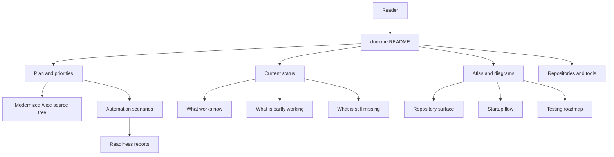
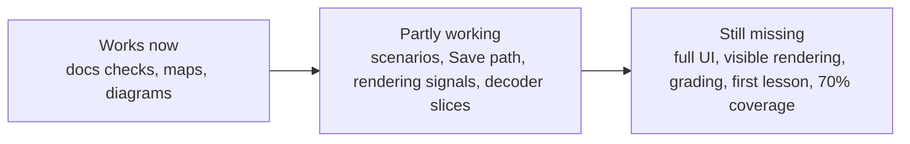

# drinkme

drinkme is the front door for the Alice 3 modernization work. It keeps the
plan, current status, project map, diagrams, and next-step links in one place so
readers can understand progress without reading pull request history.

This README is a project overview, not a changelog. Detailed status and evidence
live in the linked docs.

## Plan summary

The modernization plan is simple: protect current Alice behavior with focused
checks, refactor RabbitHole in small steps, compare scenario outcomes in eatme,
and keep drinkme as the status-and-evidence index.

- RabbitHole: behavior tests first -> evidence -> refactor -> repeat.
- eatme: create automation scenarios -> compare outcomes -> record gaps.
- drinkme: track plan -> status -> evidence links -> next decisions.

## Current verdict

The modernization is active and useful, but unfinished. The repository now has
documentation checks, scenario inventories, readiness reports, source evidence
for selected Alice areas, and diagrams that make the work easier to navigate.

Use drinkme as a map and status index. Do not read it as a claim that Alice
modernization, classroom assessment, UI automation, rendering, or coverage goals
are complete.

## One-page project map

| Area | Purpose | Start here |
| --- | --- | --- |
| Plan | Shows the modernization path and priority order. | [Investigation plan](docs/plan.md) |
| Current status | Summarizes what is complete, partial, and still open. | [Current state and next steps](docs/modernization/current-state-and-next-steps.md) |
| Full-scope status | Keeps the broader modernization boundary explicit. | [Restarted full-scope status](docs/modernization/restarted-full-scope-status.md) |
| Atlas | Maps repository structure, startup flow, and test roadmap. | [Atlas index](docs/atlas/index.md) |
| Scenarios | Tracks planned user and classroom-style checks. | [eatme implementation plan](docs/eatme/implementation-plan.md) |

## What works now

- The drinkme documentation contract is reproducible:
  `python3 -m unittest discover -s tests -v`.
- Repository documentation checks cover expected shape, JSON syntax, YAML syntax,
  and internal Markdown links.
- The plan, current status, atlas index, and diagrams are tracked here instead
  of being scattered across pull request history.
- Existing diagrams cover the repository surface, Alice startup flow, and testing
  roadmap.
- Scenario inventories and readiness reports give a usable map of Alice lesson
  surfaces that still need direct evidence.

## What is partly working

- Browser-side and desktop-side lesson checks provide useful signals, but they
  are not full Alice UI automation.
- Save-path work has selected-path, menu-dispatch, chooser, and
  component-level file-write evidence, but desktop Save
  menu-to-written-project completion is still missing.
- Rendering work has surface, window, and blocker records, but not visible
  rendering correctness.
- Scenario reports organize classroom-style coverage, but grading and creative
  assessment are not automated.
- Tweedle and player decoding covers many small source cases, but full
  Tweedle/player decode is still missing.

## What is still missing

- Alice UI automation.
- Visible rendering correctness.
- Desktop Save menu-to-written-project completion.
- Grading.
- Creative assessment.
- First-lesson completion.
- Full Tweedle/player decode.
- 70% aggregate coverage.

## Current focus

Keep drinkme readable as the map, not the timeline. New work should close the
largest evidence gaps first: real UI actions, visible rendering, desktop Save
menu-to-written-project completion, first-lesson completion, grading and
creative assessment, and broader decoder coverage.

When details change, update the linked status docs and diagrams instead of
turning this README into a chronological pull request list.

## Progress at a glance

| Area | Status | Reader takeaway |
| --- | --- | --- |
| Documentation checks | Works now | Run the unittest command above for the drinkme docs contract. |
| Project map and diagrams | Works now | Start with the atlas and diagram links below. |
| Automation scenarios | Partly working | Useful coverage map; not full Alice UI automation. |
| Desktop Save | Partly working | Component-level evidence exists, but desktop Save menu-to-written-project completion is still missing. |
| Rendering and lesson completion | Missing | Do not treat current evidence as visible correctness or a finished lesson. |
| Grading and creative assessment | Missing | Scenario reports do not grade student work. |
| Tweedle/player decode | Partly working | Many slices are characterized; full decode is missing. |
| Coverage target | Missing | 70% aggregate coverage is still a target, not a result. |

## Useful links

### Repositories and tools

- [Original Alice 3 project](https://github.com/TheAliceProject/alice3)
- [Modernized Alice source tree](https://github.com/rysweet/RabbitHole)
- [Comparison runner and scenario repository](https://github.com/rysweet/eatme)
- [drinkme repository](https://github.com/rysweet/drinkme)

### Plans, status, and diagrams

- [Investigation plan](docs/plan.md)
- [Current state and next steps](docs/modernization/current-state-and-next-steps.md)
- [Restarted full-scope status](docs/modernization/restarted-full-scope-status.md)
- [eatme implementation plan](docs/eatme/implementation-plan.md)
- [Atlas index](docs/atlas/index.md)
- [Repository surface diagram](docs/atlas/diagrams/repo-surface-mermaid.svg) and
  [source](docs/atlas/diagrams/repo-surface.mmd)
- [Startup flow diagram](docs/atlas/diagrams/startup-flow-mermaid.svg) and
  [source](docs/atlas/diagrams/startup-flow.mmd)
- [Testing roadmap diagram](docs/atlas/diagrams/testing-roadmap-mermaid.svg) and
  [source](docs/atlas/diagrams/testing-roadmap.mmd)

## Where to go next

For the shortest status read, open
[current state and next steps](docs/modernization/current-state-and-next-steps.md).
For the overall work order, read the [investigation plan](docs/plan.md). For
structure and diagrams, use the [atlas index](docs/atlas/index.md). For the
scenario and comparison-runner side, read the
[eatme implementation plan](docs/eatme/implementation-plan.md).
