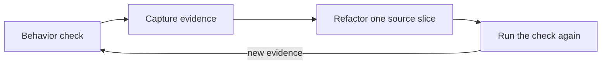
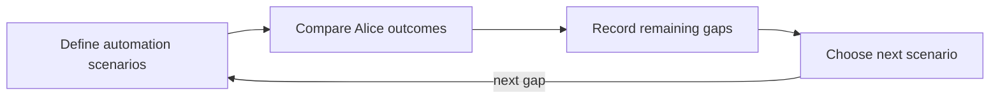
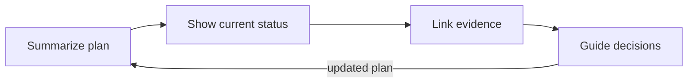
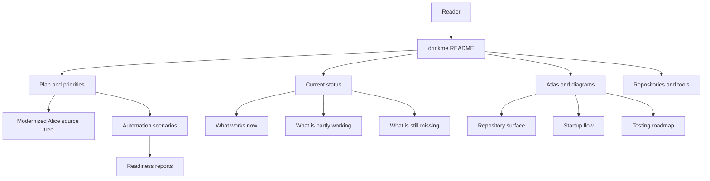
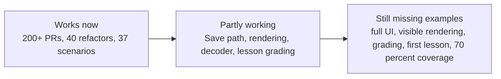

# drinkme

drinkme is the front door for the Alice 3 modernization work. It keeps the
plan, current status, project map, diagrams, and next-step links in one place so
readers can understand the work without reading pull request history.

This README is a project overview, not a changelog. Detailed status and evidence
live in the linked docs.

## Plan summary

The silver-thread journey is: launch Alice -> build or change a starter
world/program -> run and observe it -> save and reopen it -> report
instructor/student readiness.

The modernization loop is simple: protect current Alice behavior with focused
checks, use the evidence to refactor the source in small steps, compare
automation scenario outcomes and gaps, and keep drinkme as the status and
evidence index.

## How the work runs

Source work improves Alice capability, scenario work compares Alice outcomes,
and drinkme tracks plan, status, and evidence.

### Source behavior-test-before-refactor loop

### Automation scenario comparison loop

### drinkme plan/status/evidence tracking loop

## Current verdict

The modernization is active and useful, but unfinished. Over 200 pull requests
are merged. Forty-seven refactoring PRs have decomposed large production classes.
Only 41 production Java files remain over 500 lines (down from 100+). Eight
silver-thread end-to-end tests cover the full student journey. All 37 automation
scenarios validate. All 8 Alice.org curriculum lessons have grading coverage.
A TypeScript prototype runs the silver thread journey against a web API.
The repository has automation scenario coverage, readiness reports, and diagrams.

Use drinkme as a map and status index. Do not read it as a claim that Alice
modernization, classroom assessment, UI automation, rendering, or coverage goals
are complete.

## One-page project map

| Area | Purpose | Start here |
| --- | --- | --- |
| Plan | Shows the modernization path and priority order. | [Investigation plan](docs/plan.md) |
| Current status | Summarizes what is complete, partial, and still open. | [Current state and next steps](docs/modernization/current-state-and-next-steps.md) |
| Full-scope status | Keeps the broader modernization boundary explicit. | [Restarted full-scope status](docs/modernization/restarted-full-scope-status.md) |
| Atlas | Maps repository structure, startup flow, and test roadmap. | [Atlas index](docs/atlas/index.md) |
| Scenarios | Tracks planned user and classroom-style checks. | [Scenario implementation plan](docs/eatme/implementation-plan.md) |

## What works now

- Over 200 pull requests merged across source and scenario repositories.
- 47 refactoring PRs decomposing large classes. 41 files remain over 500 lines.
- Eight silver-thread end-to-end tests, all 37 automation scenarios validate.
- All 8 Alice.org curriculum lessons have automation grading coverage (650 tests).
- TypeScript prototype runs the silver thread journey against web API (39 tests).
- The drinkme documentation contract is reproducible with `python3 -m unittest discover -s tests -v`.

## What is partly working

- NonCachingTextRenderer reduced from 1842 to 476 lines.
- Save-path work has component-level evidence, but full desktop Save completion is missing.
- Rendering work has surface and blocker records, but not visible correctness.
- Tweedle and player decoding covers many cases, but full decode is still missing.
- Agentic test composability work is in progress.

## What is still missing

Still missing: full Alice UI automation, visible rendering correctness, full desktop Save
completion, full Tweedle/player decode, and the 70 percent coverage target; see
the [investigation plan](docs/plan.md) for the authoritative remaining gap list.

## Current focus

Close the largest evidence gaps: real UI actions, visible rendering, desktop Save completion, decoder coverage, and the TypeScript/.a3p prototype.

## Progress at a glance

| Area | Status | Reader takeaway |
| --- | --- | --- |
| Documentation checks | Works now | Run the unittest command above for the drinkme docs contract. |
| Project map and diagrams | Works now | Start with the atlas and diagram links below. |
| Automation scenarios | Works now | All 37 scenarios validate. |
| Desktop Save | Partly working | Component-level evidence exists, but full desktop Save completion is missing. |
| Lesson grading | Works now | All 8 curriculum lessons graded; TS prototype tested. |
| Rendering | Missing | Do not treat current evidence as visible correctness. |
| Tweedle/player decode | Partly working | Many slices are characterized; full decode is missing. |
| Coverage target | Missing | 70 percent aggregate coverage is still a target, not a result. |

## Useful links

### Repositories and tools

- [Original Alice 3 project](https://github.com/TheAliceProject/alice3)
- [Modernized Alice source tree](https://github.com/rysweet/RabbitHole)
- [Automation scenario repository](https://github.com/rysweet/eatme)
- [drinkme repository](https://github.com/rysweet/drinkme)
- [TypeScript .a3p prototype](https://github.com/rysweet/alice-web-prototype)
- [Agentic test framework](https://github.com/rysweet/gadugi-agentic-test)

### Plans, status, and diagrams

- [Investigation plan](docs/plan.md)
- [Current state and next steps](docs/modernization/current-state-and-next-steps.md)
- [Restarted full-scope status](docs/modernization/restarted-full-scope-status.md)
- [Scenario implementation plan](docs/eatme/implementation-plan.md)
- [Atlas index](docs/atlas/index.md)
- [Repository surface diagram](docs/atlas/diagrams/repo-surface-mermaid.svg) and
  [source](docs/atlas/diagrams/repo-surface.mmd)
- [Startup flow diagram](docs/atlas/diagrams/startup-flow-mermaid.svg) and
  [source](docs/atlas/diagrams/startup-flow.mmd)
- [Testing roadmap diagram](docs/atlas/diagrams/testing-roadmap-mermaid.svg) and
  [source](docs/atlas/diagrams/testing-roadmap.mmd)

## Where to go next

For the shortest status read, open
[current state and next steps](docs/modernization/current-state-and-next-steps.md).
For the overall work order, read the [investigation plan](docs/plan.md). For
structure and diagrams, use the [atlas index](docs/atlas/index.md). For the
automation scenario side, read the
[scenario implementation plan](docs/eatme/implementation-plan.md).
