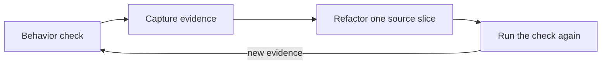
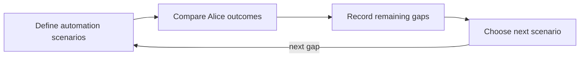
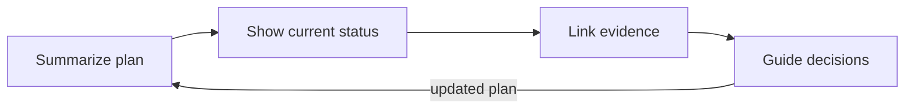
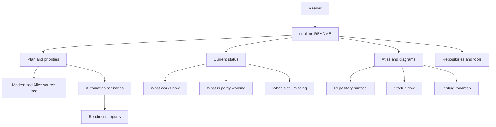
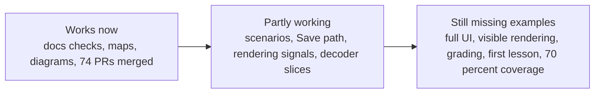

# drinkme

drinkme is the front door for the Alice 3 modernization work. It keeps the
plan, current status, project map, diagrams, and next-step links in one place so
readers can understand the work without reading pull request history.

This README is a project overview, not a changelog. Detailed status and evidence
live in the linked docs.

## Plan summary

The silver-thread journey is: launch Alice -> build or change a starter
world/program -> run and observe it -> save and reopen it -> report
instructor/student readiness.

The modernization loop is simple: protect current Alice behavior with focused
checks, use the evidence to refactor the source in small steps, compare
automation scenario outcomes and gaps, and keep drinkme as the status and
evidence index.

## How the work runs

Source work improves Alice capability, scenario work compares Alice outcomes,
and drinkme tracks plan, status, and evidence.

### Source behavior-test-before-refactor loop

### Automation scenario comparison loop

### drinkme plan/status/evidence tracking loop

## Current verdict

The modernization is active and useful, but unfinished. 74 pull requests are
merged. Two large production classes have been decomposed. Eight silver-thread
end-to-end tests cover the full student journey. 44 of 46 automation scenarios
pass. The repository now has documentation checks, linked status docs,
automation scenario coverage, readiness reports, source evidence for selected
Alice areas, and diagrams that make the work easier to navigate.

Use drinkme as a map and status index. Do not read it as a claim that Alice
modernization, classroom assessment, UI automation, rendering, or coverage goals
are complete.

## One-page project map

| Area | Purpose | Start here |
| --- | --- | --- |
| Plan | Shows the modernization path and priority order. | [Investigation plan](docs/plan.md) |
| Current status | Summarizes what is complete, partial, and still open. | [Current state and next steps](docs/modernization/current-state-and-next-steps.md) |
| Full-scope status | Keeps the broader modernization boundary explicit. | [Restarted full-scope status](docs/modernization/restarted-full-scope-status.md) |
| Atlas | Maps repository structure, startup flow, and test roadmap. | [Atlas index](docs/atlas/index.md) |
| Scenarios | Tracks planned user and classroom-style checks. | [Scenario implementation plan](docs/eatme/implementation-plan.md) |

## What works now

- 74 pull requests merged across source and scenario repositories.
- Two large classes decomposed: ProjectMigrationManager (5702 to 117 lines) and Tweedle encoder (959 to 499 lines, 4 delegate files).
- Eight silver-thread end-to-end tests covering launch, save, edit, decode, VM execution, and event dispatch.
- 44 of 46 automation scenarios pass against both fork and upstream Alice.
- Four lesson end-to-end tests with per-step grading.
- CI optimized: non-Java pull requests finish in under 30 seconds.
- The drinkme documentation contract is reproducible with
  `python3 -m unittest discover -s tests -v`.

## What is partly working

- Two automation scenarios score 18/23; the remaining assertion failures are in the edit, run, and save chain.
- Text renderer extraction started (1842 to 1318 lines) but has test compilation failures.
- Save-path work has selected-path, menu-dispatch, chooser, and component-level file-write evidence, but desktop Save menu-to-written-project completion from a real rendered click path is still missing.
- Rendering work has surface, window, and blocker records, but not visible rendering correctness.
- Tweedle and player decoding covers many small source cases, but full decode is still missing.

## What is still missing

Still missing: full Alice UI automation, visible rendering correctness, desktop
Save menu-to-written-project completion from a real rendered click path,
first-lesson completion, grading, creative assessment, deployed
sharing/platform behavior, full Tweedle/player decode, and the 70 percent
aggregate coverage target; see the [investigation plan](docs/plan.md) for the authoritative remaining gap list.

## Current focus

Close the largest evidence gaps first: real UI actions, visible rendering, desktop Save menu-to-written-project completion from a real rendered click path, first-lesson completion, grading and creative assessment, deployed sharing/platform behavior, and broader decoder coverage.

## Progress at a glance

| Area | Status | Reader takeaway |
| --- | --- | --- |
| Documentation checks | Works now | Run the unittest command above for the drinkme docs contract. |
| Project map and diagrams | Works now | Start with the atlas and diagram links below. |
| Automation scenarios | Partly working | Useful coverage map; not full Alice UI automation. |
| Desktop Save | Partly working | Component-level evidence exists, but desktop Save menu-to-written-project completion is still missing. |
| Rendering and lesson completion | Missing | Do not treat current evidence as visible correctness or a finished lesson. |
| Grading and creative assessment | Missing | Scenario reports do not grade student work. |
| Tweedle/player decode | Partly working | Many slices are characterized; full decode is missing. |
| Coverage target | Missing | 70 percent aggregate coverage is still a target, not a result. |

## Useful links

### Repositories and tools

- [Original Alice 3 project](https://github.com/TheAliceProject/alice3)
- [Modernized Alice source tree](https://github.com/rysweet/RabbitHole)
- [Automation scenario repository](https://github.com/rysweet/eatme)
- [drinkme repository](https://github.com/rysweet/drinkme)

### Plans, status, and diagrams

- [Investigation plan](docs/plan.md)
- [Current state and next steps](docs/modernization/current-state-and-next-steps.md)
- [Restarted full-scope status](docs/modernization/restarted-full-scope-status.md)
- [Scenario implementation plan](docs/eatme/implementation-plan.md)
- [Atlas index](docs/atlas/index.md)
- [Repository surface diagram](docs/atlas/diagrams/repo-surface-mermaid.svg) and
  [source](docs/atlas/diagrams/repo-surface.mmd)
- [Startup flow diagram](docs/atlas/diagrams/startup-flow-mermaid.svg) and
  [source](docs/atlas/diagrams/startup-flow.mmd)
- [Testing roadmap diagram](docs/atlas/diagrams/testing-roadmap-mermaid.svg) and
  [source](docs/atlas/diagrams/testing-roadmap.mmd)

## Where to go next

For the shortest status read, open
[current state and next steps](docs/modernization/current-state-and-next-steps.md).
For the overall work order, read the [investigation plan](docs/plan.md). For
structure and diagrams, use the [atlas index](docs/atlas/index.md). For the
automation scenario side, read the
[scenario implementation plan](docs/eatme/implementation-plan.md).
