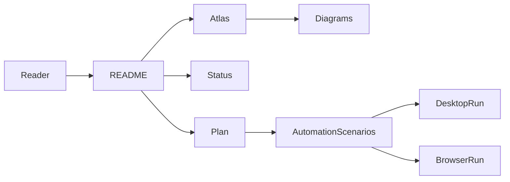

# drinkme

drinkme is the orientation and evidence repository for the Alice 3 modernization
work. It keeps the plan, status, maps, and diagrams in one place so readers can
quickly see what is proven, what is partial, and where the next work should go.

## Current verdict

The modernization is active and useful, but not complete. Documentation checks,
scenario inventories, readiness reports, and focused Alice source proofs exist.
The missing work is still large enough that this repository should be read as a
project map and evidence index, not as a claim that Alice modernization is done.

## One-page project map

## What works now

- drinkme has a reproducible documentation contract check:
  `python3 -m unittest discover -s tests -v`.
- Repository documentation validation covers expected shape, JSON syntax, YAML
  syntax, and internal Markdown links.
- The investigation plan, current status, atlas index, and diagrams are tracked
  in this repository instead of being scattered through pull request history.
- The automation scenario catalog and readiness reports give a usable map of the
  Alice lesson surfaces that still need real proof.

## What is partly working

- Browser-side and desktop-side lesson checks have useful early coverage, but
  they are not full lesson automation.
- Save-path work has evidence for selected steps and small file-write checks,
  but not completed desktop Save behavior from the full user journey.
- Tweedle and player decoding has many characterized slices, but remains short
  of full decode coverage.
- Scenario assets and reports are useful for planning classroom-style coverage,
  but grading and creative assessment are not automated.

## What is still missing

- Alice UI automation.
- Visible rendering correctness.
- Desktop Save completion.
- Grading.
- Creative assessment.
- First-lesson completion.
- Full Tweedle/player decode.
- 70% aggregate coverage.

## Current focus

Keep the README short and use it as the front door. Put durable plans, status,
evidence, and diagrams in the linked docs, then continue closing the biggest
proof gaps: real UI automation, visible rendering, Save completion, first-lesson
completion, grading, creative assessment, and broader decoder coverage.

## Progress at a glance

| Area | Status | Reader takeaway |
| --- | --- | --- |
| Documentation checks | Works now | Run the unittest command above for the drinkme docs contract. |
| Project map and diagrams | Works now | Start with the atlas and diagram links below. |
| Automation scenarios | Partly working | Useful coverage map; not full Alice UI automation. |
| Desktop Save | Partly working | Evidence exists, but full desktop Save completion is missing. |
| Rendering and lesson completion | Missing | Do not treat current evidence as visible correctness or a finished lesson. |
| Grading and creative assessment | Missing | Scenario reports do not grade student work. |
| Tweedle/player decode | Partly working | Many slices are characterized; full decode is missing. |
| Coverage target | Missing | 70% aggregate coverage is still a target, not a result. |

## Useful links

- [Investigation plan](docs/plan.md)
- [Current state and next steps](docs/modernization/current-state-and-next-steps.md)
- [Restarted full-scope status](docs/modernization/restarted-full-scope-status.md)
- [Atlas index](docs/atlas/index.md)
- [Repository surface diagram source](docs/atlas/diagrams/repo-surface.mmd)
- [Testing roadmap diagram source](docs/atlas/diagrams/testing-roadmap.mmd)

## Where to go next

If you need the shortest overview, read this page and then the
[current state](docs/modernization/current-state-and-next-steps.md). If you need
the system map, use the [atlas index](docs/atlas/index.md). If you are choosing
the next implementation slice, start with the
[investigation plan](docs/plan.md) and the
[testing roadmap](docs/atlas/diagrams/testing-roadmap.mmd).
