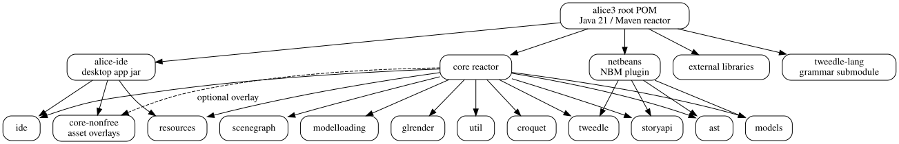
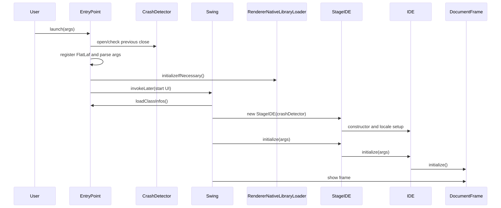
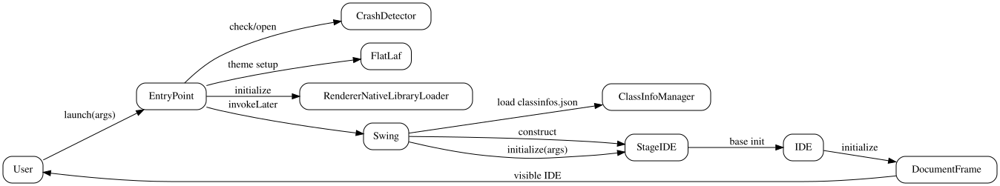

# Alice 3 code atlas

This atlas maps the Alice 3 investigation. It is intentionally stored in
`drinkme`, not in the Alice source fork.

The atlas is part of the linked status docs. Its current user-facing summary
tracks automation scenarios and remaining gaps, including full Alice UI
automation, visible rendering, desktop Save menu-to-written-project completion,
first-lesson completion, grading, creative assessment, and full Tweedle/player
decode.

## Current diagrams

### Repository surface

### Startup flow

### Testing roadmap

## Atlas layers started

| Layer | Status | Notes |
| --- | --- | --- |
| repo-surface | started | Maven reactor and major module groups mapped. |
| ast-lsp-bindings | not started | Needs Java LSP or static symbol pass. |
| compile-deps | started | Initial module dependency map only; needs full POM extraction. |
| runtime-topology | not applicable/service-light | Desktop app, not a service topology; still needs runtime component map. |
| api-contracts | not applicable/http-light | No HTTP API found in first pass; plugin and Java APIs need contract docs. |
| data-flow | started | Startup flow mapped; project/model persistence flows still needed. |
| service-components | started | Major Java modules mapped; package-level diagrams still needed. |
| user-journeys | started | Testing roadmap identifies journey candidates; executable journeys still needed. |

## Current status summary

- Linked status docs now summarize capability status instead of PR chronology.
- Automation scenarios cover more desktop, classroom, lesson, export/share,
  accessibility, Save-path, and readiness paths.
- Model export attribution and headless generated Story API runtime-state evidence
  improved the source characterization map.
- Runtime/user gaps remain open: full Alice UI automation, visible rendering,
  desktop Save menu-to-written-project completion, first-lesson completion,
  grading, creative assessment, deployed sharing/platform behavior, and full
  Tweedle/player decode.

## Evidence history

Use the journal for detailed evidence and chronology. Keep this index as the
overview.

- [Latest evidence boundary status](journal/0130-rabbithole-306-308-evidence-status.md)
  records the latest source-evidence boundary. The user-facing takeaway is
  capability-level: model export attribution and headless generated Story API
  runtime-state evidence improved, while visible rendering, JavaFX launch,
  animation playback, full world execution, grading, full UI automation, full
  lesson completion, and full Tweedle/player decode remain open.
- [Merged metadata journal](journal/0129-four-pr-merged-metadata-status.md)
  records verified merge metadata separately from user-facing capability status.
- [While-loop decode status](journal/0128-rabbithole-pr293-while-loop-decode-status.md)
  records a focused Tweedle decode improvement and the decode gaps that remain.
- [File-menu Save navigation status](journal/0127-rabbithole-pr292-file-menu-save-navigation-proof-status.md)
  records Save-path evidence while keeping real rendered desktop menu-bar
  navigation and visible rendering correctness open.
- [Scenario inventory status](journal/0122-eatme-pr135-audio-camera-and-export-sharecase-status.md)
  records the latest scenario inventory completion while keeping grading,
  automated creative assessment, real Alice UI automation, and full lesson
  delivery open.
- [Save-path evidence history](journal/0100-rabbithole-pr235-through-pr259-status.md)
  records Save-path evidence boundaries and the remaining desktop Save gaps.
- [Desktop Run execution evidence](journal/0085-desktop-run-execution-evidence.md)
  records the narrow Run window attachment signal and its limits.

## Next atlas expansion

1. Generate POM dependency graph directly from Maven metadata.
2. Add package-level diagrams for `core/ide`, `core/tweedle`, `core/model-loading`, `core/resources`, `core/glrender`, and `netbeans`.
3. Trace project load/save and model import/export data flows.
4. Trace Alice-to-Java NetBeans workflow.
5. Add static symbol and entry-point inventory.
6. Add staleness triggers keyed to Maven modules and source/resource folders.
