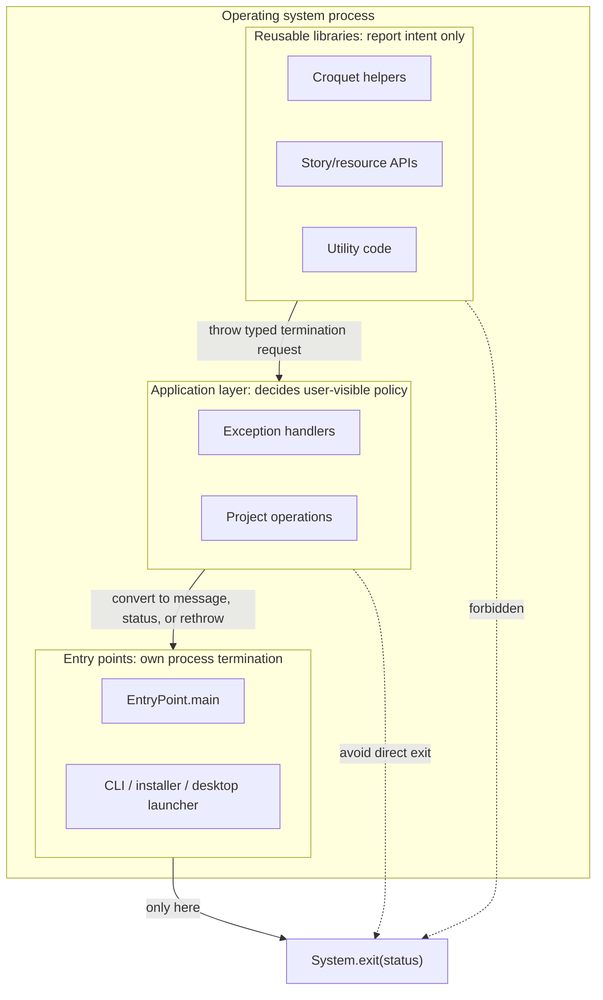
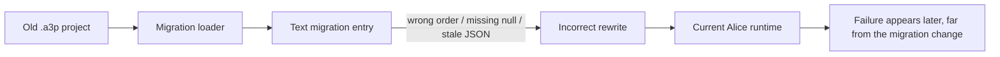

# Software Engineering Lessons from Refactoring

Refactoring is not just "cleaning up code." In a large legacy system, every
change has to preserve behavior, protect users, keep tests meaningful, and make
the next change safer. This tutorial uses real RabbitHole modernization work to
teach practical software engineering lessons from refactoring Alice.

Each example follows the same pattern:

1. What went wrong.
2. Why that kind of problem happens in real systems.
3. What boundary, test, or design habit fixed it.
4. How to recognize the same problem in another codebase.

The examples link to RabbitHole pull requests and source files so you can inspect
the actual code, not a simplified toy version.

## How to study these examples

Read each example as a small debugging and design exercise:

1. Start with the failure mode, not the implementation.
2. Ask what assumption made the bug possible.
3. Look for the boundary that was unclear: UI vs. library, entry point vs.
   reusable code, test helper vs. behavior specification, and so on.
4. Notice the characterization test or executable proof that made the refactor
   safe.
5. Check what behavior was intentionally preserved.

The goal is to learn a repeatable engineering habit: improve the code without
making the system less predictable.

## Example 1: Move process termination to entry points

**Source examples:** RabbitHole
[PR #883](https://github.com/rysweet/RabbitHole/pull/883), "Restrict process
termination to entry points"; source files
[`ProcessTerminator.java`](https://github.com/rysweet/RabbitHole/blob/develop/core/croquet/src/main/java/org/lgna/croquet/ProcessTerminator.java),
[`ProcessTerminationRequestedException.java`](https://github.com/rysweet/RabbitHole/blob/develop/core/croquet/src/main/java/org/lgna/croquet/ProcessTerminationRequestedException.java),
[`IdeUncaughtExceptionHandler.java`](https://github.com/rysweet/RabbitHole/blob/develop/core/ide/src/main/java/org/alice/ide/issue/IdeUncaughtExceptionHandler.java),
[`DefaultExceptionHandler.java`](https://github.com/rysweet/RabbitHole/blob/develop/core/ide/src/main/java/org/alice/ide/issue/DefaultExceptionHandler.java),
[`EntryPoint.java`](https://github.com/rysweet/RabbitHole/blob/develop/alice-ide/src/main/java/org/alice/stageide/EntryPoint.java), and
[`SystemExitBoundaryTest.java`](https://github.com/rysweet/RabbitHole/blob/develop/core/ide/src/test/java/org/alice/ide/SystemExitBoundaryTest.java).

**Failure mode:** reusable code and exception handlers called `System.exit`
directly. That means a helper class, a test, or an embedded caller can
accidentally terminate the entire JVM. In a desktop app this may look harmless:
"an unrecoverable error happened, so exit." In a Maven test run, CI job, plugin,
or classroom launcher, the same call kills the host process. The failure is not
local to the class that calls `System.exit`; it crosses the process boundary.

**Why it occurs:** legacy desktop code often grows from the outside in. Early
entry-point code, UI error handling, and utility error handling all live close
together. Over time, low-level code starts assuming it owns the whole
application. Once that happens, tests cannot isolate failure paths because the
failure path is "stop the JVM."

**Boundary diagram:**



**Engineering lesson:** process termination is an application boundary. Library
code should report intent with a typed result or exception. A real entry point
decides whether to show UI, log, return a status code, or exit.

**Exercise:**

1. Search for direct `System.exit` calls.
2. Classify each call as entry point, tool launcher, or reusable code.
3. Add an allowlist test for calls that are still permitted.
4. Replace reusable-code exits with a narrow termination-intent API.
5. Keep the visible error message and exit code stable at the entry point.

**Why it matters:** hidden exits are operational traps. They make a codebase hard
to embed, hard to test, and easy to break from a harmless-looking code path.

## Example 2: Keep GUI behavior out of library code

**Source examples:** RabbitHole
[PR #846](https://github.com/rysweet/RabbitHole/pull/846),
[PR #880](https://github.com/rysweet/RabbitHole/pull/880),
[PR #892](https://github.com/rysweet/RabbitHole/pull/892), and
[PR #907](https://github.com/rysweet/RabbitHole/pull/907); source files
[`StoryApiDirectoryUtilities.java`](https://github.com/rysweet/RabbitHole/blob/develop/core/story-api/src/main/java/org/lgna/story/implementation/StoryApiDirectoryUtilities.java),
[`StorytellingResources.java`](https://github.com/rysweet/RabbitHole/blob/develop/core/story-api/src/main/java/org/lgna/story/resourceutilities/StorytellingResources.java),
[`UiPromptBoundary.java`](https://github.com/rysweet/RabbitHole/blob/develop/core/util/src/main/java/edu/cmu/cs/dennisc/ui/prompt/UiPromptBoundary.java),
[`UiPrompts.java`](https://github.com/rysweet/RabbitHole/blob/develop/core/util/src/main/java/edu/cmu/cs/dennisc/ui/prompt/UiPrompts.java), and
[`SwingUiPromptBoundary.java`](https://github.com/rysweet/RabbitHole/blob/develop/core/story-api/src/main/java/org/lgna/story/resourceutilities/SwingUiPromptBoundary.java).

**Failure mode:** utility and resource code displayed modal Swing dialogs or
started GUI behavior when no user could respond. In CI this surfaced as hangs
under Xvfb. The code was trying to be helpful: if the model gallery or resource
directory was missing, ask the user to find it. But the question was asked from a
library path that also runs during tests, class loading, and non-interactive
validation.

**Why it occurs:** UI code and resource-discovery code often start life in the
same method: "find the resources, and if missing, ask the user." That is
convenient for the desktop path and dangerous everywhere else. A library method
has no reliable way to know whether it is running in a real desktop session, a
headless test, an Xvfb smoke test, or a tool that embeds Alice.

**How it was fixed:** prompting was moved behind an explicit UI boundary.
Non-interactive paths can install a boundary that returns "no selection" or
records messages instead of blocking. Desktop entry points can install a Swing
boundary that shows dialogs intentionally.

Before, the dependency direction was effectively:

```java
// Library/resource code
File gallery = FindResourcesPanel.getInstance().getGalleryDir(); // blocks
```

After, the resource code depends on a prompt boundary:

```java
ResourcePromptResult result =
    UiPrompts.requestResourceLocation(aliceResourcePrompt(resourcePaths, false));

result.selectedGalleryDirectory()
    .ifPresent(directory -> setGalleryResourceDirs(new String[] {directory.getAbsolutePath()}));
```

The same production path still supports Swing prompts through
`SwingUiPromptBoundary`, but tests and non-interactive validation no longer need
to display a dialog.

**Engineering lesson:** UI prompts belong behind a UI boundary. Core libraries
should return data, return `null` or an empty result where that is the
established contract, or throw typed exceptions. They should not block on a
dialog.

**Exercise:**

1. Search for `JOptionPane.show*`, `Dialog.setVisible`, and custom `show*`
   methods outside UI adapter code.
2. Decide whether each call is application UI or library logic.
3. Add a test for non-interactive behavior first.
4. Move prompting into an explicit application-level method or UI boundary.
5. Keep CI/headless/Xvfb behavior deterministic.

**Why it matters:** a modal dialog in the wrong layer is not a user experience.
It is a build deadlock wearing a button.

## Example 3: Treat reflection sweeps as smoke alarms, not specifications

**Source examples:** RabbitHole
[PR #889](https://github.com/rysweet/RabbitHole/pull/889) and
[PR #892](https://github.com/rysweet/RabbitHole/pull/892); source files
[`ClassLoadingSweepSupport.java`](https://github.com/rysweet/RabbitHole/blob/develop/core/croquet/src/test/java/org/lgna/croquet/ClassLoadingSweepSupport.java) and
[`HeadlessClassExerciseSupport.java`](https://github.com/rysweet/RabbitHole/blob/develop/core/ide/src/test/java/org/alice/ide/coverage/HeadlessClassExerciseSupport.java).

**Failure mode:** test helpers loaded many classes and invoked methods by
reflection. Reflection means the test asks the JVM about available methods at
runtime and calls them without writing a normal source-level call. For example:

```java
for (Method method : clazz.getDeclaredMethods()) {
  if (method.getParameterCount() == 0) {
    method.invoke(instance);
  }
}
```

That can be useful as a smoke alarm: "can this class load without exploding?"
But it is unsafe as a behavior specification. A method named `showDialog`,
`openWindow`, `print`, or `dispose` may have no parameters and still do something
very real: open UI, start a process, block on a modal dialog, mutate global
state, or close a window.

**Why it occurs:** broad reflection sweeps are tempting because they increase
coverage quickly. The test code looks generic, so it feels low-risk. The risk is
that method names and parameter counts do not describe side effects. A
zero-argument method is not automatically safe.

**Concrete filter example:** the sweep should avoid known side-effect families
and leave their behavior to explicit tests:

```java
private static boolean isBlockedMethod(Method method) {
  String name = method.getName();
  return name.startsWith("show")
      || name.startsWith("open")
      || name.startsWith("print")
      || name.startsWith("display")
      || name.startsWith("dispose");
}
```

This filter is not a perfect specification. It is a guardrail that stops the
smoke test from triggering obvious UI/lifecycle side effects. Important behavior
still needs a normal test with a direct call and clear assertions.

**Engineering lesson:** reflection sweeps should prove "this surface can be
loaded and lightly touched." They should not try to prove every method's
behavior. Important behavior needs explicit tests.

**Agentic review note:** coding agents often reproduce the same lazy shortcut a
rushed developer would take: "get coverage" by invoking everything generically.
When reviewing agentically generated tests, look for reflection loops that claim
behavioral confidence without naming the behavior, expected result, or unsafe
method families they intentionally avoid.

**Exercise:**

1. Find helpers that use `Class`, `Method`, `getDeclaredMethods`, or
   `method.invoke`.
2. List method families that are unsafe to call generically: UI, lifecycle,
   launch, print, disposal, file chooser, and modal prompt methods.
3. Add a small test for the filter itself.
4. Replace broad "invoke everything" claims with explicit behavior tests.
5. Keep the sweep small enough that a failure points to a class of problem, not
   a random side effect.

**Why it matters:** broad reflection is easy coverage and weak evidence. It
finds some crashes. It also creates crashes.

## Example 4: Limit fallback paths so they do not scan the world

**Source example:** RabbitHole
[PR #892](https://github.com/rysweet/RabbitHole/pull/892); source files
[`StoryApiDirectoryUtilities.java`](https://github.com/rysweet/RabbitHole/blob/develop/core/story-api/src/main/java/org/lgna/story/implementation/StoryApiDirectoryUtilities.java),
[`ModelManifestManager.java`](https://github.com/rysweet/RabbitHole/blob/develop/core/story-api/src/main/java/org/lgna/story/resourceutilities/ModelManifestManager.java), and
[`StoryApiDirectoryUtilitiesTest.java`](https://github.com/rysweet/RabbitHole/blob/develop/core/story-api/src/test/java/org/lgna/story/implementation/StoryApiDirectoryUtilitiesTest.java).

**Failure mode:** a missing resource directory fell back to the user's home
directory. Downstream code then recursively scanned for JSON manifests. On a
developer machine or CI runner, "home directory" can mean caches, repositories,
downloads, build outputs, and unrelated files. A missing Alice resource root
became a slow and unpredictable filesystem crawl.

**Why it occurs:** fallback code often starts as a convenience:

```java
File root = findInstallRoot();
if (root == null) {
  root = new File(System.getProperty("user.home")); // looks helpful
}
```

The problem is not the fallback itself. The problem is the blast radius. If
later code recursively searches `root`, a friendly fallback becomes an unbounded
operation.

**Engineering lesson:** fallback paths need blast-radius limits. If a resource
root is missing, fail clearly or return an explicit empty result. Do not guess a
large filesystem root.

**Exercise:**

1. Find fallback-to-home or fallback-to-current-directory behavior.
2. Add a test proving the fallback does not scan outside the intended root.
3. Return `null`, an empty collection, or a typed error according to the existing
   contract.
4. Log enough context to diagnose the missing resource root.
5. Keep recursive scans behind an explicit root, never a convenience fallback.

**Why it matters:** accidental filesystem breadth is a performance bug and a
reliability bug. It also makes local machines lie to you.

## Example 5: Keep GUI CI narrow without losing coverage

**Source examples:** RabbitHole
[PR #880](https://github.com/rysweet/RabbitHole/pull/880),
[PR #885](https://github.com/rysweet/RabbitHole/pull/885),
[PR #902](https://github.com/rysweet/RabbitHole/pull/902), and
[PR #916](https://github.com/rysweet/RabbitHole/pull/916); source files
[`alice-test-ci.yml`](https://github.com/rysweet/RabbitHole/blob/develop/.github/workflows/alice-test-ci.yml),
[`setup-xvfb/action.yml`](https://github.com/rysweet/RabbitHole/blob/develop/.github/actions/setup-xvfb/action.yml),
[`validate-gui-with-xvfb.sh`](https://github.com/rysweet/RabbitHole/blob/develop/scripts/validate-gui-with-xvfb.sh),
[`validate-getting-started.sh`](https://github.com/rysweet/RabbitHole/blob/develop/scripts/validate-getting-started.sh), and
[`test_xvfb_gui_harness_contract.py`](https://github.com/rysweet/RabbitHole/blob/develop/tests/test_xvfb_gui_harness_contract.py).

**Failure mode:** headed GUI validation was mixed with full unit tests, Xvfb
setup, Maven dependency resolution, startup probing, and cleanup behavior. When
the job failed, it was unclear whether the problem was "Alice cannot start,"
"Xvfb is misconfigured," "a unit test failed," or "Maven could not reach an
external repository."

**Why it occurs:** teams often try to make one GUI job prove everything because
GUI tests are expensive. That makes the job too broad. Expensive tests should be
narrower, not broader.

**How to keep coverage:** do not move all coverage into the GUI lane. Split the
evidence:

- Headless unit/integration tests cover normal logic and most branches.
- Contract tests cover scripts and workflow wiring.
- A headed Xvfb job proves a small display-dependent contract: no-Sims Alice can
  build, start under Xvfb, and fail/stop within bounded time.
- Coverage reporting runs separately, with its own JaCoCo gate and artifacts.

That gives multiple GUI-related CI checks without making each one a full clone
of the entire test suite.

**Engineering lesson:** a GUI CI lane should prove one display contract. Other
coverage should come from headless tests, contract tests, and focused behavior
tests.

**Agentic review note:** coding agents tend to make CI "more comprehensive" by
piling unrelated checks into one job. That is the same lazy developer habit as
"just run everything here." When reviewing agentically generated CI, look for
jobs that mix setup validation, dependency downloads, unit tests, GUI startup,
coverage, and cleanup without a single named contract.

**Exercise:**

1. Name the exact GUI contract the job proves.
2. Put Xvfb setup in one reusable action or script.
3. Bound startup with a timeout and process-tree cleanup.
4. Keep full headless tests in the headless lane.
5. Add contract tests for the workflow/script interface so docs and CI do not
   drift.

**Why it matters:** mixing too many contracts into one CI job makes failures
ambiguous. Ambiguous CI gets ignored.

## Example 6: Data-driven migration with parity checks

**Source examples:** RabbitHole
[PR #881](https://github.com/rysweet/RabbitHole/pull/881),
[PR #882](https://github.com/rysweet/RabbitHole/pull/882),
[PR #884](https://github.com/rysweet/RabbitHole/pull/884), and
[PR #905](https://github.com/rysweet/RabbitHole/pull/905); source files
[`TextMigrationJsonGeneratorTest.java`](https://github.com/rysweet/RabbitHole/blob/develop/core/story-api-migration/src/test/java/org/lgna/project/migration/TextMigrationJsonGeneratorTest.java),
[`TextMigrationParityTestSupport.java`](https://github.com/rysweet/RabbitHole/blob/develop/core/story-api-migration/src/test/java/org/lgna/project/migration/TextMigrationParityTestSupport.java), and
[`text-migrations.json`](https://github.com/rysweet/RabbitHole/blob/develop/core/story-api-migration/src/main/resources/migrations/text-migrations.json).

**What "migration" means here:** Alice projects are saved files. As the codebase
changes, old saved projects may mention old type names, method names, resource
paths, or text fragments. A migration is compatibility code that translates old
saved-project data into the shape expected by the current runtime.

**Failure mode:** text migrations were historically encoded in large Java
registries. Moving them to JSON made them easier to inspect and regenerate, but
it also introduced a second representation of compatibility data. If the JSON
order changes, if a `null` replacement is treated differently, or if generated
data drifts from the committed file, old project loading can silently change.

**Failure path:**



**Engineering lesson:** data-driven does not mean "trust the data." Parity tests
must compare the old registry, generated representation, committed resource, and
runtime loader.

**Agentic review note:** agents are good at moving data from code to JSON, but
they may stop after the mechanical conversion. That mirrors the lazy developer
shortcut of assuming "generated" means "correct." When reviewing agentic
migrations, look for parity tests that prove the old source, generated data,
committed file, and runtime loader still agree.

**Exercise:**

1. Extract canonical migration data from the legacy source.
2. Compare it to generated JSON.
3. Compare generated JSON to the committed resource.
4. Add runtime loader tests for edge cases such as `null` replacement entries.
5. Do not manually edit generated migration data.

**Why it matters:** migrations are compatibility code. If they are wrong, old
projects fail later and far from the change that broke them.

## Example 7: Replace global mutable registries with scoped registries

**Source examples:** RabbitHole
[PR #906](https://github.com/rysweet/RabbitHole/pull/906); source files
[`ClipboardOperationRegistry.java`](https://github.com/rysweet/RabbitHole/blob/develop/core/clipboard-dnd/src/main/java/org/alice/ide/clipboard/ClipboardOperationRegistry.java),
[`ClipboardOperationRegistries.java`](https://github.com/rysweet/RabbitHole/blob/develop/core/clipboard-dnd/src/main/java/org/alice/ide/clipboard/ClipboardOperationRegistries.java), and
[`ClipboardOperationRegistryTest.java`](https://github.com/rysweet/RabbitHole/blob/develop/core/clipboard-dnd/src/test/java/org/alice/ide/clipboard/ClipboardOperationRegistryTest.java).

**Failure mode:** clipboard and drag-and-drop operations used static mutable
maps. A static map is shared for the whole JVM. That means one test, one project,
or one IDE session can leave entries behind for the next one. The bug does not
always appear where the bad write happened. It appears later, when some other
code reads stale global state.

**Why it occurs:** global maps are convenient when the system has one desktop
window and one active project. They become unreliable when tests create many
projects in one JVM, or when code needs a temporary registry for a scoped
operation.

**Engineering lesson:** mutable operation registries need an owner and a
lifetime. If the lifetime is "current clipboard operation" or "current project,"
do not store the state in a process-wide static map.

**Agentic review note:** coding agents often preserve static state because it is
the smallest diff and keeps old call sites compiling. That repeats the lazy
developer habit of clearing globals in tests instead of removing the global
lifetime. When reviewing agentically generated tests, look for suites that pass
only because they reset shared state between cases.

**Code example:** the old shape was a process-wide cache hidden behind a static
factory. Once a statement key entered the map, every later caller in the same JVM
could see the cached operation, even if the later caller was a different test or
project.

```java
// Before: one JVM-wide map owns every clipboard operation.
public final class CopyToClipboardOperation {
  private static final Map<Statement, CopyToClipboardOperation> INSTANCES =
      new HashMap<>();

  public static synchronized CopyToClipboardOperation getInstance(
      Statement statement) {
    return INSTANCES.computeIfAbsent(
        statement,
        CopyToClipboardOperation::new);
  }
}
```

The refactor moved the cache into an object whose lifetime can be chosen by the
caller. Production code can still use the compatibility facade, but tests and
temporary operations can create a fresh registry and prove that state does not
leak.

```java
// After: each registry owns its own memoized operations.
ClipboardOperationRegistry firstRegistry = new ClipboardOperationRegistry();
ClipboardOperationRegistry secondRegistry = new ClipboardOperationRegistry();
Statement statement = new Comment("shared-key");

CopyToClipboardOperation firstCopy =
    firstRegistry.getCopyToClipboardOperation(statement);
CopyToClipboardOperation secondCopy =
    secondRegistry.getCopyToClipboardOperation(statement);

assertNotSame(firstCopy, secondCopy);
```

The compatibility facade was kept, but it now resolves through the active scoped
registry. That lets old call sites keep using `CopyToClipboardOperation.getInstance`
while tests can install a temporary registry and automatically restore the
previous one.

```java
ClipboardOperationRegistry scopedRegistry = new ClipboardOperationRegistry();
Statement statement = new Comment("override");

CopyToClipboardOperation scopedCopy;
try (ClipboardOperationRegistries.RegistryScope scope =
    ClipboardOperationRegistries.useRegistry(scopedRegistry)) {
  scopedCopy = CopyToClipboardOperation.getInstance(statement);

  assertSame(
      scopedRegistry.getCopyToClipboardOperation(statement),
      scopedCopy);
}

assertNotSame(scopedCopy, CopyToClipboardOperation.getInstance(statement));
```

**Exercise:**

1. Find static maps, sets, or lists that hold operation state.
2. Write a characterization test showing state isolation between two registries.
3. Introduce a registry object with explicit registration and lookup methods.
4. Keep a small compatibility facade only where existing callers need it.
5. Make tests create fresh registries instead of clearing shared globals.

**Why it matters:** global mutable state turns ordering into behavior. That makes
tests flaky and sessions leak into each other.

## Example 8: Split generated-source checks from packaging checks

**Source examples:** RabbitHole
[PR #911](https://github.com/rysweet/RabbitHole/pull/911); source files
[`ProjectCodeGeneratorGeneratedSourceOwnershipTest.java`](https://github.com/rysweet/RabbitHole/blob/develop/netbeans/src/test/java/org/alice/netbeans/project/ProjectCodeGeneratorGeneratedSourceOwnershipTest.java),
[`ProjectCodeGeneratorGeneratedSourceTest.java`](https://github.com/rysweet/RabbitHole/blob/develop/netbeans/src/test/java/org/alice/netbeans/project/ProjectCodeGeneratorGeneratedSourceTest.java), and
[`StoryApiGeneratedSourceTest.java`](https://github.com/rysweet/RabbitHole/blob/develop/core/story-api-migration/src/test/java/org/alice/stageide/storyapi/StoryApiGeneratedSourceTest.java).

**Failure mode:** generated-source correctness was coupled to NetBeans package
tests. That made a simple question expensive: "did this generator produce the
right Java source?" The answer depended on package setup, NetBeans test
fixtures, and generated project scaffolding.

**Why it occurs:** generated code often starts as a side effect of packaging or
export flows. Tests are then written at the outer package boundary because that
is where the generated files first appear. Over time, the package test becomes
responsible for both packaging and source-generator correctness.

**Engineering lesson:** generated-source correctness is its own contract. Package
tests should prove package ownership and assembly. Generator tests should prove
the generated text, ownership boundaries, and story-api assumptions directly.

**Agentic review note:** agents often add assertions to the first test that
already exercises a flow, even when that test is at the wrong layer. That is the
lazy developer habit of "there is already a test here, so add more to it." When
reviewing agentically generated tests, look for slow outer-boundary tests that
hide a small generator contract that could fail faster and closer to the cause.

**Exercise:**

1. Identify which assertions are about generated text and which are about package
   structure.
2. Move pure generated-source assertions closer to the generator.
3. Keep one package-level test proving the generated file is included where it
   belongs.
4. Add ownership tests that prevent two modules from claiming the same generated
   source responsibility.
5. Make the fast generator tests fail before the heavy packaging tests.

**Why it matters:** when a test proves too many contracts, failures become slow
and hard to diagnose. Split contracts fail closer to the cause.

## Example 9: Replace sleeps with deterministic waits

**Source examples:** RabbitHole
[PR #909](https://github.com/rysweet/RabbitHole/pull/909); source files
[`TestWait.java`](https://github.com/rysweet/RabbitHole/blob/develop/core/util/src/test/java/edu/cmu/cs/dennisc/TestWait.java),
[`TestWaitContractTest.java`](https://github.com/rysweet/RabbitHole/blob/develop/core/util/src/test/java/edu/cmu/cs/dennisc/TestWaitContractTest.java),
[`IdeTestWaitContractTest.java`](https://github.com/rysweet/RabbitHole/blob/develop/core/ide/src/test/java/org/alice/ide/IdeTestWaitContractTest.java), and
[`GlRenderTestWaitContractTest.java`](https://github.com/rysweet/RabbitHole/blob/develop/core/glrender/src/test/java/edu/cmu/cs/dennisc/render/gl/GlRenderTestWaitContractTest.java).

**Failure mode:** tests used fixed sleeps to wait for async behavior. A sleep is
not synchronization. If the machine is fast, the test wastes time. If the machine
is slow, the test still races and fails. If the event never happens, the test
waits anyway and then fails without explaining what condition was missing.

**Why it occurs:** sleeps are easy to add at the point of pain. A test fails
because work has not finished yet, so the quick patch is `Thread.sleep(1000)`.
That hides the race without identifying the condition the test actually needs.

**Engineering lesson:** tests should wait for conditions, not time. A good wait
helper polls a named condition, stops as soon as the condition is true, and fails
with a useful message when the condition never becomes true.

**Agentic review note:** coding agents frequently "fix" flaky async tests by
adding `Thread.sleep`, longer timeouts, or arbitrary delays. That is not an AI
quirk; it is the same lazy developer patch that hides a race instead of naming
the synchronization condition. When reviewing agentically generated tests, treat
raw sleeps as a smell unless the test is explicitly about semantic time.

**Code example:** the lazy fix waits for time and then hopes the event happened.
If the event already happened, the test is slow. If the event never happens, the
failure does not say what condition was missing.

```java
// Before: time is used as a proxy for "the background load finished."
startBackgroundLoad(project);

Thread.sleep(1000);

assertTrue(project.isLoaded());
```

The deterministic version names the condition. The timeout is still present, but
only as a failure bound. It is no longer the synchronization mechanism.

```java
// After: the test waits for the condition it actually needs.
startBackgroundLoad(project);

TestWait.until(project::isLoaded, "project to finish loading");

assertTrue(project.isLoaded());
```

The same rule applies to futures: wait for the result with a named description
instead of sleeping and then checking whether the result happened to arrive.

```java
Future<RenderResult> renderResult = startRender();

RenderResult result = TestWait.future(renderResult, "render result");

assertTrue(result.isComplete());
```

**Exercise:**

1. Search for `Thread.sleep`, `TimeUnit.sleep`, and arbitrary timeout constants.
2. Name the condition the test really needs.
3. Replace the sleep with a polling helper, latch, callback, or test hook.
4. Add a contract test for the wait helper.
5. Keep the timeout as a failure bound, not as the synchronization mechanism.

**Why it matters:** deterministic waits make tests faster when the system is
fast, clearer when the system is broken, and less flaky under CI load.

## Review checklist for future entries

Before adding a refactor to this tutorial, answer these questions:

1. What concrete failure mode did it remove?
2. What characterization test would have failed before the fix?
3. What boundary became cleaner?
4. What behavior was intentionally preserved?
5. What future mistake should this example prevent?

If those answers are vague, it is not a teaching example yet. It is just a pull
request.
