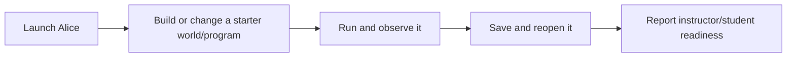

# Alice modernization investigation plan

## Current goal

The goal is one clear silver-thread journey: launch Alice -> build or change a
starter world/program -> run and observe it -> save and reopen it -> report
instructor/student readiness.

This plan keeps the product journey, current readiness state, remaining
coverage gaps, and next workstreams visible without using pull request chronology
as the reader-facing view. It is part of the linked status docs.

## Repository model

| Repository | Role |
| --- | --- |
| `rysweet/RabbitHole` | Alice-side capability work: launch, UI action paths, rendering, Save/Open, player and Tweedle behavior, and source characterization. |
| `rysweet/eatme` | Scenario coverage, reporting, grading/readiness workflows, and platform-facing automation. |
| `rysweet/drinkme` | Plan, status, atlas, diagrams, and evidence index. |
| `TheAliceProject/alice3` | Upstream reference only. Do not open issues or pull requests there for this effort. |

## Product journey

The journey is intentionally user-facing. Source tests, readiness files, and
automation scenarios matter because they move this sequence closer to a reliable
student and instructor experience.

## Current state

| Area | Current readiness |
| --- | --- |
| Launch and desktop discovery | Partly covered by current scenarios and source evidence. More real Alice UI automation is still needed. |
| Build or change a starter world/program | Partly covered through starter project fixtures, generated Story API checks, and lesson scenario inventories. Full first-lesson completion remains open. |
| Run and observe | Desktop Run status and rendering-adjacent evidence exist, but visible rendering correctness remains open. |
| Save and reopen | Project IO, selected-path Save, chooser, and file-write slices exist. Desktop Save menu-to-written-project completion from a real rendered click path remains open. |
| Readiness reporting | Instructor/student readiness reports organize scenario coverage and missing evidence. Grading, creative assessment, and deployed sharing/platform behavior remain open. |
| Decoder/player behavior | Many Tweedle and player slices are characterized. Full Tweedle/player decode remains open. |
| Aggregate coverage | Current coverage is below the modernization target. The 70 percent aggregate coverage target remains open. |

## Remaining coverage gaps

| Remaining coverage gap | Current meaning |
| --- | --- |
| Full Alice UI automation | Alice must be driven through representative real UI paths, not only component seams or status files. |
| Visible rendering correctness | A run must show the expected visible world behavior, not only window or surface availability. |
| Desktop Save menu-to-written-project completion from a real rendered click path | The rendered menu path must lead to a written project that can be reopened. |
| First-lesson completion | The first lesson must complete end to end as a student-facing activity. |
| Grading | Readiness reporting must evaluate the expected student outcome. |
| Creative assessment | Readiness reporting must evaluate creative student work, not only fixed-path checks. |
| Deployed sharing/platform behavior | Sharing and platform workflows must work in the deployed environment, not only as local scenario descriptions. |
| Full Tweedle/player decode | Player and Tweedle archives must decode complete supported programs, not only narrow slices. |
| 70 percent aggregate coverage target | The modernization suite must reach the stated aggregate coverage target. |

## Next workstream mapping

| Remaining coverage gap | Next workstream |
| --- | --- |
| Full Alice UI automation | RabbitHole |
| Visible rendering correctness | RabbitHole |
| Desktop Save menu-to-written-project completion from a real rendered click path | RabbitHole + eatme |
| First-lesson completion | eatme |
| Grading | eatme |
| Creative assessment | eatme |
| Deployed sharing/platform behavior | eatme |
| Full Tweedle/player decode | RabbitHole |
| 70 percent aggregate coverage target | RabbitHole + eatme |

## Next workstreams

1. Make the launch-to-first-edit path reliable enough for automation scenarios to
   drive real starter-world changes.
2. Close visible rendering correctness by checking what the student actually
   sees after Run.
3. Complete the Save menu-to-written-project path from a real rendered click,
   then reopen the saved project.
4. Connect scenario outcomes to instructor/student readiness reporting,
   including grading and creative assessment.
5. Expand Tweedle/player decoding and source characterization until the coverage
   target is reachable.

## Related status and diagrams

- [Current state and next steps](modernization/current-state-and-next-steps.md)
  is the shortest status narrative.
- [Restarted full-scope status](modernization/restarted-full-scope-status.md)
  keeps the broader modernization boundary explicit.
- [Scenario implementation plan](eatme/implementation-plan.md) describes the
  automation scenarios and readiness reporting path.
- [Atlas index](atlas/index.md) links the current repository, startup, and
  testing roadmap diagrams.
- [Repository surface diagram](atlas/diagrams/repo-surface-mermaid.svg)
- [Startup flow diagram](atlas/diagrams/startup-flow-mermaid.svg)
- [Testing roadmap diagram](atlas/diagrams/testing-roadmap-mermaid.svg)

## Success criteria

- A student-facing silver-thread run can launch Alice, change a starter
  world/program, run and observe it, save and reopen it, and report readiness.
- Remaining gaps are mapped to RabbitHole, eatme, or both.
- Documentation stays concise and linked instead of becoming a pull request log.
- Source changes continue behind characterization checks.
- Scenario reports use plain readiness language and avoid overstating confidence.
